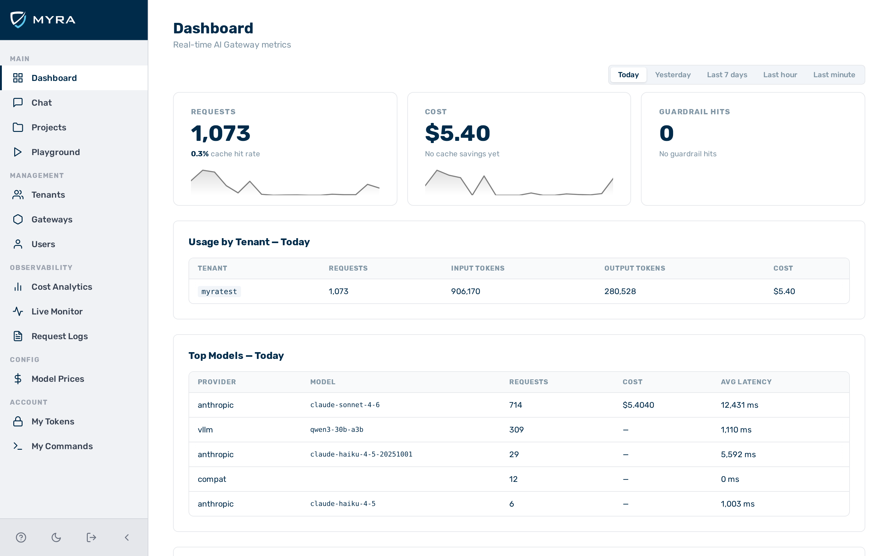

# Admin Panel Authentication

The admin panel (`/admin/*`) is protected by a stateless JWT session cookie. Two login methods are supported: **Google SSO** and **Email one-time code (OTP)**.

---

## Login page

Navigate to `http://<your-gateway>/login`. You will be redirected here automatically if you access a protected page without a valid session.

---

## Google SSO

Click **Continue with Google**. You will be redirected to Google's consent screen and returned to the dashboard on success.

!!! note
    Your email must already exist as a user in the system. Accounts are not created automatically on first login. Contact your administrator if you do not have access.

---

## Email OTP

Click **Continue with Email code**, enter your email address, and wait for a 6-digit code. The code expires in **15 minutes** and can only be used once.

The code is delivered by email to the address you entered.

Before clicking **Send code**, you can check **Stay logged in for 30 days on this device**. When checked, your session remains active for 30 days instead of the default 8 hours.

---

## Session

After a successful login, a secure session is created.

| Login method | Default session duration | With **Stay logged in** |
|---|---|---|
| Email OTP | 8 hours | 30 days |
| Google SSO | 8 hours | — |

You will be redirected to the login page automatically when your session expires. If you are already logged in and navigate to the login page, you are redirected to the dashboard immediately.

---

## Role model

| Role | Access |
|---|---|
| `admin` | Full platform — all tenants, gateways, users |
| `tenant_admin` | Own tenant — manages users, gateways, and settings within their tenant |
| `member` | Own tenant — full access to gateways within their tenant; can create their own inference tokens via [My Tokens](my-tokens.md) |
| `viewer` | Own tenant — read-only access to the admin panel; cannot make inference requests |

Any user in the database can log in to the admin panel regardless of role. Create users via **Users → New User** or the [Users API](../api-reference/users-tokens.md).
