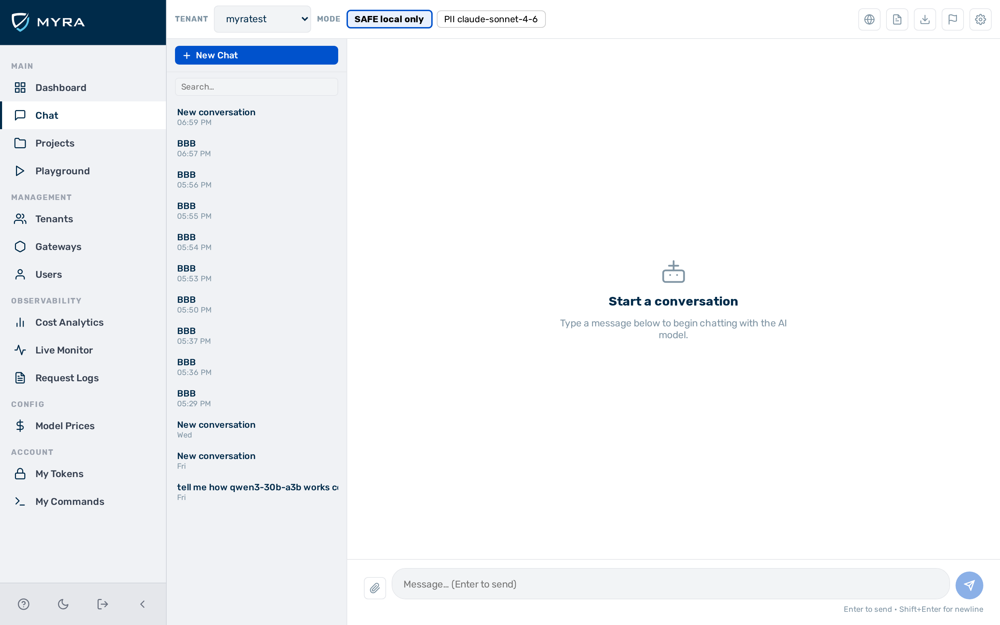
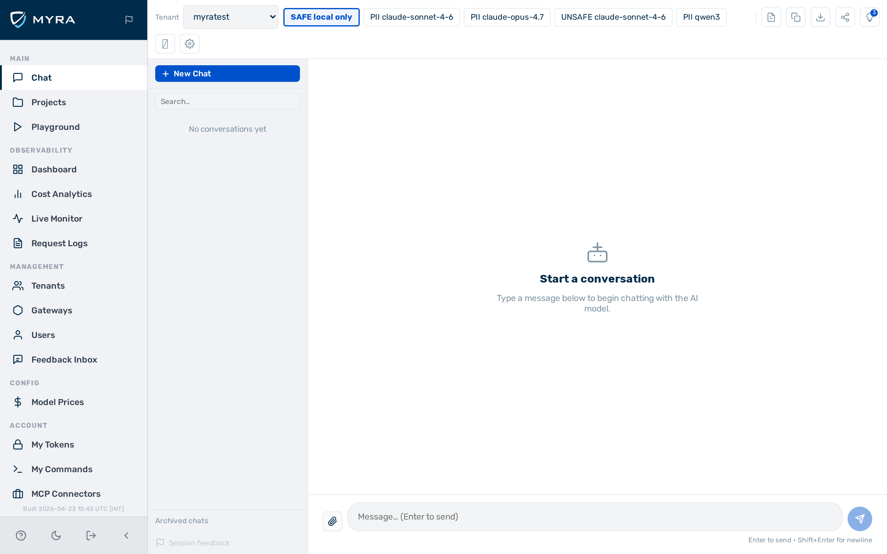

# Chat

## View: Chat

*View: Chat*

The **Chat** view provides a persistent, multi-turn conversation interface that routes messages through the gateway. It is accessible to all authenticated users. The view is available from the **Chat** entry in the sidebar.

The view is divided into three areas:

- **Configuration bar** — runs along the top of the view. Contains the tenant, gateway, and model selectors, as well as the export buttons.
- **Conversation list** — a panel on the left side. Lists all saved conversations for the current user.
- **Message area** — the main area on the right. Shows the message history for the active conversation and contains the message input field.

### Configuration bar

The configuration bar contains three selectors that determine which gateway handles your messages:

| Control | Description |
|---|---|
| **Tenant** drop-down list | Selects the tenant whose gateways are available |
| **Gateway** drop-down list | Selects a gateway within the chosen tenant. The gateway's provider keys, routing rules, and guardrails apply to every message. |
| **Model** drop-down list | Selects the model to use. Lists models from all providers with a key configured on the selected gateway. |

Selections are stored in your browser's local storage and restored when you return to the view.

When a conversation with messages is active, two export buttons appear in the configuration bar:

| Button | Description |
|---|---|
| **Download Markdown** button | Downloads the conversation as a `.md` file. Attached images and documents appear as labelled references. |
| **Download PDF** button | Downloads the conversation as a formatted `.pdf` file. |

Both buttons are inactive when no conversation is selected or the active conversation has no messages.

### Conversation list

The conversation list panel shows all conversations belonging to the current user, ordered by most recently updated. Clicking a conversation loads its message history in the message area. Conversations are private — only the user who created them can see them.

| Action | Control |
|---|---|
| Create a new conversation | **+ New Chat** button at the top of the list |
| Rename a conversation | Double-click the conversation title to edit it inline |
| Delete a conversation | Click the **×** button on the conversation row |

### Message area

The message area shows the full message history for the active conversation. Each assistant response displays the token counts (input and output) and the cost for that turn.

A settings drawer is accessible by clicking the **gear** (⚙) icon. Settings apply to the current conversation:

| Setting | Description |
|---|---|
| **System prompt** text field | An initial instruction sent to the model before any user messages. A default prompt is pre-filled. |
| **Temperature** slider | Controls response randomness. Range: 0–2. Default: 0.7. |
| **Max tokens** field | The maximum number of tokens the model generates per response. Default: 8 192. |

The message input field sits at the bottom of the message area. Text typed here is sent when you press **Enter** or click the **Send** button. A **Stop** button appears while a response is streaming — clicking it aborts the current response.

All messages in the active conversation are sent to the model on every turn, giving the model full context. Documents and spreadsheets attached in earlier turns remain accessible throughout the conversation.

---

## Starting a conversation

Proceed as follows to start a new conversation:

1. Click the **+ New Chat** button at the top of the conversation list.
   - A new, empty conversation appears in the list and becomes active.
2. Select a tenant from the **Tenant** drop-down list in the configuration bar.
3. Select a gateway from the **Gateway** drop-down list.
4. Select a model from the **Model** drop-down list.
5. Type your message in the input field at the bottom of the message area.
6. Press **Enter** or click the **Send** button.
   - A status indicator appears in the message area while the system processes the request.
   - -> The model's response streams into the message area in real time.

---

## Importing a file

Proceed as follows to attach a file to a message:

*View: Chat — file attachment*

1. Click the **paperclip** icon in the message input area, or drag a file from your desktop and drop it anywhere on the message area.
   - A blue drop target appears when you drag a file over the message area.
   - The attached file appears in the input area.
2. Type a message to accompany the file, or leave the input field empty to let the model describe the file.
3. Press **Enter** or click the **Send** button.
   - -> The file is sent with your message. The model processes the file content and responds.

The following file types are supported:

| Format | Extensions |
|---|---|
| Images | `.jpg`, `.jpeg`, `.png`, `.gif`, `.webp` |
| PDF | `.pdf` |
| Plain text | `.txt` |
| Word document | `.docx` |
| Spreadsheet | `.csv`, `.tsv`, `.xlsx`, `.xlsm`, `.ods` |

!!! note "Word and spreadsheet files"
    Word and spreadsheet files require an **Anthropic** provider key on the selected gateway. Claude reads and analyses the document content and can answer questions about it.

Attaching an unsupported file type shows an error message listing the supported formats.

---

## Exporting a conversation

Proceed as follows to export a conversation:

1. Open the conversation you want to export by clicking it in the conversation list.
2. To export as Markdown: click the **Download Markdown** button in the configuration bar.
   - -> The conversation downloads as a `.md` file. Attached images and documents appear as labelled references.
3. To export as PDF: click the **Download PDF** button in the configuration bar.
   - -> The conversation downloads as a formatted `.pdf` file.

---

## See also

- [Prompt examples (English)](prompts.md) — ready-to-use prompts for legal, marketing, sales, and finance documents
- [Prompt-Beispiele (Deutsch)](prompts-de.md) — einsatzbereite Prompts auf Deutsch
- [Playground](../observability/playground.md) — side-by-side multi-model comparison without conversation history
- [Provider key management (BYOK)](../security/byok.md) — adding provider keys to a gateway
- [Guardrail pipeline](../security/guardrails.md) — content policies applied to every message
