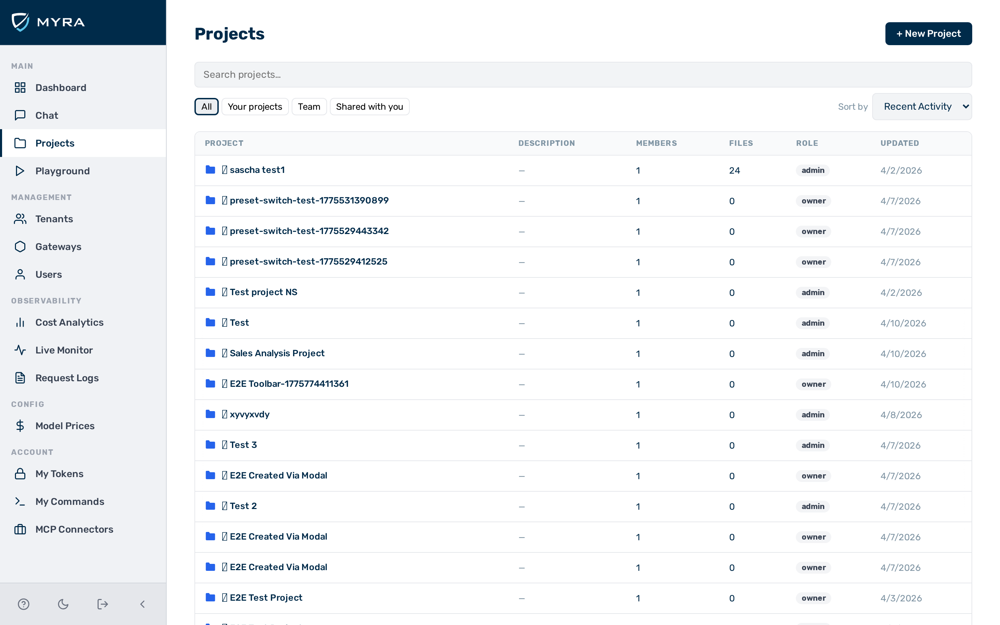
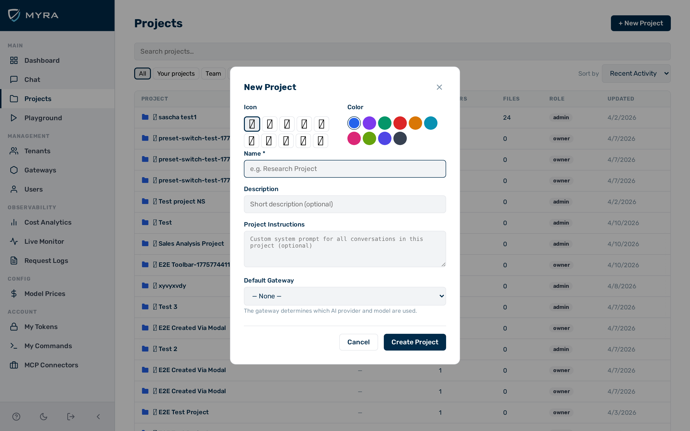

# Projects

*The **Projects** list.*

A project is a workspace that groups conversations under a common context. Each project can have a set of instructions that are automatically prepended to every conversation as a system prompt, a default gateway that determines which AI provider is used, and a library of knowledge files whose contents are injected into every conversation. Projects also have members, so access can be shared with other users.

The **Projects** view is accessible from the **Projects** entry in the left sidebar and is available to all users.

---

## Creating a project

Before you begin, ensure the following conditions are met:

- ☑ You are logged in with the `admin`, `tenant_admin`, or `member` role. (`viewer` accounts cannot create projects.)

*The **New Project** dialog.*

Proceed as follows to create a project:

1. Click on **Projects** in the left sidebar.
   - The **Projects** list opens.
2. Click on the **+ New Project** button.
   - The **New Project** dialog opens.
3. Select an icon for the project by clicking on one of the icon buttons in the **Icon** row.
4. Select a colour for the project by clicking on one of the colour swatches in the **Colour** row.
5. Enter a name for the project in the **Name** text field.
6. If required, enter a short description in the **Description** text field.
7. If required, enter project instructions in the **Project Instructions** text field. The instructions are sent as a system prompt at the start of every conversation in this project.
8. If required, select a gateway from the **Default Gateway** drop-down list. The gateway determines which AI provider and model are used for conversations in this project.
9. Click on the **Create Project** button.

→ The new project appears in the projects list and its detail view opens automatically.

---

## Editing a project

Before you begin, ensure the following conditions are met:

- ☑ You have the `admin` role, or you are a member of the project with the `owner` or `editor` role.

Proceed as follows to edit a project:

1. Click on **Projects** in the left sidebar.
   - The **Projects** list opens.
2. Click on the project you want to edit.
   - The project detail view opens.
3. Click on the pencil button in the project header.
   - The edit form opens in the **Overview** tab.
4. Update the **Name**, **Description**, **Project Instructions**, or **Default Gateway** fields as required.
5. Click on the **Save Changes** button.

→ The updated details are applied immediately to all new conversations in this project.

---

## Deleting a project

Before you begin, ensure the following conditions are met:

- ☑ You have the `admin` role, or you are a member of the project with the `owner` role.

> ⚠️ **Caution:** Deleting a project removes all members and knowledge files permanently. Conversations that were linked to the project are detached but not deleted — they remain accessible in the **Chat** view.

Proceed as follows to delete a project:

1. Click on **Projects** in the left sidebar.
   - The **Projects** list opens.
2. Click on the project you want to delete.
   - The project detail view opens.
3. Click on the trash button in the project header.
   - A confirmation dialog opens.
4. Click on the **Delete Project** button to confirm.

→ The project is permanently deleted. Linked conversations are detached and remain in the **Chat** view without a project context.

---

## Managing knowledge files

Knowledge files are text documents injected into the system prompt of every conversation in the project. Use them to provide background information, reference data, or instructions that all conversations should have access to.

Supported file types: `.txt`, `.md`, `.csv`, `.json`, `.yaml`, `.yml`, `.xml`, `.html`, `.rst`, `.log`. Maximum file size: 5 MB per file.

Before you begin, ensure the following conditions are met:

- ☑ You have the `admin` role, or you are a member of the project with the `owner` or `editor` role.

### Uploading a knowledge file

Proceed as follows to upload a knowledge file:

1. Open the project detail view.
2. Click on the **Knowledge** tab.
   - The **Knowledge Files** panel opens.
3. Click on the **Upload File** button, or drag a file onto the drop zone.
   - If you click on the button, a file browser opens. Select the file you want to upload.
   - If you drag a file, drop it onto the drop zone area.
4. Wait for the upload to complete.

→ The file appears in the knowledge files list. Its contents will be injected into all new conversations in this project.

### Deleting a knowledge file

Proceed as follows to delete a knowledge file:

1. Open the project detail view.
2. Click on the **Knowledge** tab.
   - The **Knowledge Files** panel opens.
3. Click on the trash button in the row of the file you want to remove.
   - A confirmation dialog opens.
4. Confirm the deletion.

→ The file is removed from the project. Existing conversations are not affected; only new conversations will no longer receive the file's contents.

---

## Managing members

Each project has its own member list that controls who can access and interact with the project. Members can have one of three roles:

| **Role** | **Permissions** |
|---|---|
| `owner` | Full control: can edit, delete, manage members, and manage knowledge files |
| `editor` | Can edit project settings and manage knowledge files |
| `viewer` | Can read the project and open conversations; cannot edit |

The user who creates the project is automatically added as `owner`. At least one `owner` must remain at all times.

### Inviting a member

Before you begin, ensure the following conditions are met:

- ☑ You have the `admin` role, or you are a member of the project with the `owner` role.
- ☑ The user you want to invite already has an account. See [Users](users.md) to create an account.

Proceed as follows to invite a member:

1. Open the project detail view.
2. Click on the **Members** tab.
   - The members list opens.
3. Click on the **+ Invite Member** button.
   - The **Invite Member** dialog opens.
4. Enter the email address of the user in the **Email address** text field.
5. Select a role from the **Role** drop-down list.
6. Click on the **Invite** button.

→ The user appears in the members list with the selected role.

### Removing a member

Before you begin, ensure the following conditions are met:

- ☑ You have the `admin` role, or you are a member of the project with the `owner` role.
- ☑ The member you want to remove is not the last `owner` of the project.

Proceed as follows to remove a member:

1. Open the project detail view.
2. Click on the **Members** tab.
   - The members list opens.
3. Click on the **Remove** button in the row of the member you want to remove.

→ The member no longer has access to the project.

> 💡 **Note:** You cannot remove the last `owner` of a project. Assign another member as `owner` first.

---

## Opening a project in Chat

Proceed as follows to start a conversation within a project:

1. Open the project detail view.
2. Click on the **Open Chat** button in the project header.

→ The **Chat** view opens with the project pre-selected. All new conversations started from this view are linked to the project and use the project instructions and default gateway.

---

## Project feed

The **Feed** tab in the project detail view shows conversations that members have shared with the project. Sharing a conversation makes it visible to all project members in the feed.

### Sharing a conversation to the feed

Before you begin, ensure the following conditions are met:

- ☑ The conversation was started in the context of this project (via **Open Chat** from the project detail view).

Proceed as follows to share a conversation to the project feed:

1. Open the conversation in Chat.
2. Click the **Share to project** button in the configuration bar.

→ The conversation appears in the project **Feed** tab and is visible to all project members.

### Removing a conversation from the feed

Proceed as follows to remove a conversation from the project feed:

1. Open the conversation in Chat.
2. Click the **Share to project** button again to toggle it off.

→ The conversation is removed from the feed. The conversation itself is not deleted.

### Viewing the feed

Proceed as follows to view the project feed:

1. Open the project detail view.
2. Click the **Feed** tab.

→ All conversations shared to the project are listed, ordered by the time they were shared.

---

## See also

- [Chat](chat.md)
- [Gateways](../configuration/gateway-config.md)
- [Users](users.md)
