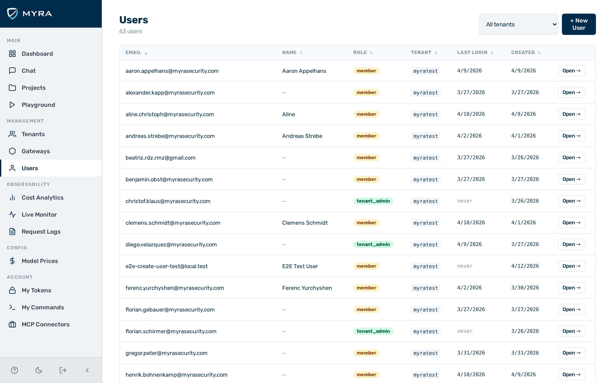
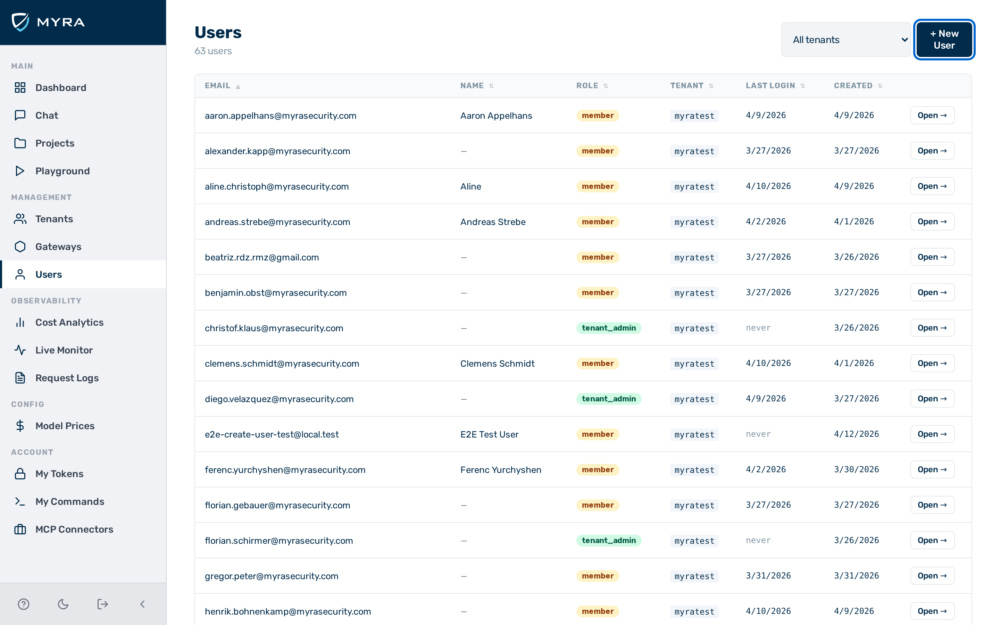
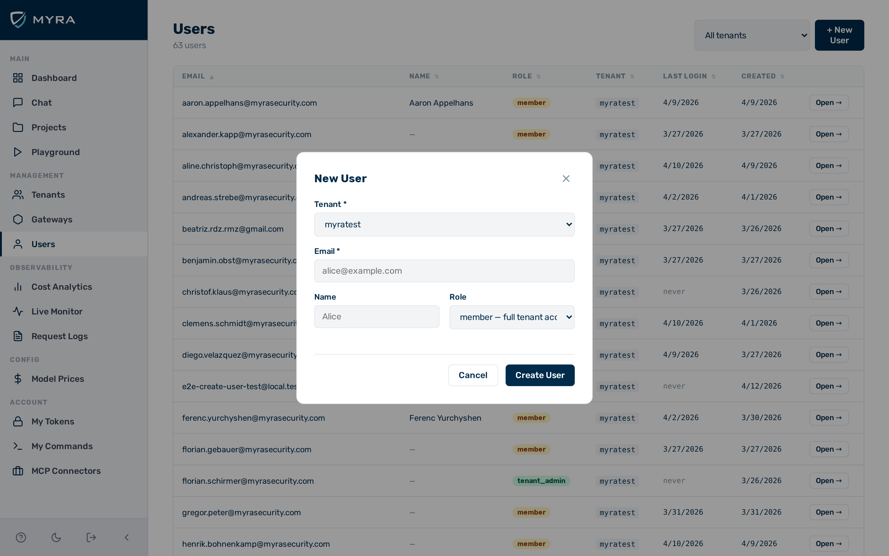

# User management

## View: Users

*View: Users*

The **Users** view lists all user accounts accessible to the currently logged-in administrator. `admin` users see accounts across all tenants, including global admin accounts. `tenant_admin` users see only accounts within their own tenant.

The view is accessible from the **Users** entry in the sidebar. It is visible only to users with the `admin` or `tenant_admin` role.

The table shows the following columns:

| Column | Description |
|---|---|
| Email | The email address of the user |
| Name | The display name of the user, if set |
| Role | `admin`, `tenant_admin`, `member`, or `viewer` |
| Tenant | The tenant the user belongs to |
| Last Login | The timestamp of the user's most recent login, if any |
| Created | The account creation timestamp |

All column headers are sortable. Click a header to sort ascending; click the same header again to sort descending. The active sort column shows a ▲ (ascending) or ▼ (descending) indicator next to the header label. Sorting is applied server-side.

Clicking a row opens the user detail panel for that user.

---

## Access control

| Role | Can access Users view | Can manage other users |
|---|---|---|
| `admin` | Yes — all tenants | Yes |
| `tenant_admin` | Yes — own tenant | Yes (own tenant only) |
| `member` | No | — |
| `viewer` | No | — |

---

## Creating a user

Before you begin, ensure the following conditions are met:

- ☑ You have the `admin` or `tenant_admin` role.

*The **+ New User** button in the **Users** view.*

Proceed as follows to create a user:

1. Click the **+ New User** button.
   - The **New User** dialog opens.

*The **New User** dialog.*

2. Enter the email address of the user in the **Email** text field.
3. If required, enter a display name in the **Name** text field.
4. Select a role from the **Role** drop-down list.
5. Click the **Create User** button.

→ The new user appears in the table and can immediately log in via the [login page](authentication.md).

---

## Editing a user

Before you begin, ensure the following conditions are met:

- ☑ You have the `admin` or `tenant_admin` role.

Proceed as follows to edit a user:

1. Click the row for the user you want to edit.
   - The user detail panel opens.
2. Click the **Edit** button.
   - The edit form opens.
3. Update the **Email** text field, the **Name** text field, or the **Role** drop-down list as required.
   - `admin` users can additionally select a different tenant from the **Tenant** drop-down list. `tenant_admin` users cannot change a user's tenant.
4. Click the **Save** button.

→ The updated details appear in the user table.

---

## Deleting a user

Before you begin, ensure the following conditions are met:

- ☑ You have the `admin` or `tenant_admin` role.

> ⚠️ **Caution:** Deleting a user revokes all inference tokens associated with that user immediately.

Proceed as follows to delete a user:

1. Click the row for the user you want to delete.
   - The user detail panel opens.
2. Click the **Delete User** button.

→ The user is removed immediately. All inference tokens associated with that user are revoked.

---

## Managing tokens for a user

Open the user detail panel to view, create, and revoke inference tokens for that user. For the full token management workflow, see [My tokens](my-tokens.md). For the underlying API endpoints, see [Users & Tokens API](../api-reference/users-tokens.md).

> 💡 **Note:** `member` users can manage their own tokens without administrator assistance via [My tokens](my-tokens.md).
