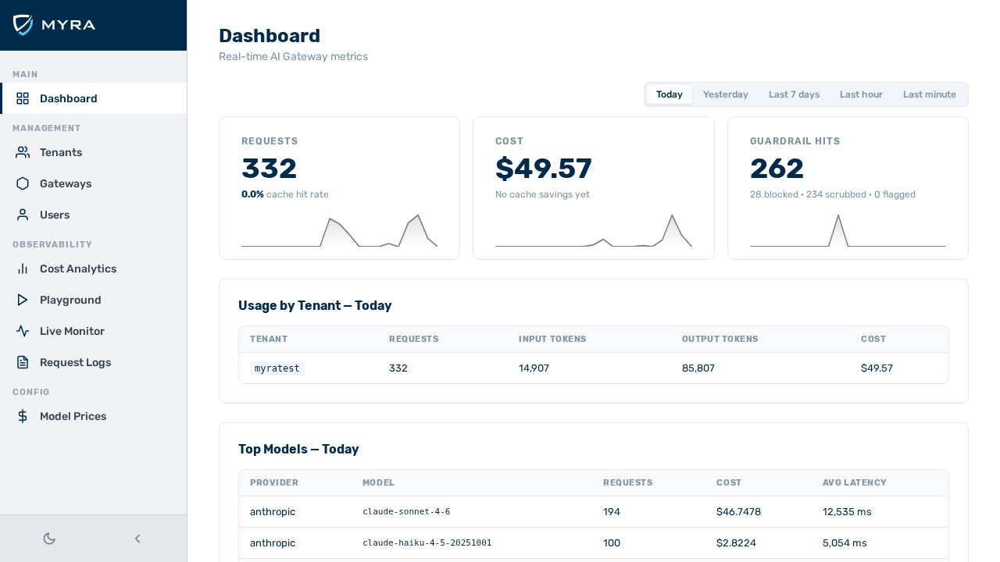

# Start page and GUI structure

*View: Dashboard*

The AI Gateway admin panel is a browser-based interface. After logging in, the panel opens at the **Dashboard** view. All other views are accessible from the main navigation sidebar on the left side of the screen.

---

## Layout

The admin panel has three structural areas:

| Area | Description |
|---|---|
| **Sidebar** | The main navigation. Present on every view. Lists all available views grouped by function. |
| **Main area** | The content area to the right of the sidebar. Displays the active view. |
| **Account section** | At the bottom of the sidebar. Contains links to **My tokens** and account settings for the currently logged-in user. |

---

## Main navigation

The sidebar groups views into the following sections:

### Overview

| View | Description |
|---|---|
| **Dashboard** | A summary of gateway activity, request counts, costs, and system status. |

### AI tools

| View | Description |
|---|---|
| **Chat** | A persistent, multi-turn conversation interface that routes messages through the gateway. |

### Administration

| View | Description |
|---|---|
| **Users** | Lists all users within the accessible scope. Allows creating, editing, and deleting user accounts. Visible to `admin` and `tenant_admin` roles only. |
| **Gateways** | Lists and manages gateways within the accessible scope. |
| **Tenants** | Lists and manages tenants. Visible to `admin` role only. |

### Observability

| View | Description |
|---|---|
| **Live Monitor** | A real-time stream of requests passing through the gateway. |
| **Logs** | A searchable, filterable record of all past requests. |
| **Playground** | A side-by-side multi-model comparison interface without conversation history. |

### Account

| View | Description |
|---|---|
| **My tokens** | Self-service management of personal inference tokens for the currently logged-in user. |

---

## View visibility by role

Not all views are visible to all users. The sidebar shows only the views the current user has access to.

| View | `admin` | `tenant_admin` | `member` | `viewer` |
|---|---|---|---|---|
| Dashboard | Yes | Yes | Yes | Yes |
| Chat | Yes | Yes | Yes | Yes |
| Users | Yes | Yes | No | No |
| Gateways | Yes | Yes | No | No |
| Tenants | Yes | No | No | No |
| Live Monitor | Yes | Yes | No | No |
| Logs | Yes | Yes | No | No |
| Playground | Yes | Yes | Yes | No |
| My tokens | Yes | Yes | Yes | No |

---

## Moving between views

Click any entry in the sidebar to navigate to that view. The active view is highlighted in the sidebar. No page reload occurs — the panel uses client-side navigation.

To return to the dashboard from any view, click the **Dashboard** entry at the top of the sidebar, or click the product logo at the top of the sidebar.

---

## See also

- [Logging in](authentication.md) — how to authenticate and what roles exist
- [User management](users.md) — managing user accounts
- [My tokens](my-tokens.md) — creating and revoking inference tokens
- [Chat](chat.md) — using the conversation interface
