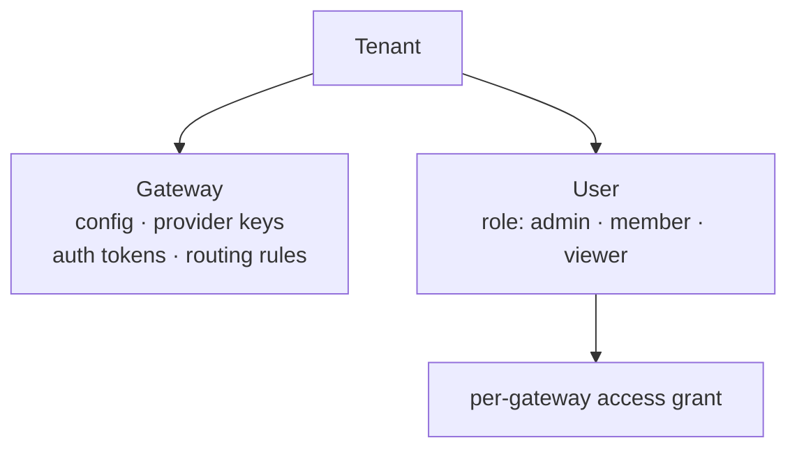

# Multi-Tenancy

AI Gateway organizes everything into two levels: **tenants** and **gateways**.

A **tenant** is your top-level account — typically one company, application, or team. A **gateway** is a named deployment inside a tenant, such as `production` or `staging`. Each gateway has its own API keys, auth tokens, rate limits, and routing rules — completely isolated from every other gateway.

Most organizations start with one tenant and one or two gateways (e.g. `production` + `development`). You'd create additional tenants if you need to provide the gateway service to separate customers or business units with billing isolation between them.

AI Gateway can serve many tenants and gateways from a single process, with hard isolation boundaries between them.

---

## Object hierarchy



A **Tenant** is the top-level billing and isolation boundary. Each tenant can have multiple **Gateways** — each gateway is an independent policy domain with its own config, keys, tokens, and rules.

**Users** belong to a tenant and are granted per-gateway access. Their role (`admin`, `member`, or `viewer`) determines what they can do across all gateways in the tenant.


---

## URL routing

Every inference request encodes the tenant and gateway in the URL path:

```
POST /v1/{tenant_slug}/{gateway_slug}/{provider}/chat/completions
POST /v1/{tenant_slug}/{gateway_slug}/compat/chat/completions
```

The gateway resolves `{tenant_slug}` and `{gateway_slug}` on every request and loads the corresponding gateway config. Configuration changes take effect within seconds.

---

## Isolation mechanisms

| Boundary | Mechanism |
|----------|-----------|
| URL routing | `{tenant_slug}/{gateway_slug}` prefix resolved on every request; unknown slugs return `404 TENANT_NOT_FOUND` |
| Internal state isolation | All internal state is namespaced per tenant and gateway — no cross-tenant data leakage is possible |
| Database | `tenant_id` foreign key on all tables; all queries filter by tenant |
| BYOK keys | Encrypted at rest; decrypted only for the matching gateway at request time |
| Auth tokens | Scoped to a single gateway; a token issued for gateway A is rejected on gateway B |
| Rate limits and budgets | Tracked per gateway, not shared across tenants or gateways |

---

## User roles

| Role | Inference requests | Admin operations |
|------|-------------------|-----------------|
| `admin` | Yes, on all gateways in the tenant | Full CRUD on tenant, gateways, users, tokens, rules, keys |
| `member` | Yes, on gateways explicitly assigned to them | None |
| `viewer` | No — returns `403 FORBIDDEN` | None |

Role is enforced at the authentication step. A `viewer` token is rejected before the request body is read.

Per-user gateway access is managed via the admin API:

```bash
# Grant a user access to a specific gateway
curl -X POST "https://<your-gateway-host>/admin/v1/users/{user_id}/gateways/{gw_id}"

# Revoke access
curl -X DELETE "https://<your-gateway-host>/admin/v1/users/{user_id}/gateways/{gw_id}"
```

Deleting a user immediately disables all of their auth tokens.

---

## Auth tokens

Tokens are scoped to a single gateway and carry optional per-token overrides:

| Field | Description |
|-------|-------------|
| `label` | Human-readable name, e.g., `"ci-pipeline"` |
| `expiration` | ISO-8601 timestamp; requests after this date return `401` |
| `rate_limit` | `{"requests": N, "window_sec": S}` — overrides gateway-level rate limit |
| `budget_usd` | Per-token spending cap; takes precedence over gateway-level budget |
| `user_id` | Optional binding to a user; recorded in request logs |

Token values are stored as a one-way hash. The plaintext token is shown only once at creation time — it cannot be recovered.

---

## See also

- [Authentication](../security/authentication.md) — token acceptance order, role enforcement
- [BYOK Key Vault](../security/byok.md) — per-gateway provider key encryption
- [Request Pipeline](request-pipeline.md) — where tenant resolution happens in the chain
- [Admin REST API — Tenants & Gateways](../api-reference/tenants-gateways.md)
