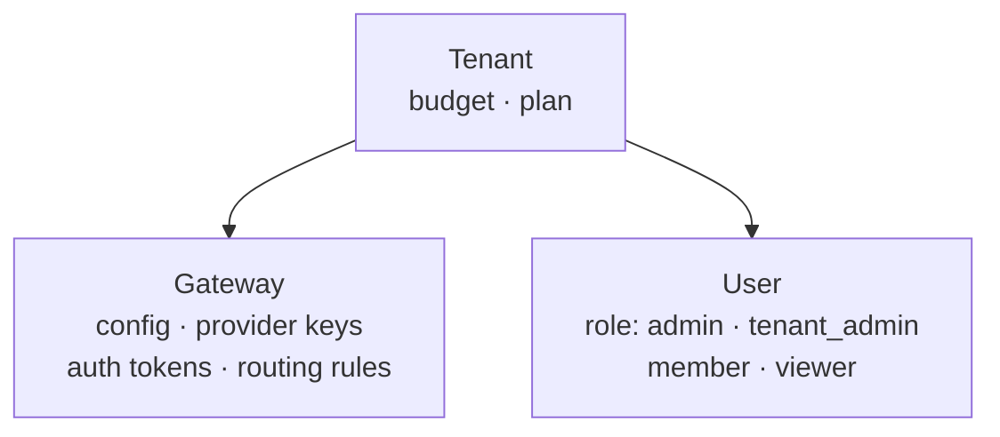
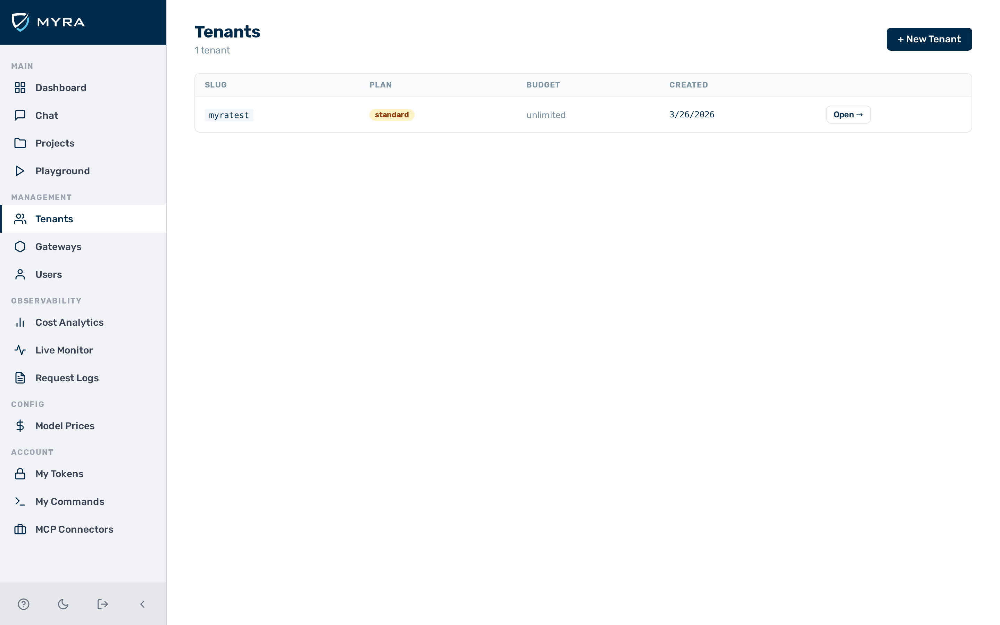

# Multi-tenancy

AI Gateway by Myra Security organises everything into two levels: **tenants** and **gateways**.

A **tenant** is the top-level account — typically one company, application, or team. A **gateway** is a named deployment inside a tenant, such as `production` or `staging`. Each gateway has its own API keys, auth tokens, rate limits, and routing rules, completely isolated from every other gateway.

Most organisations start with one tenant and one or two gateways (e.g. `production` and `development`). Additional tenants are appropriate when you need to provide the gateway service to separate customers or business units with billing isolation between them.

AI Gateway serves many tenants and gateways from a single process, with hard isolation boundaries between them.

---

## Object hierarchy



A **Tenant** is the top-level grouping for users and gateways. Each tenant can have multiple **Gateways** — each gateway is an independent policy domain with its own config, keys, tokens, and rules.

**Users** belong to a tenant. The role of a user determines what the user can do within that tenant.



---

## URL routing

Every inference request encodes the tenant and gateway in the URL path:

```
POST /v1/{tenant_slug}/{gateway_slug}/{provider}/chat/completions
POST /v1/{tenant_slug}/{gateway_slug}/compat/chat/completions
```

The gateway resolves `{tenant_slug}` and `{gateway_slug}` on every request and loads the corresponding gateway config. Configuration changes take effect within seconds.

---

## Isolation mechanisms

| **Boundary** | **Mechanism** |
|--------------|---------------|
| URL routing | `{tenant_slug}/{gateway_slug}` prefix resolved on every request; unknown slugs return `404 TENANT_NOT_FOUND` |
| Internal state isolation | All internal state is namespaced per tenant and gateway — no cross-tenant data leakage is possible |
| Storage | All data is strictly scoped to the owning tenant at the storage layer; cross-tenant access is not possible |
| BYOK keys | Encrypted at rest; decrypted only for the matching gateway at request time |
| Auth tokens | Scoped to a single gateway; a token issued for gateway A is rejected on gateway B |
| Rate limits and budgets | Tracked per gateway, not shared across tenants or gateways |

---

## User roles

| **Role** | **Inference requests** | **Admin operations** |
|----------|----------------------|----------------------|
| `admin` | Yes, on all gateways (platform-wide) | Full CRUD on all tenants, gateways, users, tokens, rules, keys |
| `tenant_admin` | Yes, on all gateways in their tenant | Full access within their tenant; manages users and tenant settings |
| `member` | Yes, on all gateways in their tenant | Full access within their tenant |
| `viewer` | No — returns `403 FORBIDDEN` | Read-only within their tenant |

Role is enforced at the authentication step. A `viewer` token is rejected before the request body is read.

Deleting a user immediately disables all auth tokens of that user.

---

## Auth tokens

Tokens are scoped to a single gateway and carry optional per-token overrides:

| **Field** | **Description** |
|-----------|-----------------|
| `label` | Human-readable name, e.g. `"ci-pipeline"` |
| `expiration` | Unix timestamp (seconds since epoch); requests after this date return `401` |
| `rate_limit` | `{"requests": N, "window_sec": S}` — overrides gateway-level rate limit |
| `budget_usd` | Per-token spending cap; takes precedence over gateway-level budget |
| `user_id` | Optional binding to a user; recorded in request logs |

Token values are stored as a one-way hash. The plaintext token is shown only once at creation time — it cannot be recovered.

> ⚠️ **Caution:** Store the token value immediately after creation. The plaintext token is displayed only once and cannot be retrieved again.

---

## See also

- [Authentication](../security/authentication.md) — token acceptance order, role enforcement
- [BYOK Key Vault](../security/byok.md) — per-gateway provider key encryption
- [Request pipeline](request-pipeline.md) — where tenant resolution happens in the chain
- [Admin REST API — Tenants and gateways](../api-reference/tenants-gateways.md)
