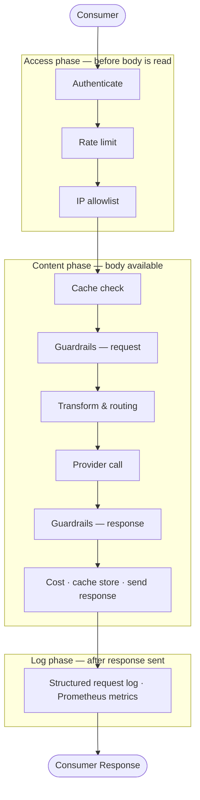

# Request Pipeline

Every request to the gateway passes through three processing phases. Each phase either short-circuits — returning a response to the client immediately — or passes the request to the next step.

---

## Phase overview

---

## Access phase

Runs before the request body is read. A rejection here is low-cost.

### Authentication

Accepts a token from (in priority order):

1. `x-aig-token` header
2. `Authorization: Bearer <token>`
3. `x-api-key` header (Anthropic SDK compatibility)

Returns `401 UNAUTHORIZED` if no valid token is found, `403 FORBIDDEN` if the token's role does not permit inference requests. Skipped when the gateway's `auth_required` is `false`.

### Rate limiting

Enforces the sliding-window request limit configured on the gateway or per-token. Returns `429 RATE_LIMITED` with `X-RateLimit-Limit`, `X-RateLimit-Remaining`, and `X-RateLimit-Reset` headers.

### IP allowlist

Checks the client IP against the gateway's `ip_allowlist` CIDR list. An empty list allows all traffic. Returns `403 FORBIDDEN` on mismatch.

---

## Content phase

Has access to the full request body.

### Cache check

Looks up the request in the exact-match response cache. On a hit, returns the stored response immediately with `X-AIG-Cache: HIT` — the provider is never called. See [Response Caching](caching.md).

### Guardrails (request)

Two-tier guardrail pipeline runs against the outbound request body:

- **Tier 1** (in-process, sub-millisecond): regex and keyword guardrails
- **Tier 2** (HTTP sidecar, milliseconds): NLP PII Detector, Prompt Guard, PII Protector — only if Tier 1 passes

A `block` verdict returns a synthetic error response to the client. `scrub` replaces matched content. `flag` records the match in the log. See [Guardrail Pipeline](../security/guardrails.md).

### Routing

Evaluates the ordered routing rules. The first matching rule wins and can override the provider, model, and fallback chain. If no rule matches, the provider and model from the request URL are used.

### Provider call

Makes the HTTP call to the upstream provider. On a 5xx response, retries up to `retry_count` times (default: 2 total attempts). If all retries fail, walks the fallback chain. Returns `502 ALL_PROVIDERS_FAILED` if every option is exhausted.

4xx responses from the provider are returned to the client immediately with no retry.

For streaming requests (`"stream": true`), SSE chunks are flushed to the client as they arrive.

### Guardrails (response)

Runs the guardrail pipeline against the inbound provider response before forwarding it to the client. Blocked responses are never sent to the client.

### Cost accounting

Extracts token counts from the provider response and computes the request cost. Increments the budget counter. See [Cost Attribution](cost-attribution.md).

### Cache store

Persists non-streaming 200 responses to the cache when `cache_ttl > 0`.

---

## Log phase

Runs after the response has been sent. Failures here do not affect the client.

Writes a structured log entry containing identity, routing, status, cache state, token counts, cost, timing, guardrail results, and custom metadata. Payload logging can be suppressed per gateway (`log_payloads: false`) or per request (`x-aig-collect-log-payload: false`). The log entry can be skipped entirely with `x-aig-collect-log: false`.

---

## See also

- [Multi-Tenancy](multi-tenancy.md) — how tenant and gateway resolution works
- [Response Caching](caching.md) — cache key construction and TTL configuration
- [Routing Rules](../routing/routing-rules.md) — rule engine conditions and actions
- [Cost Attribution](cost-attribution.md) — token counting and pricing lookup
