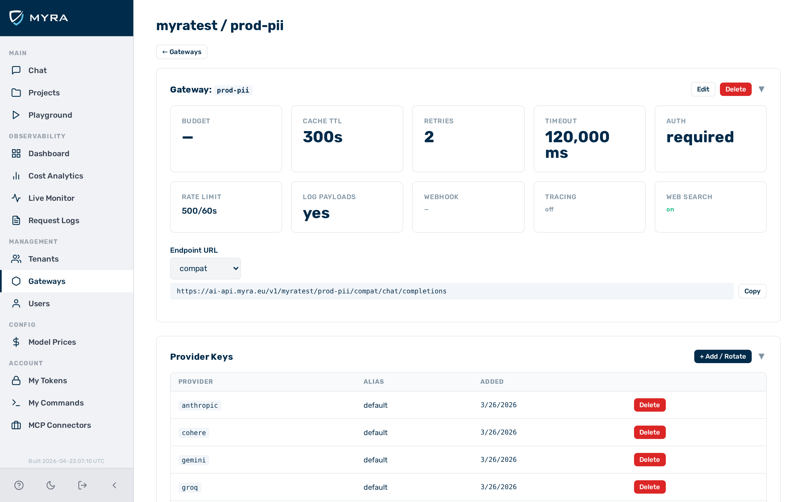
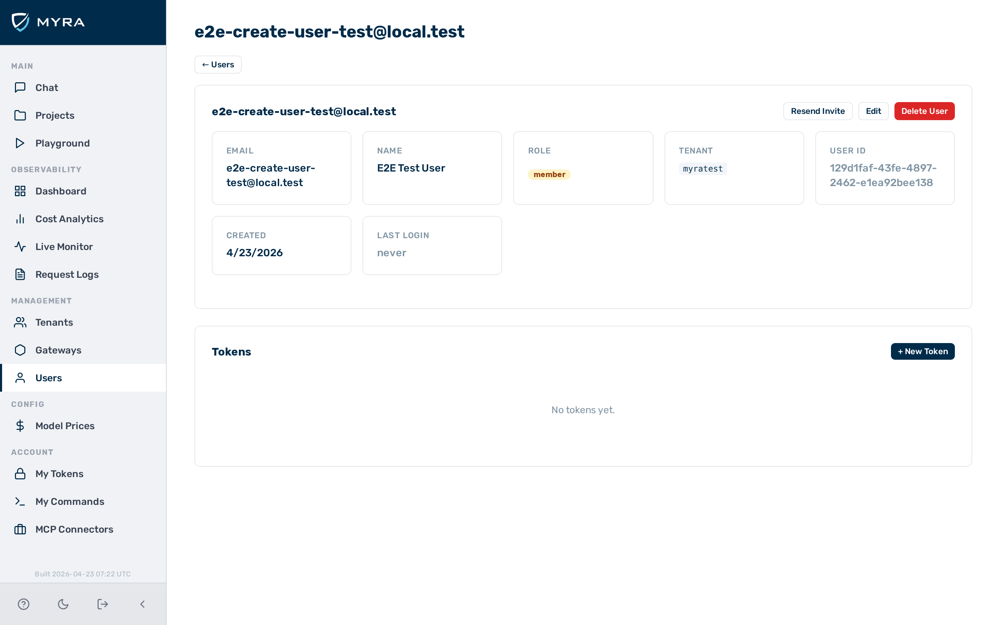

# Budget and quota enforcement

The gateway tracks cumulative spend per token, per tenant, and per gateway, and blocks requests once a configured budget is exhausted. Budgets provide hard cost caps on individual clients, tenants, or entire gateways.

## Budget hierarchy

Three budget levels exist and are evaluated in order: per-token → per-tenant → per-gateway.

1. **Per-token budget** — tracks spend for one specific auth token. If the token budget is exhausted, the request is blocked regardless of the other budget levels.
2. **Per-tenant budget** — tracks aggregate spend for all requests across a tenant (all gateways belonging to that tenant). Set via the `tenant_budget_usd` field in the gateway config. Blocks requests for the entire tenant when exhausted.
3. **Per-gateway budget** — tracks aggregate spend across all tokens on one gateway. Acts as a hard cap for that gateway as a whole.

All three levels are independent. A request must pass all applicable checks before reaching the provider. Setting any level to `null` disables that level's budget enforcement.

## Budget periods

Each budget level has a configurable period — the window over which spend is accumulated. At the start of each new period, spend resets automatically with no manual action required.

| **Config field** | **Scope** | **Default** | **Options** |
|---|---|---|---|
| `budget_period` | Gateway | `monthly` | `daily`, `monthly`, `total` |
| `tenant_budget_period` | Tenant | `monthly` | `daily`, `monthly`, `total` |
| `token_budget_period` | Token (auth token) | `monthly` | `daily`, `monthly`, `total` |

| **Value** | **Resets** | **Use case** |
|---|---|---|
| `daily` | Each calendar day at midnight UTC | Per-day spend caps for high-volume tenants |
| `monthly` | First day of each calendar month | Standard billing-period enforcement (default) |
| `total` | Never — lifetime accumulation | One-time spend allowances, trial accounts |

!!! note
    Automatic period reset is distinct from a manual budget reset, which clears accumulated spend immediately. Manual resets are available for one-off corrections.

## Cost calculation

Cost is computed from the token usage returned in the provider response (prompt tokens + completion tokens) combined with per-model pricing data maintained by the gateway.

Spend is incremented after each successful inference response. Streaming responses increment spend when the final chunk is processed and usage data is available.

!!! note
    Cost data depends on the gateway's internal model pricing table. If a model's pricing is not known, spend may not be tracked for that model. Check the model list endpoint to confirm pricing coverage.

## QUOTA_EXCEEDED response

When a budget is exhausted, the gateway returns `HTTP 429` with an actionable message that identifies the scope that triggered the block and the exact API call needed to resolve it.

**Token budget exhausted**

```json
{
  "error": {
    "code": "QUOTA_EXCEEDED",
    "message": "Token budget $10.0000 exceeded (spent $10.0023).\n
      Adjust budget_usd on the auth token (PATCH /admin/v1/tokens/{id})\n
      or reset spend (DELETE /admin/v1/tokens/{id}/budget)."
  }
}
```

**Tenant budget exhausted**

```json
{
  "error": {
    "code": "QUOTA_EXCEEDED",
    "message": "Tenant budget $50.0000 exceeded (spent $50.0041).\n
      Adjust budget_usd on the tenant (PATCH /admin/v1/tenants/{id})\n
      or reset spend (DELETE /admin/v1/tenants/{id}/budget)."
  }
}
```

**Gateway budget exhausted**

```json
{
  "error": {
    "code": "QUOTA_EXCEEDED",
    "message": "Gateway budget $200.0000 exceeded (spent $200.0019).\n
      Adjust budget_usd in the gateway config (PATCH /admin/v1/gateways/{id})\n
      or reset spend (DELETE /admin/v1/gateways/{id}/budget)."
  }
}
```

The message always includes the configured budget, the current spend, and two corrective actions: increase the budget or reset spend for the current period.

## Best practices

| **Scenario** | **Recommendation** |
|---|---|
| Absolute cost cap for the gateway | Set `gateway.budget_usd`; reset monthly. |
| Per-client spend limit | Set `budget_usd` on each client's token. |
| Development / internal use | Leave budget `null`; rely on rate limiting instead. |
| Multi-tenant with shared cap | Use gateway budget as the shared ceiling; per-token for individual client limits. |

!!! note
    The gateway budget and per-token budget are not linked. Exhausting the gateway budget blocks all requests even if individual token budgets have remaining balance.

---

## Configuring a gateway budget

Before you begin, ensure the following conditions are met:

- You are logged in as a user with the `admin` role.


*The **Budget (USD)** field in the gateway **Config** tab.*

Proceed as follows to configure a gateway budget:

1. Click on **Gateways** in the left sidebar.
   - The **Gateways** list opens.
2. Click on the gateway.
   - The gateway detail view opens.
3. Click on the **Config** tab.
   - The configuration form opens.
4. Enter the spend cap in the **Budget (USD)** text field.
5. Click on the **Save** button.
   - The gateway budget is applied to all requests through the gateway.

-> The gateway enforces the budget. Requests are blocked once the configured spend cap is reached.

---

## Configuring a per-token budget

Before you begin, ensure the following conditions are met:

- You are logged in as a user with the `admin` role.


*The **Budget (USD)** field in the token dialog.*

Proceed as follows to configure a per-token budget:

1. Click on **Users** in the left sidebar.
   - The **Users** list opens.
2. Click on the user.
   - The user detail view opens.
3. Create or open a token.
   - The token dialog opens.
4. Enter the spend cap in the **Budget (USD)** text field.
5. Click on the **Save** button.
   - The budget is applied to all requests authenticated with that token.

-> The token budget is active immediately. Requests using that token are blocked once the spend cap is reached.

---

## Resetting a budget

Use the reset action to clear accumulated spend so that requests can resume. Resetting is useful when correcting an over-run or starting a new billing period manually.

!!! warning
    Budget resets are immediate and irreversible. There is no confirmation step. Automate resets with care.

### Resetting a gateway budget


*The **Reset budget** button in the gateway **Config** tab.*

Proceed as follows to reset a gateway budget:

1. Click on **Gateways** in the left sidebar.
   - The **Gateways** list opens.
2. Click on the gateway.
   - The gateway detail view opens.
3. Click on the **Config** tab.
   - The configuration form opens.
4. Click on the **Reset budget** button.
   - Accumulated spend for the current period is cleared.

-> The gateway spend counter resets to zero. Requests are accepted again up to the configured budget cap.

### Resetting a user token budget


*The **Reset budget** action in the **Users** module.*

Proceed as follows to reset a user token budget:

1. Click on **Users** in the left sidebar.
   - The **Users** list opens.
2. Click on the user.
   - The user detail view opens.
3. Click on the **Reset budget** action for the token.
   - Accumulated spend for that token is cleared.

-> The token spend counter resets to zero. Requests authenticated with that token are accepted again up to the configured budget cap.

---

## API

Budget fields and reset endpoints are part of the gateway and user APIs. See [Tenants & Gateways API](../api-reference/tenants-gateways.md) and [Users & Tokens API](../api-reference/users-tokens.md) for examples.

## See also

- [Rate Limiting](rate-limiting.md)
- [Gateway Configuration](gateway-config.md)
- [Authentication & Tokens](../security/authentication.md)
- [API Reference: Users & Tokens](../api-reference/users-tokens.md)
