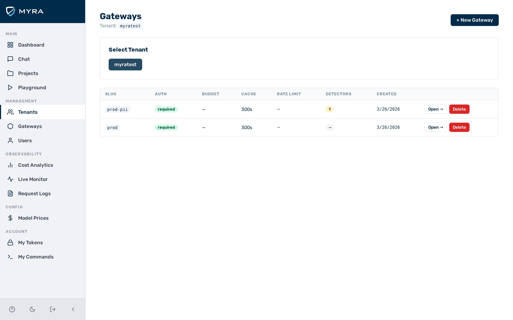
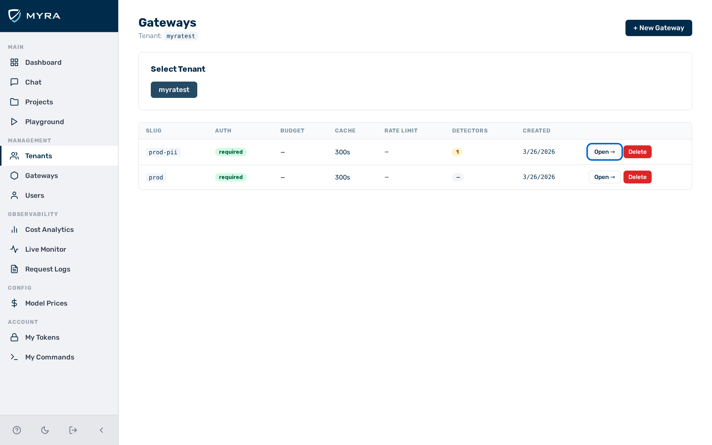
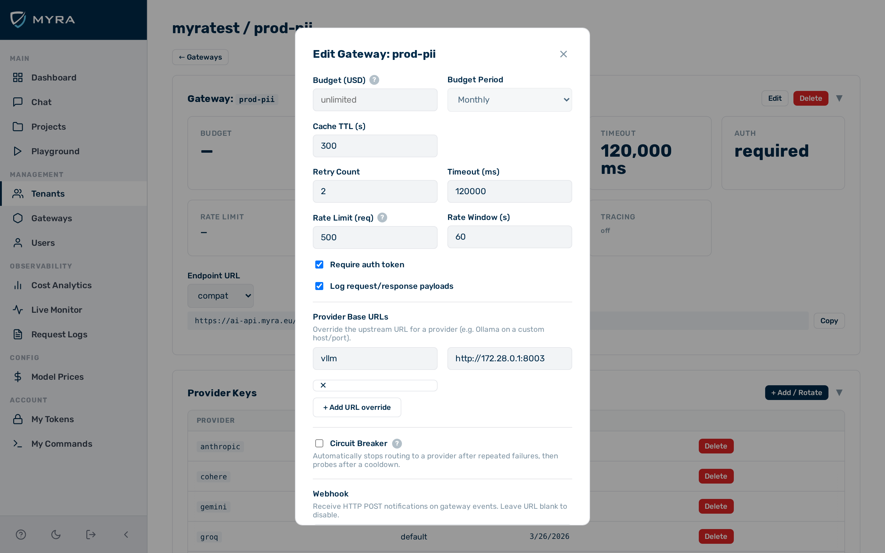

# Gateways


*The **Gateways** list.*

A gateway is the central routing object in AI Gateway by Myra Security. Each gateway exposes an inference endpoint, enforces security policies, and routes requests to one or more AI providers. Every gateway belongs to a tenant and can be configured with caching, timeouts, security rules, routing logic, and provider-specific settings.

The **Gateways** view is accessible from the **Gateways** entry in the sidebar. It is visible only to users with the `admin` role.

---

## Creating a gateway

Before you begin, ensure the following conditions are met:

- ☑ You are logged in as a user with the `admin` role.


*The **New Gateway** button in the **Gateways** list.*

► Proceed as follows to create a gateway:

1. Click on **Gateways** in the left sidebar.
   - The **Gateways** list opens.
2. Click on the **New Gateway** button.
   - The **New Gateway** dialog opens.
3. Enter a name for the gateway in the **Name** text field.
4. Select the primary provider from the **Provider** drop-down list.
5. If required, expand the **Advanced** section and adjust the configuration fields. See [Gateway settings reference](#gateway-settings-reference) for a description of each field.
6. Click on the **Save** button.

→ The new gateway appears in the list of gateways and is active immediately.

---

## Editing a gateway

Before you begin, ensure the following conditions are met:

- ☑ You are logged in as a user with the `admin` role.


*The gateway **Config** tab.*

► Proceed as follows to edit a gateway:

1. Click on **Gateways** in the left sidebar.
   - The **Gateways** list opens.
2. Click on the gateway you want to edit.
   - The gateway detail view opens.
3. Click on the **Config** tab.
   - The configuration form opens.
4. Change the fields you want to update.
5. If required, proceed as follows to add a provider base URL override:
   - Scroll to the **Provider base URLs** section.
   - Click on the **Add** button.
     - A new row appears.
   - Enter the provider name in the **Provider** text field. For example: `ollama`.
   - Enter the base URL in the **Base URL** text field. For example: `http://192.168.1.50:11434`.
6. Click on the **Save** button.

→ The gateway reflects the new configuration for all subsequent requests.

> 💡 **Note:** To remove a provider base URL override, delete the entry in the **Provider base URLs** section and click on **Save**.

---

## Deleting a gateway

Before you begin, ensure the following conditions are met:

- ☑ You are logged in as a user with the `admin` role.
- ☑ No active client applications are routing traffic through the gateway.

> ⚠️ **Caution:** Deleting a gateway is irreversible. All associated logs, tokens, and configuration are permanently removed.

► Proceed as follows to delete a gateway:

1. Click on **Gateways** in the left sidebar.
   - The **Gateways** list opens.
2. Click on the gateway you want to delete.
   - The gateway detail view opens.
3. Click on the **Settings** tab.
   - The gateway settings open.
4. Click on the **Delete Gateway** button.
   - A confirmation dialog opens.
5. Click on the **Delete** button to confirm.

→ The gateway is permanently deleted and no longer accepts requests.

---

## Gateway settings reference

### Configuration fields

| **Field** | **Type** | **Default** | **Description** |
|---|---|---|---|
| `cache_ttl` | integer | `0` | Response cache TTL in seconds. `0` disables caching. |
| `retry_count` | integer | `2` | Number of retry attempts against the primary provider on 5xx errors before moving to fallbacks. |
| `timeout_ms` | integer | `60000` | Per-request upstream timeout in milliseconds. |
| `log_payloads` | boolean | `true` | Whether to store request and response bodies in the log table. Disable for sensitive workloads. |
| `auth_required` | boolean | `true` | Require a valid auth token on every inference request. Set to `false` only for development. |
| `budget_usd` | number \| null | `null` | Monthly spend cap in USD for this gateway. `null` means no limit. Superseded by per-token budgets. |
| `rate_limit` | object \| null | `null` | Gateway-level rate limit. Example: `{"requests": 100, "window_sec": 60}`. Applied before per-token limits. |
| `ip_allowlist` | array | `[]` | List of CIDR blocks permitted to call this gateway. An empty list allows all sources. |
| `guardrails` | array | `[]` | Ordered list of guardrail configs (`regex`, `keyword`, `presidio`, `prompt_guard`, `pii_protector`). |
| `azure_endpoint` | string \| null | `null` | Azure OpenAI resource endpoint, e.g. `https://myresource.openai.azure.com`. |
| `azure_deployment` | string \| null | `null` | Azure deployment name. Overrides the model name in the request path. |
| `azure_api_version` | string | `"2024-02-01"` | Azure OpenAI API version query parameter. |
| `bedrock_region` | string | `"us-east-1"` | AWS region used for Bedrock requests. |
| `vertex_project` | string \| null | `null` | Google Cloud project ID for Vertex AI. |
| `vertex_region` | string | `"us-central1"` | Google Cloud region for Vertex AI. |
| `provider_base_urls` | object | `{}` | Map of `provider → base URL` for overriding default provider endpoints. |
| `tracing` | object \| null | `null` | Request tracing configuration. See [Distributed tracing](../observability/tracing.md). |
| `web_search` | object \| null | `null` | Web search augmentation settings. See [Web search](../features/web-search.md). |

### Default configuration

```json
{
  "cache_ttl": 0,
  "retry_count": 2,
  "timeout_ms": 60000,
  "log_payloads": true,
  "auth_required": true,
  "budget_usd": null,
  "rate_limit": null,
  "ip_allowlist": [],
  "guardrails": [],
  "azure_endpoint": null,
  "azure_deployment": null,
  "azure_api_version": "2024-02-01",
  "bedrock_region": "us-east-1",
  "vertex_project": null,
  "vertex_region": "us-central1",
  "provider_base_urls": {},
  "tracing": null,
  "web_search": null
}
```

### Provider base URLs

The `provider_base_urls` field overrides the default upstream endpoint for any provider on a per-gateway basis. Use it for local Ollama instances, private deployments, or corporate proxies.

The value must be a bare `protocol://host:port` with no trailing slash or path. The gateway appends the standard request path of the provider automatically.

| **Provider** | **Override value** | **When to use** |
|---|---|---|
| `ollama` | `http://localhost:11434` | Ollama running locally on the default port |
| `ollama` | `http://192.168.1.50:11434` | Ollama on another machine in the same network |
| `openai` | `https://proxy.internal/openai` | Corporate proxy in front of the OpenAI API |
| `anthropic` | `http://localhost:4010` | Local mock server for integration tests |

Any of the 21 supported providers can be overridden.

### Per-request header overrides

Certain behaviours can be overridden on individual requests without changing the gateway configuration.

| **Header** | **Type** | **Description** |
|---|---|---|
| `x-aig-byok-alias` | string | Select a non-default BYOK key alias for this request. See [Provider keys (BYOK)](../security/byok.md). |
| `x-aig-meta-{key}` | string | Attach arbitrary metadata to the request log entry. Accessible as `meta:{key}` in routing rule conditions. |
| `x-aig-collect-log` | `"0"` / `"1"` | Override whether this request is written to the log table. `"0"` or `"false"` disables logging. |
| `x-aig-collect-log-payload` | `"0"` / `"1"` | Override whether request/response bodies are stored for this request. |
| `x-aig-provider-{field}` | string | Override a provider-specific field for this request (for example: `x-aig-provider-model`). |

> ⚠️ **Caution:** `x-aig-collect-log-payload: 0` suppresses body storage for that request only. It does not affect the gateway-level `log_payloads` setting for other requests.

---

## API

Gateway configuration can also be updated via the Admin API using a PATCH request. See [Tenants & Gateways API](../api-reference/tenants-gateways.md) for the endpoint reference and examples.

## See also

- [Rate limiting](rate-limiting.md)
- [Budgets](budgets.md)
- [Guardrails](../security/guardrails.md)
- [Provider keys (BYOK)](../security/byok.md)
- [Routing rules](../routing/routing-rules.md)
