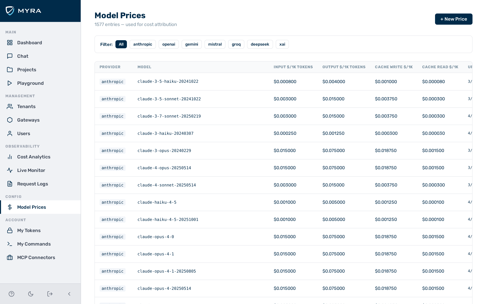
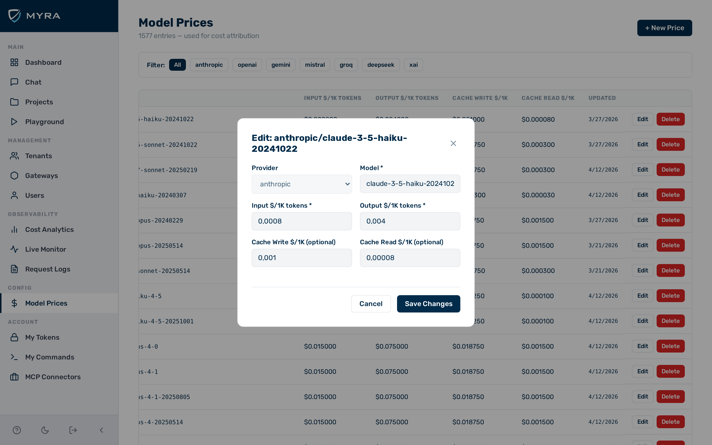

# Model prices

The **Model Prices** page lets administrators view and maintain the per-model pricing table that the gateway uses for cost attribution. Pricing data converts token counts into USD spend values shown throughout the dashboard, analytics, and budget enforcement.

Navigate to **Model Prices** in the left sidebar (visible to `admin` users only).

## How model prices affect cost attribution

The gateway looks up model prices at log-write time for every inference response. If a model has no entry in this table, the gateway falls back to built-in default prices where available. Requests to models with no matching price and no built-in fallback are logged with `cost_usd = 0` and do not count against budgets.

See [Cost Attribution](../concepts/cost-attribution.md) for details on how token counts and prices combine to produce the final cost value.

## Price table columns

| **Column** | **Description** |
|---|---|
| **Provider** | Provider slug (e.g. `openai`, `anthropic`) |
| **Model** | Model name as used in inference requests |
| **Input / 1K** | Cost in USD per 1,000 input (prompt) tokens |
| **Output / 1K** | Cost in USD per 1,000 output (completion) tokens |
| **Cache Write / 1K** | Cost per 1,000 tokens written to the provider-side prompt cache (optional) |
| **Cache Read / 1K** | Cost per 1,000 tokens read from the provider-side prompt cache (optional) |
| **Updated** | Timestamp of the last price update |

---

## Adding a model price

Before you begin, ensure the following conditions are met:

- You are logged in as a user with the `admin` role.


*The **Model Prices** page.*

Proceed as follows to add a model price:

1. Click on **Model Prices** in the left sidebar.
   - The **Model Prices** page opens.
2. Click on the **+ New Price** button.
   - The **New Price** dialog opens.
3. Select the provider from the **Provider** drop-down list.
4. Enter the model name in the **Model** text field. Use the exact name as sent in inference requests.
5. Enter the USD price per 1,000 input tokens in the **Input / 1K** text field.
6. Enter the USD price per 1,000 output tokens in the **Output / 1K** text field.
7. If required, enter the USD price per 1,000 prompt-cache write tokens in the **Cache Write / 1K** text field.
8. If required, enter the USD price per 1,000 prompt-cache read tokens in the **Cache Read / 1K** text field.
9. Click on the **Save** button.
   - The new entry appears in the price table.

-> The new model price is active immediately. The gateway uses it for all subsequent cost calculations for that model.

---

## Editing a model price

Before you begin, ensure the following conditions are met:

- You are logged in as a user with the `admin` role.


*A model price row open for editing.*

Proceed as follows to edit a model price:

1. Click on **Model Prices** in the left sidebar.
   - The **Model Prices** page opens.
2. Click on the row for the model you want to update.
   - The edit dialog opens with the current values pre-filled.
3. Update the price fields as required.
4. Click on the **Save** button.
   - The updated prices are saved.

-> The gateway uses the updated prices for all subsequent cost calculations for that model.

!!! note
    The provider and model name fields cannot be changed when editing. To correct a model name, delete the entry and add a new one.

---

## Deleting a model price

!!! warning
    Deleting a model price entry causes the gateway to fall back to built-in default prices for that model, or to log `cost_usd = 0` if no default is available.

Before you begin, ensure the following conditions are met:

- You are logged in as a user with the `admin` role.

Proceed as follows to delete a model price:

1. Click on **Model Prices** in the left sidebar.
   - The **Model Prices** page opens.
2. Select the row for the model you want to delete.
3. Click on the delete action for that row.
   - A confirmation prompt appears.
4. Confirm the deletion.
   - The entry is removed from the price table.

-> The model price entry is permanently deleted.

---

## API

Model prices can also be managed via the Admin API:

```bash
# List all model prices
curl "https://<your-gateway-host>/admin/v1/model-prices" \
  -H "x-aig-token: <admin-token>"

# Set or update a price (upsert)
curl -X PUT "https://<your-gateway-host>/admin/v1/model-prices" \
  -H "x-aig-token: <admin-token>" \
  -H "Content-Type: application/json" \
  -d '{
    "provider": "openai",
    "model": "gpt-4o",
    "input_per_1k": 0.0025,
    "output_per_1k": 0.01
  }'

# Delete a price entry
curl -X DELETE "https://<your-gateway-host>/admin/v1/model-prices/openai/gpt-4o" \
  -H "x-aig-token: <admin-token>"
```

See [Models API](../api-reference/models.md) for the full endpoint reference.

## See also

- [Cost Attribution](../concepts/cost-attribution.md)
- [Budget & Quota Enforcement](budgets.md)
- [Models API](../api-reference/models.md)
