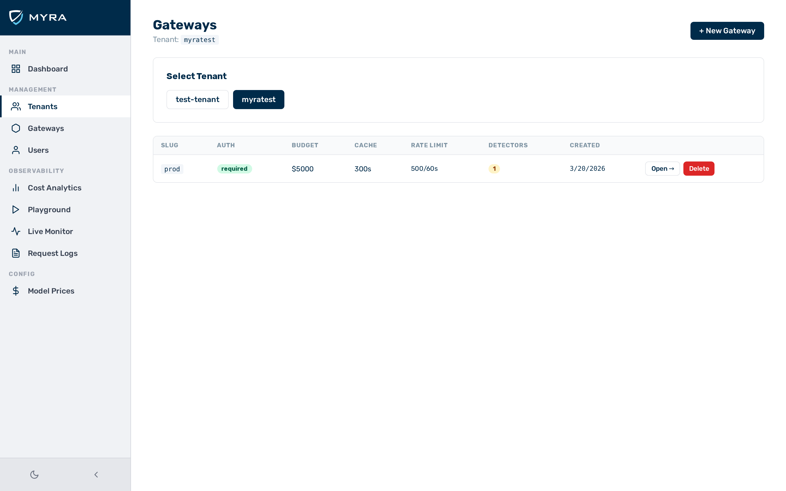
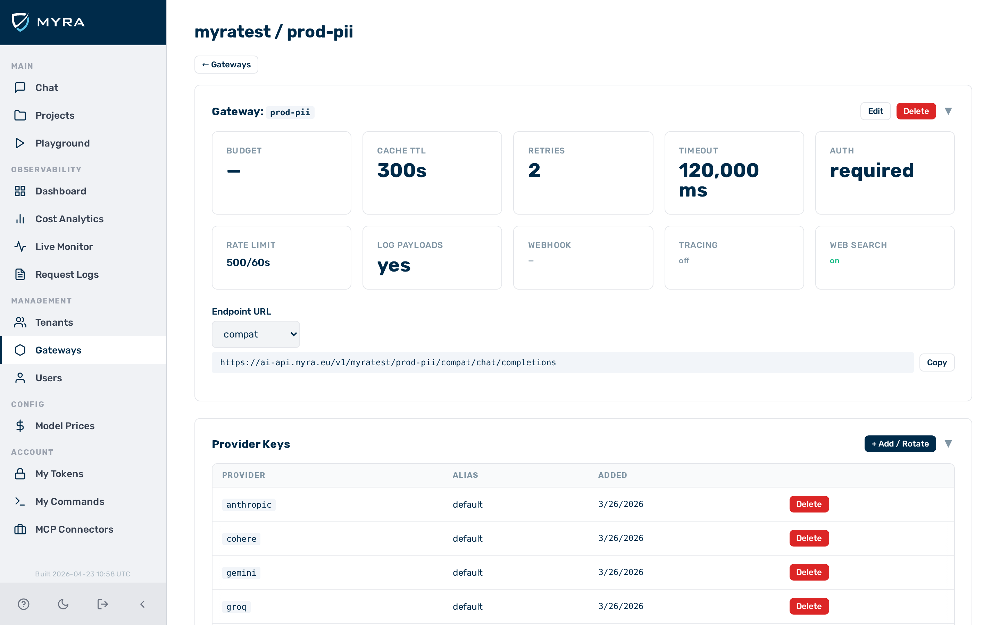

# Quick start

This guide takes you from first login to a working inference request. Complete the [Getting access](installation.md) steps before you begin.

Before you begin, ensure the following conditions are met:

- ☑ You have logged in to the admin UI at `https://<your-gateway-host>/admin`.
- ☑ You have your provider API key (for example, an OpenAI API key) to hand.

---

## Creating a tenant and gateway



► Proceed as follows to create a tenant and gateway:

1. Click on **Tenants** in the left sidebar.
   ⇒ The **Tenants** view opens.
2. Click on the **New Tenant** button.
   ⇒ The **New Tenant** dialog opens.
3. Enter a slug in the **Slug** text field. For example: `myapp`.
4. Click on the **Save** button.
   ⇒ The new tenant appears in the tenant list.
5. Click on **Gateways** in the left sidebar.
   ⇒ The **Gateways** view opens.
6. Click on the **New Gateway** button.
   ⇒ The **New Gateway** dialog opens.
7. Select your new tenant from the **Tenant** drop-down list.
8. Enter a slug in the **Slug** text field. For example: `production`.
9. Click on the **Save** button.
   ⇒ The new gateway appears in the gateway list.

→ The gateway is created and associated with the tenant.

> ⚠️ **Caution:** By default, gateways require an auth token on every inference request. To skip that for now, open the **Config** tab of the gateway and set the **Auth Required** toggle to off. Re-enable it before going to production.

---

## Storing a provider key



► Proceed as follows to store a provider API key in the gateway:

1. Click on **Gateways** in the left sidebar.
   ⇒ The **Gateways** view opens.
2. Click on the gateway you created.
   ⇒ The gateway detail view opens.
3. Open the **Keys** tab.
   ⇒ The provider keys list opens.
4. Click on the **Add Key** button.
   ⇒ The **Add Key** dialog opens.
5. Select a provider from the **Provider** drop-down list. For example: `openai`.
6. Paste your API key into the **API Key** text field.
7. Click on the **Save** button.
   ⇒ The new provider key appears in the keys list. The key is encrypted at rest immediately; the plaintext is never stored.

→ The provider key is saved and the gateway is ready to forward requests to the provider.

---

## Making your first request

### Provider-native endpoint

Send a request directly to a specific provider using the provider-native endpoint:

```bash
curl -s -X POST \
  "https://<your-gateway-host>/v1/myapp/production/openai/chat/completions" \
  -H 'Content-Type: application/json' \
  -d '{
    "model": "gpt-4o",
    "messages": [{"role": "user", "content": "Hello!"}]
  }'
```

### OpenAI-compatible unified endpoint

The compat endpoint infers the provider from the model name:

```bash
curl -s -X POST \
  "https://<your-gateway-host>/v1/myapp/production/compat/chat/completions" \
  -H 'Content-Type: application/json' \
  -d '{
    "model": "gpt-4o",
    "messages": [{"role": "user", "content": "Hello!"}]
  }'
```

A successful response looks like:

```json
{
  "id": "chatcmpl-...",
  "object": "chat.completion",
  "model": "gpt-4o",
  "choices": [{"message": {"role": "assistant", "content": "Hello! How can I help?"}}],
  "usage": {"prompt_tokens": 10, "completion_tokens": 9, "total_tokens": 19}
}
```

→ The gateway forwards the request to the provider and returns the response to the client.

---

## Checking the request log

► Proceed as follows to verify the request was recorded:

1. Click on **Logs** in the left sidebar.
   ⇒ The **Logs** view opens. Your request appears at the top of the list with provider, model, token count, cost, and latency.

→ The request log entry confirms the gateway processed and recorded the request.

---

## Next steps

- [Multi-tenancy](../concepts/multi-tenancy.md) — understand the tenant/gateway/token hierarchy
- [Request pipeline](../concepts/request-pipeline.md) — see what happens to every request
- [Supported providers](../concepts/providers.md) — swap OpenAI for any of the 21 supported providers
