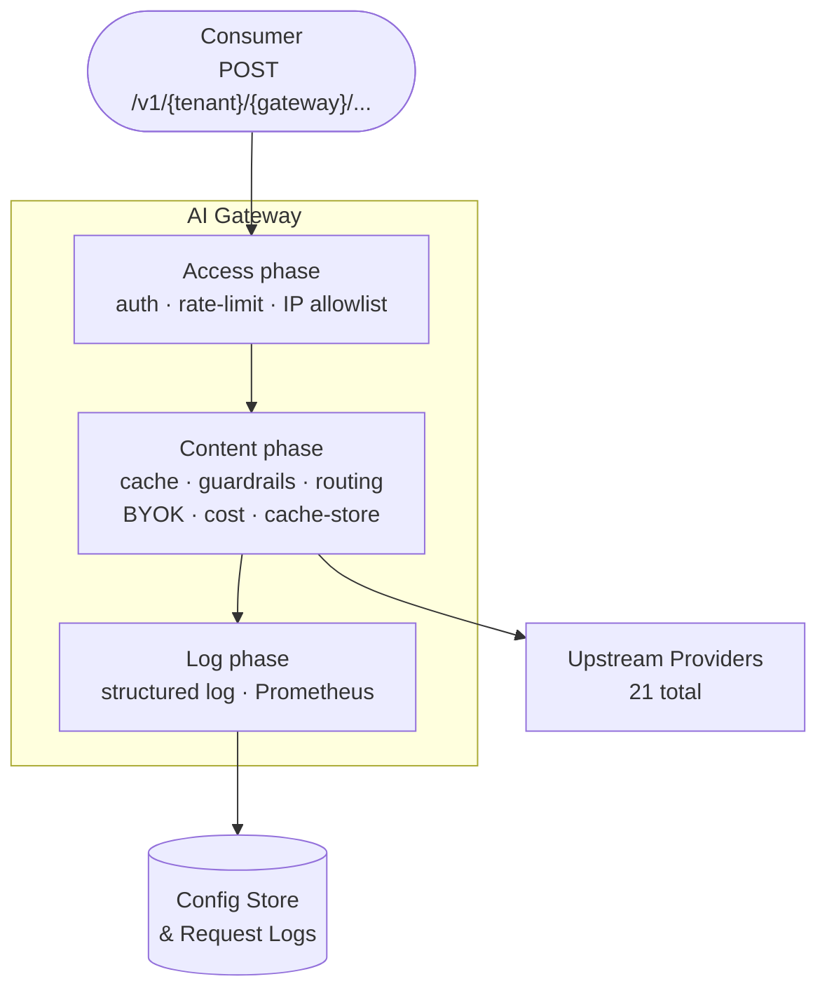

# What is AI Gateway by Myra Security

AI Gateway by Myra Security is a multi-tenant reverse proxy built upon the Global Myra Security CDN. It sits between your applications and upstream AI provider application programming interfaces (APIs), enforcing policy, managing credentials, and recording every request — all in-process, with no external sidecar required.

> 💡 **Note:** All policy enforcement — authentication, rate limiting, caching, and security checks — runs in-process with no additional network round trips, ensuring consistent low-latency enforcement at scale.

---

## Key features

- **21 provider integrations** — OpenAI, Anthropic, Google Gemini, Vertex AI, AWS Bedrock, Azure OpenAI, Mistral, Groq, Together AI, Fireworks, Cerebras, DeepSeek, OpenRouter, Perplexity, SambaNova, xAI, NVIDIA NIM, Cloudflare AI, Cohere, HuggingFace, Ollama
- **Unified OpenAI-compatible endpoint** — send any model name to `/compat/chat/completions`; the gateway resolves the provider automatically
- **Exact-match response caching** — repeated identical prompts are served from cache, reducing cost and latency
- **Rate limiting** — per-gateway or per-token request caps, enforced before any upstream call is made
- **Budget enforcement** — hard spending caps at the gateway level and per auth token
- **Guardrail pipeline** — a two-tier system: fast in-process regex/keyword checks (Tier 1) followed by optional HTTP sidecars — NLP PII Detector, Prompt Guard, and PII Protector (Tier 2)
- **BYOK key vault** — provider API keys encrypted at rest with AES-256
- **Routing rules** — an ordered rule engine that rewrites provider, model, and attaches fallback chains based on request metadata
- **Prometheus metrics** — request counters and latency histograms with provider, tenant, status, and cache labels; exposed at `/metrics`
- **Admin UI and Playground** — a web-based interface for managing tenants, gateways, users, and routing rules, and for running side-by-side multi-model comparisons

---

## Use cases

**Centralised API key management**
The gateway stores all provider API keys in one encrypted vault. Applications authenticate to the gateway with a scoped token and never access raw provider credentials directly.

**Cost control and attribution**
Every request is logged with token counts, cost in USD, and a `meta` map of custom headers. Budget caps prevent runaway spend at both the gateway and per-user-token level.

**Compliance and security policy enforcement**
The guardrail pipeline (NLP PII Detector, Prompt Guard, regex, keyword) applies PII scrubbing and content moderation centrally, before prompts reach a provider.

**A/B routing and model experimentation**
Routing rules redirect a configurable percentage of traffic to a different provider or model, with automatic fallback if the primary fails. The **Playground** presents results side-by-side for comparison.

**Self-hosted model routing**
Requests route to a self-hosted Ollama instance via `provider_base_urls`. Application code remains identical whether it targets Ollama or any cloud provider.

---

## Architecture overview

| Capability | Description |
|---|---|
| Platform | Built upon the Global Myra Security CDN |
| Providers | 21 AI providers via a unified API |
| Security | Authentication, rate limiting, budget enforcement, and guardrail pipeline (regex, NLP PII Detector, Prompt Guard, PII Protector) — all enforced in-process |
| Encryption | Provider API keys encrypted at rest with AES-256 |
| Observability | Structured request logs, metrics, real-time admin dashboard |
| Admin UI | Web-based admin interface with playground for model testing |

---

## See also

- [Quick start](quick-start.md) — make your first request in four steps
- [Getting access](installation.md) — managed service and on-premise options
- [Request pipeline](../concepts/request-pipeline.md) — detailed walkthrough of every middleware step
- [Supported providers](../concepts/providers.md) — full provider table with supported models
