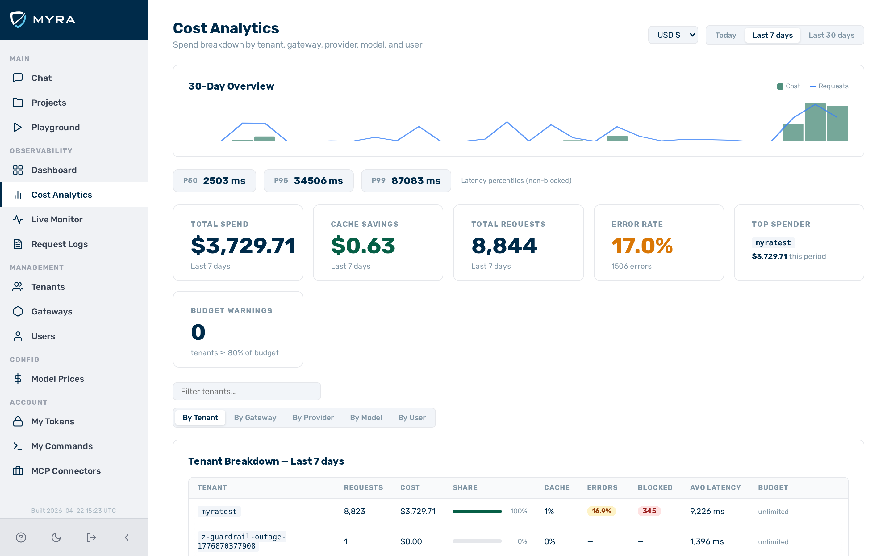

# Cost analytics

*The cost analytics view showing the overview chart, summary cards, and analytics tabs.*

The **Cost Analytics** view provides a spend breakdown across all tenants, gateways, providers, models, and users. Access it from the **Cost Analytics** entry in the left sidebar.

---

## Period selector

The **Period** drop-down list in the top-right controls the analytics window for all cards and tables on the page.

| Option | Window |
|--------|--------|
| Today | From midnight UTC to now |
| Last 7 days | Rolling 7-day window |
| Last 30 days | Rolling 30-day window |

---

## 30-day overview chart

A combined bar and line chart always shows the last 30 calendar days, regardless of the period selector. Green bars represent daily cost (left scale); the blue line represents daily request count (right scale).

---

## Latency strip

Three chips below the overview chart show latency percentiles for the selected analytics window:

| Chip | Description |
|------|-------------|
| p50 | Median end-to-end latency in milliseconds |
| p95 | 95th-percentile latency |
| p99 | 99th-percentile latency |

Percentiles cover non-blocked requests only. `—` is shown when no data is available.

---

## Summary cards

Six cards summarise the selected period across all tenants:

| Card | Description |
|------|-------------|
| Total Spend | Cumulative cost in USD |
| Cache Savings | Cost avoided by serving cached responses |
| Total Requests | Total request count |
| Error Rate | Percentage of requests with a 4xx/5xx upstream response |
| Top Spender | Tenant with the highest spend in the period |
| Budget Warnings | Number of tenants at or above 80 % of their configured budget |

---

## Filter bar

A text-input filter appears above the tab bar. Type to search by name or ID within the active tab; the row count updates as you filter (`N of M`). The filter clears automatically when you switch tabs.

---

## Analytics tabs

### By tenant

| Column | Description |
|--------|-------------|
| Tenant | Tenant slug |
| Requests | Total requests |
| Cost | Total cost in USD |
| Share | Proportional bar showing this tenant's share of total cost |
| Cache | Cache hit rate (%) |
| Errors | Error rate as a percentage; badge shown only when errors > 0 |
| Blocked | Blocked request count; badge shown only when > 0 |
| Avg Latency | Average end-to-end latency in milliseconds |
| Budget | Budget utilisation bar if a budget is configured; `unlimited` otherwise |

Clicking a tenant row opens the [tenant detail panel](#tenant-detail-panel).

### By gateway

| Column | Description |
|--------|-------------|
| Gateway | Gateway slug |
| Tenant | Owning tenant |
| Requests | Total requests |
| Cost | Total cost in USD |
| Share | Proportional bar showing this gateway's share of total cost |
| Cache | Cache hit rate (%) |
| Errors | Error rate; badge shown when errors > 0 |
| Blocked | Blocked request count; badge shown when > 0 |
| Avg Latency | Average end-to-end latency in milliseconds |

### By provider

Aggregated client-side from the model-level data by grouping rows under their provider.

| Column | Description |
|--------|-------------|
| Provider | Provider slug (e.g. `openai`, `anthropic`) |
| Models | Number of distinct models used |
| Requests | Total requests routed to this provider |
| Cost | Total cost in USD |
| Share | Proportional bar showing this provider's share of total cost |
| Avg Latency | Average end-to-end latency in milliseconds |

### By model

| Column | Description |
|--------|-------------|
| Model | Model name |
| Provider | Provider slug |
| Requests | Total requests to this model |
| Cost | Total cost in USD |
| Share | Proportional bar showing this model's share of total cost |
| Avg Latency | Average end-to-end latency in milliseconds |

### By user

This tab includes only requests made with auth tokens that have a `user_id` set. Anonymous token requests are not shown.

| Column | Description |
|--------|-------------|
| User | User ID |
| Requests | Total requests |
| Cost | Total cost in USD |
| Share | Proportional bar showing this user's share of total cost |
| Cache | Cache hit rate (%) |
| Errors | Error rate; badge shown when errors > 0 |
| Blocked | Blocked request count; badge shown when > 0 |
| Avg Latency | Average end-to-end latency in milliseconds |

---

## Tenant detail panel

Clicking any row in the **By Tenant** tab opens a slide-in panel on the right side of the screen with deeper detail for that tenant.

| Section | Content |
|---------|---------|
| Summary cards | Requests, Cost, Avg Latency for the selected period |
| Budget utilisation | Progress bar showing spend vs. configured budget (shown only when a budget is set) |
| Cost — Last 30 Days | Bar chart of daily cost over the past 30 days |
| Top Models | Table of models used by this tenant: Model, Provider, Requests, Cost, Avg Latency |
| Monthly Spend | Table of per-month spend going back up to 12 months |

Click outside the panel or the **×** button to close it.

---

## See also

- [Dashboard](dashboard.md) — live operations view with real-time metrics
- [Budgets and quotas](../configuration/budgets.md) — configuring spend caps that appear in budget warnings
- [Cost attribution](../concepts/cost-attribution.md) — how costs are calculated
- [Stats API](../api-reference/stats.md)
