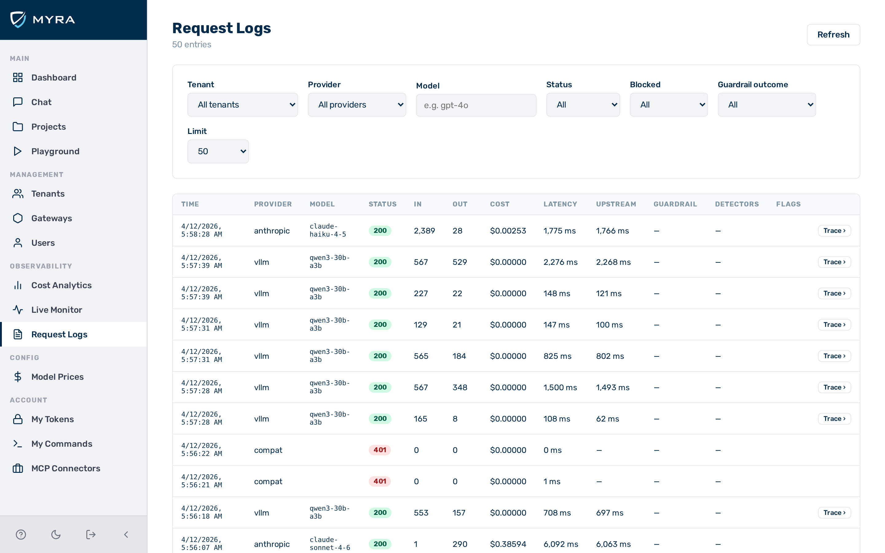

# Request logging


*The request log table in the admin UI, showing per-request identity, routing, status, and cost fields.*

AI Gateway by Myra Security captures a structured log entry for every inference request. Each entry records the provider used, token counts, cost, latency, cache status, and — optionally — the full prompt and response text. View logs in real time in the admin UI under **Logs**, or query them via the API.

Logging happens after the response is sent. It adds no latency to the request path.

---

## Log entry fields

### Identity

| **Field** | **Type** | **Description** |
|-----------|----------|-----------------|
| `id` | string | Unique request ID (UUID) |
| `tenant_id` | string | Tenant that owns this gateway |
| `gateway_id` | string | Gateway through which the request was routed |
| `user_id` | string \| null | User ID extracted from the auth token |
| `token_label` | string \| null | Human-readable label of the auth token used |

### Routing

| **Field** | **Type** | **Description** |
|-----------|----------|-----------------|
| `provider` | string | Provider that handled the request (e.g. `openai`, `anthropic`) |
| `model` | string | Model name as sent in the request |
| `fallback_provider` | string \| null | Provider used if the primary provider failed |
| `fallback_model` | string \| null | Model used on the fallback attempt |
| `upstream_attempts` | integer | Number of upstream attempts (1 = no retry needed) |

### Status

| **Field** | **Type** | **Description** |
|-----------|----------|-----------------|
| `status` | integer | HTTP status code returned to the caller |
| `blocked` | boolean | Whether the request was blocked by a detector or guardrail |
| `blocked_by` | string \| null | Name of the detector or rule that blocked the request |
| `block_reason` | string \| null | Human-readable block reason |

### Cache

| **Field** | **Type** | **Description** |
|-----------|----------|-----------------|
| `cached` | boolean | Whether the response was served from cache |
| `saved_cost_usd` | number \| null | Cost saved by serving from cache |
| `saved_latency_ms` | integer \| null | Latency saved by serving from cache |

### Tokens

| **Field** | **Type** | **Description** |
|-----------|----------|-----------------|
| `input_tokens` | integer | Prompt tokens consumed |
| `output_tokens` | integer | Completion tokens generated |
| `cache_creation_tokens` | integer \| null | Tokens written to Anthropic prompt cache |
| `cache_read_tokens` | integer \| null | Tokens read from Anthropic prompt cache |

### Cost

| **Field** | **Type** | **Description** |
|-----------|----------|-----------------|
| `cost_usd` | number \| null | Estimated cost in USD, computed from the prices table |

### Timing

| **Field** | **Type** | **Description** |
|-----------|----------|-----------------|
| `latency_ms` | integer | Total request latency from gateway receipt to response sent |
| `upstream_latency_ms` | integer \| null | Time spent waiting for the upstream provider |
| `time_to_first_token_ms` | integer \| null | Time to first SSE token (streaming requests only) |

### Payload

| **Field** | **Type** | **Description** |
|-----------|----------|-----------------|
| `prompt` | string \| null | Full prompt text (null if `log_payloads: false` or suppressed per-request) |
| `response` | string \| null | Full response text (null for streaming requests, or if payload logging is off) |

### Detectors

| **Field** | **Type** | **Description** |
|-----------|----------|-----------------|
| `detector_results` | object \| null | Map of detector name → result for all detectors that ran |

### Custom metadata

| **Field** | **Type** | **Description** |
|-----------|----------|-----------------|
| `meta` | object \| null | Key/value map from `x-aig-meta-*` request headers |

---

## Querying request logs

Proceed as follows to query request logs via the API:

1. Send a `GET` request to `/admin/v1/logs` with an admin token.
   - The endpoint accepts the following query parameters:

   | Parameter | Description |
   |-----------|-------------|
   | `limit` | Number of entries to return (default: 50) |
   | `offset` | Pagination offset |
   | `tenant_id` | Filter by tenant |
   | `gateway_id` | Filter by gateway |
   | `provider` | Filter by provider name |
   | `status` | Filter by HTTP status code |
   | `blocked` | `true` / `false` |
   | `cached` | `true` / `false` |
   | `from` | ISO 8601 start timestamp |
   | `to` | ISO 8601 end timestamp |

2. If filtering blocked requests, add `blocked=true` to the query string.
3. If filtering by time range, add `from` and `to` parameters in ISO 8601 format.
   - The API returns a paginated list of log entries matching the filter.

> ⭐ **Example:**
> ```bash
> # Last 10 blocked requests
> curl "https://gateway.example.com/admin/v1/logs?blocked=true&limit=10" \
>   -H "x-aig-token: <admin-token>"
>
> # Requests for a specific gateway in the last hour
> curl "https://gateway.example.com/admin/v1/logs?gateway_id={id}&from=2025-01-01T12:00:00Z" \
>   -H "x-aig-token: <admin-token>"
> ```

→ The API returns a paginated list of log entries matching the specified filters.

---

## Enabling payload logging

Payload logging is controlled at two levels: per-gateway and per-request.

### Disabling payload logging at gateway level

Proceed as follows to disable payload storage for all requests through a gateway:

1. Send a `PATCH` request to `/admin/v1/gateways/{id}` with the `log_payloads` field set to `false`.

   ```bash
   curl -X PATCH "https://gateway.example.com/admin/v1/gateways/{id}" \
     -H "x-aig-token: <admin-token>" \
     -H "Content-Type: application/json" \
     -d '{"config": {"log_payloads": false}}'
   ```

   - The `prompt` and `response` fields are set to `null` for every subsequent request through that gateway.

→ The gateway no longer stores prompt or response text in log entries.

### Suppressing payloads per request

Proceed as follows to suppress payload logging for individual requests:

1. Include the `x-aig-collect-log-payload` header set to `false` in the client request.

   ```bash
   # Log metadata but not the prompt/response text
   curl -s -X POST "https://gateway.example.com/v1/myapp/prod/openai/chat/completions" \
     -H "x-aig-collect-log-payload: false" \
     ...
   ```

   - The log entry is written with metadata only; `prompt` and `response` are set to `null`.

2. If you want to skip the log entry entirely, include `x-aig-collect-log: false` instead.

   ```bash
   # Skip logging entirely
   curl -s -X POST "https://gateway.example.com/v1/myapp/prod/openai/chat/completions" \
     -H "x-aig-collect-log: false" \
     ...
   ```

   - No log entry is written for this request.

→ The specified request is either logged without payload text, or not logged at all.

> ⚠️ **Caution:** `x-aig-collect-log-payload: false` only suppresses payloads for the single request that includes the header. It does not change the gateway-level `log_payloads` setting.

---

## Attaching custom metadata

Any request header prefixed with `x-aig-meta-` is captured in the `meta` field of the log entry:

```bash
curl -s -X POST "https://gateway.example.com/v1/myapp/prod/openai/chat/completions" \
  -H "x-aig-meta-session-id: sess_abc123" \
  -H "x-aig-meta-feature-flag: new-summariser" \
  ...
```

The log entry will contain:

```json
{
  "meta": {
    "session-id": "sess_abc123",
    "feature-flag": "new-summariser"
  }
}
```

---

## Storage

Request logs are stored and retained by the Myra Security platform. Log retention and backend configuration are managed as part of your service agreement. For enterprise retention or export requirements, contact your Myra Security account team.

---

## See also

- [Admin dashboard](dashboard.md)
- [Gateway configuration](../configuration/gateway-config.md) — `log_payloads`
