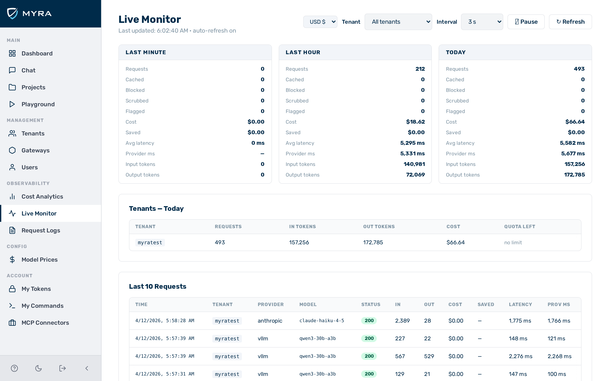

# Live monitor

*The live monitor showing the activity sparkline, period cards, and controls.*

The **Live Monitor** view provides a real-time view of gateway activity. It polls the Stats API on a configurable interval and displays continuously updating metrics for the current minute, last hour, today, and yesterday.

Navigate to **Live Monitor** in the left sidebar.

---

## Controls

| Control | Description |
|---------|-------------|
| Tenant filter | Scopes all metrics to a single tenant. Defaults to all tenants. |
| Interval | Auto-refresh interval: 1 s, 2 s, 3 s (default), 5 s, 10 s, or 30 s. |
| Pause / Resume | Stops or restarts auto-refresh. Metrics freeze on pause. |
| Refresh | Forces an immediate update regardless of the current interval. |

The header shows the timestamp of the last successful poll and whether auto-refresh is running.

---

## Activity sparkline

A rolling line chart plots the request count per polling interval over the last 60 samples. The current requests-per-interval value appears to the right of the chart.

---

## Period cards

Four cards break down activity across time windows:

| Card | Window |
|------|--------|
| Last minute | Rolling 60-second window |
| Last hour | Rolling 60-minute window |
| Today | From midnight UTC to now |
| Yesterday | The previous calendar day |

Each card shows the following metrics:

| Metric | Description |
|--------|-------------|
| Requests | Total inference requests |
| Cached | Requests served from cache |
| Blocked | Requests blocked by guardrails or budget |
| Scrubbed | Requests where a guardrail scrubbed content (action = `scrub`) |
| Flagged | Requests flagged by a guardrail (action = `flag`) |
| Cost | Total estimated cost in USD |
| Saved | Cost saved by cache hits |
| Avg latency | Average end-to-end latency in milliseconds |
| Provider ms | Average upstream (provider) latency in milliseconds |
| Input tokens | Total prompt tokens consumed |
| Output tokens | Total completion tokens generated |

---

## Recent guardrail events

The **Recent Guardrail Events** table shows the most recent blocked requests, identical to the one on the [Dashboard](dashboard.md). It is visible only when blocked events exist for the selected scope.

---

## See also

- [Dashboard](dashboard.md) — snapshot view with selectable timeframes
- [Cost analytics](analytics.md) — historical spend breakdown by tenant, gateway, provider, model, and user
- [Stats API](../api-reference/stats.md)
