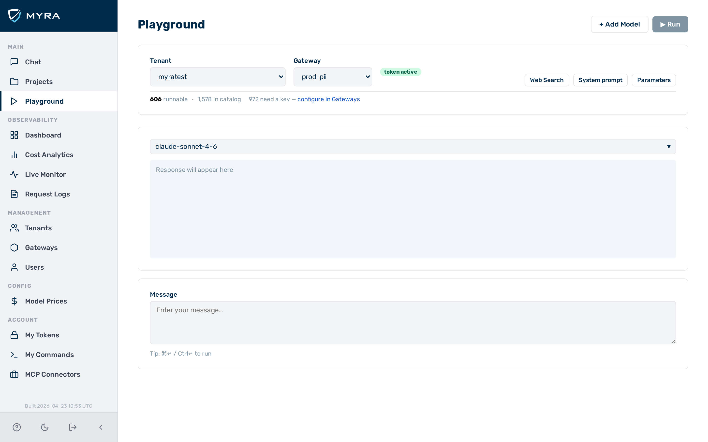

# Playground

*The playground showing a multi-panel comparison with response cards and status bars.*

The **Playground** view lets you send prompts to one or more models simultaneously and compare responses side-by-side without writing any code.

---

## Multi-panel comparison

The playground supports up to four model panels side by side. All panels receive the same prompt at the same time when you click the **Send** button.

- Click the **+ Add Model** button to open a new panel (up to four).
- Each panel has its own provider and model selector.
- Response cards display in a horizontal scroll layout on wide screens and stack on mobile.

The multi-panel layout supports comparing:

- Different models from the same provider (e.g. `gpt-4o` vs `gpt-4o-mini`)
- The same model across different providers (e.g. Llama 3 on Groq vs Together AI vs Fireworks)
- Cloud vs local inference (any cloud model vs `ollama/llama3.2`)

---

## Request configuration

The following settings are shared across all panels in a session:

| Control | Range / type | Description |
|---------|-------------|-------------|
| System prompt | Free text (collapsible) | Prepended as a system message to every request |
| Temperature | 0–2 (slider) | Controls response randomness |
| Max tokens | Integer input | Maximum output tokens per response |
| Web search | Toggle | Enables web search grounding (when enabled by your account configuration) |

Settings apply to every panel simultaneously. To set different temperatures for different panels, use separate sessions.

---

## Real-time streaming

Responses stream token-by-token using server-sent events (SSE). Each panel renders markdown in real time as tokens arrive.

### Status bar

Each panel has a status bar beneath the response that shows, after the response completes:

| Field | Description |
|-------|-------------|
| Elapsed | Wall-clock time from send to last token (ms) |
| Input tokens | Prompt token count |
| Output tokens | Completion token count |
| Cache write tokens | Anthropic prompt cache creation tokens (if applicable) |
| Cache read tokens | Anthropic prompt cache read tokens (if applicable) |
| Cost estimate | Estimated cost in USD based on the prices table |

---

## Error badges

If a provider returns an error, the panel shows a badge instead of a response:

| Badge | HTTP status | Meaning |
|-------|------------|---------|
| `AUTH ERROR` | 401 | Missing or invalid API key / auth token |
| `FORBIDDEN` | 403 | Request blocked by a detector or guardrail |
| `NOT FOUND` | 404 | Model not found or endpoint path incorrect |
| `RATE LIMITED` | 429 | Provider or gateway rate limit exceeded |
| `SERVER ERROR` | 5xx | Upstream provider or gateway internal error |

---

## State persistence

The playground saves its configuration in the browser automatically. The following fields persist across page reloads:

| Field | Description |
|-------|-------------|
| Tenant selection | Last-used tenant |
| Gateway selection | Last-used gateway |
| Model selections | Model chosen in each panel |
| System prompt | System prompt text |
| Temperature | Temperature slider value |
| Max tokens | Max tokens input value |

Conversation history is **not** persisted — each page load starts with an empty conversation.

---

## Web search

Web search is available when enabled by your Myra Security account configuration. Toggle the **Web search** control in any panel to have the model search the web before answering.

---

## See also

- [Providers overview](../providers/overview.md)
- [Request logging](../observability/logging.md)
