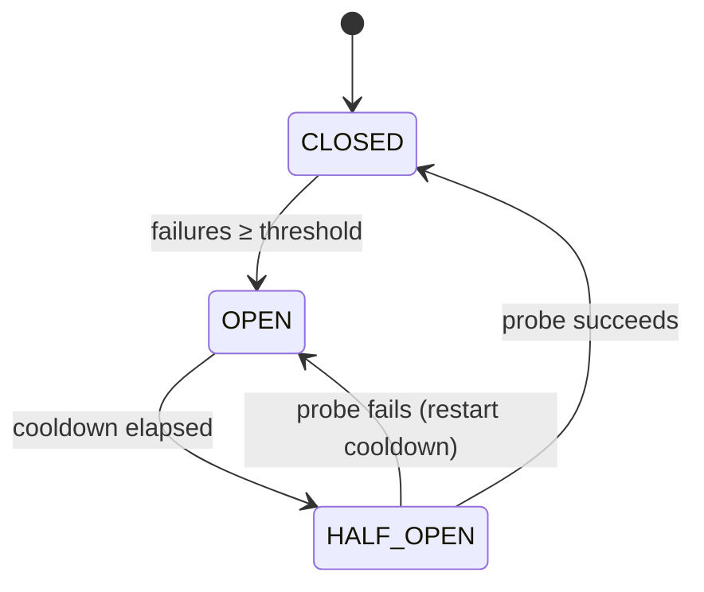

# Circuit breaker

The circuit breaker automatically stops routing traffic to a provider that is consistently failing, then probes it after a cooldown period to detect recovery. This prevents cascading failures where a broken provider repeatedly consumes retries on every request.

## State machine

The circuit breaker operates as a three-state machine:



| State | Behaviour |
|---|---|
| **Closed** (healthy) | All requests route normally |
| **Open** | Requests skip this provider entirely; the next target in the fallback chain is tried |
| **Half-open** | One probe request is allowed through to test recovery |

The default state is **Closed**. No state is stored until the first failure is recorded.

## Configuration fields

| Field | Type | Default | Description |
|---|---|---|---|
| `enabled` | boolean | `false` | Set to `true` to activate the circuit breaker |
| `failure_threshold` | integer | `5` | Number of failures within `window_sec` before the breaker opens |
| `window_sec` | integer | `60` | Sliding window in seconds over which failures are counted |
| `cooldown_ms` | integer | `30000` | Milliseconds to wait in the Open state before allowing a probe |
| `failure_status_codes` | array | `[500,502,503,504]` | HTTP status codes that count as failures. Connection and timeout errors always count regardless of this list. |

## What counts as a failure

The following events increment the failure counter:

- **HTTP 5xx from the provider** — only codes listed in `failure_status_codes` count (default: 500, 502, 503, 504).
- **Connection errors** — DNS failure, connection refused, TLS error — always counted regardless of `failure_status_codes`.
- **Timeouts** — treated as connection errors.

The following events do not increment the failure counter:

- **4xx responses from the provider** — bad request, auth failure, and similar client errors are not treated as provider failures.

## Interaction with retries and fallbacks

The circuit breaker check runs before each upstream attempt. Consider a request with `retry_count: 2` and one fallback, where the breaker of OpenAI is open:

1. Check the breaker of OpenAI → **Open** → skip OpenAI entirely.
2. Check the breaker of Anthropic → Closed → attempt Anthropic.
3. Anthropic succeeds → record success → return response.

Without a circuit breaker, the gateway would exhaust two retry attempts on a failing OpenAI before trying Anthropic.

## Configuring the circuit breaker

Before you begin, ensure the following conditions are met:

- ☑ You have admin access.
- ☑ A gateway exists.


*The circuit breaker configuration on the gateway detail page.*

► Proceed as follows to configure the circuit breaker for a gateway:

1. Open **Gateways** in the left sidebar.
   ⇒ The gateway list opens.
2. Click on the gateway you want to configure.
   ⇒ The gateway detail page opens.
3. Click on the **Configuration** tab.
   ⇒ The configuration form opens.
4. Toggle the **Circuit breaker enabled** toggle on.
   ⇒ The circuit breaker configuration fields appear.
5. Enter a value in the **Failure threshold** text field.
   ⇒ The failure threshold is set.
6. Enter a value in the **Window** text field (in seconds).
   ⇒ The counting window is set.
7. Enter a value in the **Cooldown** text field (in milliseconds).
   ⇒ The cooldown period is set.
8. If required, edit the **Failure status codes** field to customise which HTTP status codes count as failures.
   ⇒ The status code list is updated.
9. Click on the **Save** button.

→ The circuit breaker configuration is saved and takes effect immediately.

To configure the circuit breaker via the API:

```json
{
  "circuit_breaker": {
    "enabled": true,
    "failure_threshold": 5,
    "window_sec": 60,
    "cooldown_ms": 30000,
    "failure_status_codes": [500, 502, 503, 504]
  }
}
```

## Status API

Check the current state of the breaker for all providers on a gateway:

```
GET /admin/v1/gateways/{id}/circuit-breaker
```

Response:

```json
{
  "openai": {
    "state": "open",
    "failures": 7,
    "opened_at": 1748123456
  },
  "anthropic": {
    "state": "closed",
    "failures": 0
  }
}
```

Only providers that have recorded at least one failure appear in the response. A missing provider entry means the breaker is closed with zero recorded failures.

The dashboard UI shows this status in a live table on the gateway detail page when the circuit breaker is enabled.

## Example configurations

### Conservative — trip only on sustained outage

```json
{
  "circuit_breaker": {
    "enabled": true,
    "failure_threshold": 10,
    "window_sec": 120,
    "cooldown_ms": 60000
  }
}
```

Opens after 10 failures in 2 minutes. Probes after 1 minute. Appropriate when providers have occasional transient errors.

### Aggressive — trip fast, recover fast

```json
{
  "circuit_breaker": {
    "enabled": true,
    "failure_threshold": 3,
    "window_sec": 30,
    "cooldown_ms": 10000
  }
}
```

Opens after 3 failures in 30 seconds. Probes after 10 seconds. Appropriate when you have multiple healthy fallbacks and want to shed load immediately.

## See also

- [Fallback and retry](fallback.md)
- [Load balancing](load-balancing.md)
- [Gateway configuration reference](../reference/config-reference.md)
