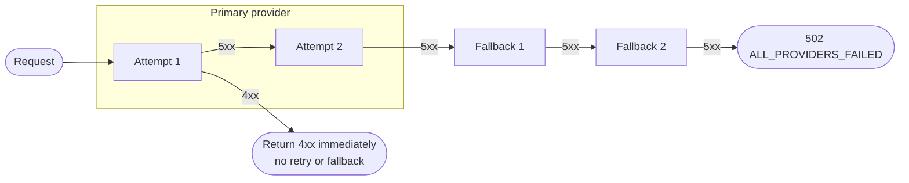
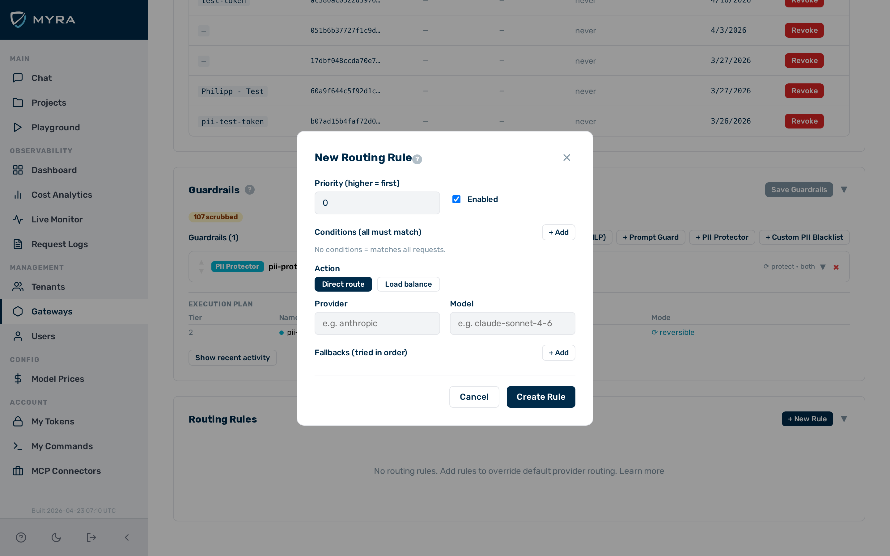

# Fallback and retry

AI providers occasionally become unavailable, apply rate limits, or return errors during high-traffic periods. Without a fallback, the gateway returns an error to the caller. With a fallback chain, the gateway silently retries against another provider and the caller receives a response.

Fallbacks are defined per routing rule and are transparent to the caller — the response format is the same regardless of which provider in the chain ultimately handled the request.

## How the fallback chain works

A request follows this sequence:

1. **Primary provider** — attempted up to `retry_count` times on server errors (HTTP 5xx). The default is 2 total attempts (1 retry).
2. **Fallback providers** — each fallback is attempted once, in order. Fallbacks are defined in the routing rule that matched the request.
3. If all providers are exhausted, the gateway returns `502 ALL_PROVIDERS_FAILED`.



## Client errors

A client error response from a provider (HTTP 4xx — for example, bad request, unauthorised, not found) is treated as a definitive failure. The gateway does not retry the request and does not attempt fallbacks. The error is returned to the caller immediately.

> 💡 **Note:** This prevents pointless retries: if your request is malformed or your API key is invalid, retrying against another provider will not help.

## retry_count

`retry_count` controls the total number of attempts against the primary provider (not the number of retries). Set it in the gateway config:

```bash
curl -X PATCH https://your-gateway-host/admin/v1/gateways/{id} \
  -H "x-aig-token: <admin-token>" \
  -H "Content-Type: application/json" \
  -d '{"config": {"retry_count": 3}}'
```

| `retry_count` | Primary attempts | Retries |
|---|---|---|
| `1` | 1 | 0 |
| `2` | 2 | 1 |
| `3` | 3 | 2 |

## Fallback configuration in routing rules

Fallbacks are defined in the `actions` object of a routing rule:

```json
{
  "priority": 10,
  "conditions": [
    {"field": "model", "op": "prefix", "value": "gpt-"}
  ],
  "actions": {
    "provider": "openai",
    "model": "gpt-4o",
    "fallbacks": [
      {"provider": "anthropic", "model": "claude-sonnet-4-6"},
      {"provider": "gemini", "model": "gemini-2.0-flash"}
    ]
  },
  "enabled": true
}
```

Each entry in `fallbacks` is attempted once, in array order.

## Configuring fallback providers

Before you begin, ensure the following conditions are met:

- ☑ You have admin access.
- ☑ A gateway with at least one routing rule exists.


*The fallbacks section of the routing rule editor.*

► Proceed as follows to add fallback providers to a routing rule:

1. Open **Gateways** in the left sidebar.
   ⇒ The gateway list opens.
2. Click on the gateway you want to configure.
   ⇒ The gateway detail page opens.
3. Click on the **Routing** tab.
   ⇒ The rule list opens.
4. Click on the routing rule you want to edit.
   ⇒ The rule editor opens.
5. Scroll to the **Fallbacks** section.
   ⇒ The fallbacks list is visible.
6. Click on the **Add Fallback** button.
   ⇒ A new fallback row appears.
7. Select the fallback provider from the **Provider** drop-down list.
   ⇒ The provider is set.
8. Enter the model name in the **Model** text field.
   ⇒ The model is set.
9. Repeat steps 6–8 for each additional fallback provider, in the order the gateway should try them.
   ⇒ Each fallback is added to the list.
10. Click on the **Save** button.

→ The routing rule is updated with the configured fallback chain.

To create the same configuration via the API:

```bash
curl -X POST https://your-gateway-host/admin/v1/gateways/{id}/rules \
  -H "x-aig-token: <admin-token>" \
  -H "Content-Type: application/json" \
  -d '{
    "priority": 10,
    "conditions": [{"field": "model", "op": "prefix", "value": "gpt-"}],
    "actions": {
      "provider": "openai",
      "model": "gpt-4o",
      "fallbacks": [
        {"provider": "anthropic", "model": "claude-sonnet-4-6"},
        {"provider": "gemini", "model": "gemini-2.0-flash"}
      ]
    },
    "enabled": true
  }'
```

## BYOK key swap on provider change

When a fallback triggers a provider change, the gateway automatically selects the BYOK (bring your own key) key for the new provider. The `x-aig-byok-alias` header is honoured for the fallback provider if a key with that alias exists; otherwise the `"default"` alias is used.

A BYOK key must be stored for each provider in the fallback chain. If no key is found for a fallback provider, that fallback attempt fails with an authentication error.

> ⚠️ **Caution:** Ensure BYOK keys are stored for every provider in your fallback chains. A missing key for a fallback provider causes that fallback to fail with a `4xx`, which halts the chain immediately.

## 502 ALL_PROVIDERS_FAILED

When every provider in the chain (primary plus all fallbacks) has been tried and none succeeded, the gateway returns:

```json
{
  "error": {
    "code": "ALL_PROVIDERS_FAILED",
    "message": "All providers failed to process the request"
  }
}
```

HTTP status code: `502`.

## Logged fields

For every request that uses a fallback, the gateway logs the final provider used:

| Log field | Description |
|---|---|
| `fallback_provider` | Name of the provider that ultimately served the request, if different from the primary. |
| `fallback_model` | Model name used by the fallback provider. |

These fields are visible in the request log table and in the admin UI log viewer.

## See also

- [Routing rules](routing-rules.md)
- [OpenAI-compatible endpoint](compat-endpoint.md)
- [Provider key management (BYOK)](../security/byok.md)
- [Gateway configuration](../configuration/gateway-config.md)
