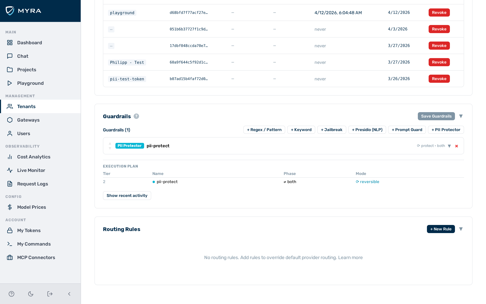
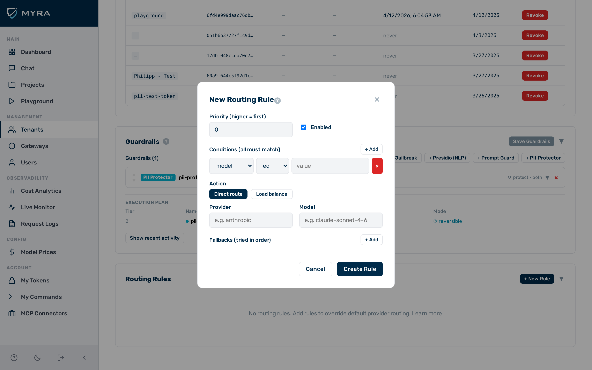

# Routing rules

Routing rules let you redirect incoming requests to specific providers and models based on attributes of the request. The gateway evaluates rules in ascending priority order. The first rule whose conditions all match is applied — evaluation stops there. If no rule matches, the gateway uses the provider and model from the original request.

## How evaluation works

- Rules are evaluated in ascending priority order — a lower number means higher priority.
- First match wins: evaluation stops at the first rule whose conditions all match.
- All conditions within a single rule are combined with a logical AND.
- If no rule matches, the gateway forwards the request using the provider and model specified in the original request.

> 💡 **Note:** Priority values do not need to be contiguous. Using increments of 10 (10, 20, 30 …) leaves room to insert rules between existing ones without renumbering.

## Condition fields

| Field | Matches against |
|---|---|
| `model` | The `model` field in the request body |
| `provider` | The provider name resolved for this gateway |
| `tenant_id` | The tenant identifier in the request URL |
| `header:{name}` | The value of HTTP header `{name}` (e.g. `header:x-customer-tier`) |
| `meta:{key}` | The value of `x-aig-meta-{key}` header (e.g. `meta:region`) |

## Operators

| Operator | Description |
|---|---|
| `eq` | Exact equality match |
| `neq` | Not equal |
| `prefix` | Value starts with the specified string |
| `contains` | Value contains the specified string |
| `regex` | Value matches the specified regular expression |

## Actions

| Field | Type | Description |
|---|---|---|
| `provider` | string | Route the request to this provider. |
| `model` | string | Replace the model name with this value when forwarding. |
| `fallbacks` | array | Ordered list of `{provider, model}` objects to try if the primary fails. |

## Creating a routing rule

Before you begin, ensure the following conditions are met:

- ☑ You have admin access.
- ☑ A gateway exists.


*The routing rules list on the gateway detail page.*

Proceed as follows to create a routing rule:

1. Open **Gateways** in the left sidebar.
   - The gateway list opens.
2. Click on the gateway you want to configure.
   - The gateway detail page opens.
3. Click on the **Routing** tab.
   - The rule list opens, showing all rules in priority order.
4. Click on the **Add Rule** button.
   - The rule editor opens.


*The routing rule editor.*

5. Enter a value in the **Priority** text field (use increments of 10 to leave room for future insertions).
   - The priority value is set.
6. Click on the **Add Condition** button to add one or more conditions.
   - A condition row appears.
7. Select the field from the **Field** drop-down list.
   - The field is set.
8. Select the operator from the **Operator** drop-down list.
   - The operator is set.
9. Enter the match value in the **Value** text field.
   - The condition is complete.
10. Select the target provider from the **Provider** drop-down list in the **Actions** section.
    - The provider is set.
11. If required, enter a model name in the **Model** text field to rewrite the model name when forwarding.
    - The model rewrite is set.
12. Toggle the **Enabled** toggle on.
    - The rule is marked active.
13. Click on the **Save** button.

→ The routing rule is created and appears in the rule list in priority order.

## Editing a routing rule

Proceed as follows to edit a routing rule:

1. Open **Gateways** in the left sidebar.
   - The gateway list opens.
2. Click on the gateway that contains the rule.
   - The gateway detail page opens.
3. Click on the **Routing** tab.
   - The rule list opens.
4. Click on the rule you want to edit.
   - The rule editor opens with the current values.
5. Edit the required fields.
   - The fields are updated.
6. Click on the **Save** button.

→ The routing rule is updated with the new values.

## Deleting a routing rule

Proceed as follows to delete a routing rule:

1. Open **Gateways** in the left sidebar.
   - The gateway list opens.
2. Click on the gateway that contains the rule.
   - The gateway detail page opens.
3. Click on the **Routing** tab.
   - The rule list opens.
4. Click on the rule you want to delete.
   - The rule editor opens.
5. Click on the **Delete** button.
   - A confirmation dialogue appears.
6. Click on the **Confirm** button.

→ The routing rule is deleted and removed from the rule list.

## Common patterns

### Route by model prefix

Send all `gpt-*` requests to OpenAI and all `claude-*` requests to Anthropic:

```json
[
  {
    "priority": 10,
    "conditions": [{"field": "model", "op": "prefix", "value": "gpt-"}],
    "actions": {"provider": "openai", "model": "gpt-4o"},
    "enabled": true
  },
  {
    "priority": 20,
    "conditions": [{"field": "model", "op": "prefix", "value": "claude-"}],
    "actions": {"provider": "anthropic", "model": "claude-sonnet-4-6"},
    "enabled": true
  }
]
```

### Route by tenant

Send a specific tenant's traffic to a dedicated provider account:

```json
{
  "priority": 5,
  "conditions": [{"field": "tenant_id", "op": "eq", "value": "enterprise-corp"}],
  "actions": {
    "provider": "openai",
    "model": "gpt-4o"
  },
  "enabled": true
}
```

### Route by custom header

Use a customer tier header to select a model:

```json
{
  "priority": 15,
  "conditions": [
    {"field": "header:x-customer-tier", "op": "eq", "value": "premium"}
  ],
  "actions": {
    "provider": "openai",
    "model": "gpt-4o"
  },
  "enabled": true
}
```

### Route by metadata

Route requests tagged with a region metadata header:

```json
{
  "priority": 20,
  "conditions": [
    {"field": "meta:region", "op": "eq", "value": "eu"}
  ],
  "actions": {
    "provider": "azure",
    "model": "gpt-4o"
  },
  "enabled": true
}
```

Attach the metadata with `x-aig-meta-region: eu` on the inference request.

## API

Routing rules are fully manageable via the Admin API. See [Routing Rules API](../api-reference/routing-rules.md) for endpoint reference and request/response examples.

## See also

- [OpenAI-compatible endpoint](compat-endpoint.md)
- [Fallback and retry](fallback.md)
- [Gateway configuration](../configuration/gateway-config.md)
- [API reference: routing rules](../api-reference/routing-rules.md)
