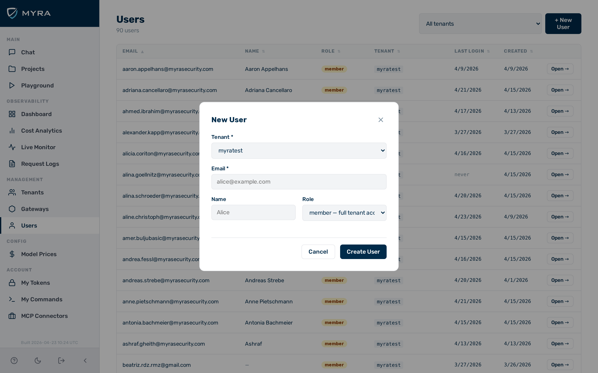
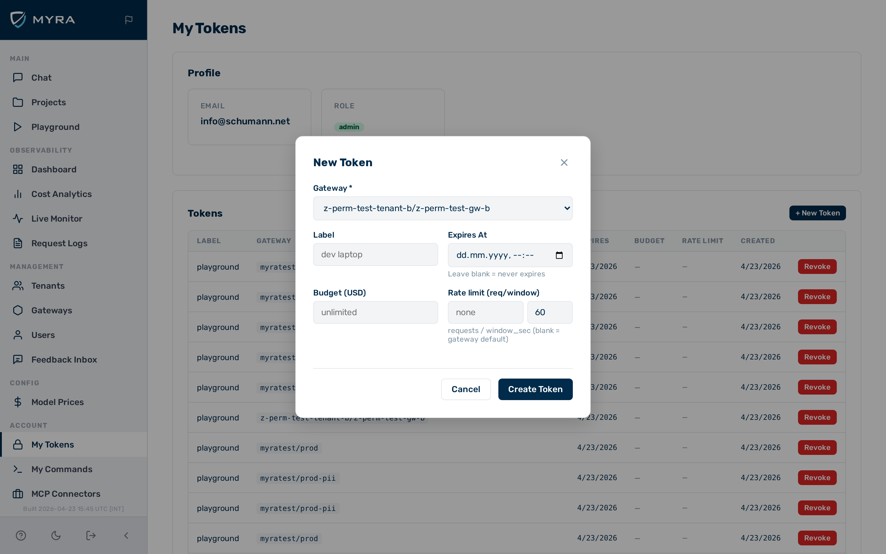

# Authentication

AI Gateway by Myra Security authenticates inference requests using access tokens. Tokens are issued via the admin UI or the Admin API. Each token carries an expiry date, an optional rate limit, an optional spend cap, and one or more scopes. The gateway stores only a one-way hash of each token — the plaintext is returned once at creation time and cannot be recovered afterwards.

## Token format

All tokens begin with the `myra_` prefix followed by 64 hexadecimal characters (32 random bytes):

```
myra_xxxxxxxxxxxxxxxxxxxxxxxxxxxxxxxxxxxxxxxxxxxxxxxxxxxxxxxxxxxxxxxx
```

The prefix identifies a string as an AI Gateway token, which is useful when auditing secrets managers or environment variable inventories.

## Token security model

- Tokens are stored as a one-way hash. The original value cannot be recovered from the database.
- The plaintext token is returned **once** in the creation response. Copy it immediately.
- If a token is lost, delete it and create a new one. There is no recovery path.

## Header acceptance order

The gateway looks for an authentication token in the following header order. The first matching header is used:

1. `x-aig-token: <token>`
2. `Authorization: Bearer <token>`
3. `x-api-key: <token>`

This order lets you use the gateway as a drop-in replacement for OpenAI-compatible clients that send `Authorization: Bearer` or `x-api-key` without reconfiguration.

## Role-based access control

The `user_id` of each token maps to a user record that has a `role` field:

| Role | Inference access | Admin panel access |
|---|---|---|
| `admin` | All gateways (platform-wide) | Full access, all tenants |
| `tenant_admin` | All gateways in their tenant | Own tenant — manages users and settings |
| `member` | All gateways in their tenant | Own tenant |
| `viewer` | 403 on all inference requests | Own tenant (read-only) |

> ⚠️ **Caution:** The `viewer` role is intended for users who need read access to the admin UI only. Sending an inference request with a viewer-role token always returns `403 Forbidden`.

## Token types

Two types of token are available. They serve different purposes:

| | Gateway token | User token |
|---|---|---|
| **Where** | Gateways → [gateway] → Tokens tab | Users → [user] → New Token |
| **Fields** | Expiration only | Label, gateway, expiry, budget, rate limit, scopes |
| **Associated with** | No user identity | A specific user record |
| **Budget tracking** | None | Per-user spend tracked |
| **Use case** | Quick service-to-service token | Named credential tied to an identity |

Use gateway tokens when you need a simple credential for a service or integration and do not need spend tracking per caller.

Use user tokens when you need to attribute usage, enforce per-user budgets, or manage access for individual people or teams.

## Token fields

| Field | Type | Description |
|---|---|---|
| `label` | string | Human-readable name for the token |
| `user_id` | string | Associates the token with a user identity for audit logs and budget tracking |
| `scopes` | array of strings | Permissions granted by this token (e.g. `["inference"]`) |
| `expires_at` | string \| null | ISO-8601 expiration timestamp. `null` = no expiry |
| `rate_limit` | object \| null | Per-token rate limit: `{"requests": N, "window_sec": S}` |
| `budget_usd` | number \| null | Per-token spend cap in USD. `null` = no cap |

## Token scopes

When creating a user token, select one or more scopes:

| Scope | Description |
|---|---|
| `inference` | Grants access to inference endpoints. Select this for any token that makes model requests. |
| `read` | Reserved for future use. |
| `admin` | Reserved for future use. |

Select `inference` for standard API access.

---

## Creating a user

> 💡 **Note:** User creation is also covered in the [Users](../admin-ui/users.md) section of the admin UI documentation. The steps below are provided here for convenience.


*New User form*

► Proceed as follows to create a user:

1. Click on **Users** in the left sidebar.
   ⇒ The user list opens.
2. Click on the **New User** button.
   ⇒ The New User form opens.
3. Select the tenant from the **Tenant** drop-down list.
4. Enter the email address in the **Email** text field.
5. If required, enter a display name in the **Name** text field.
6. Select the role from the **Role** drop-down list:
   - **tenant_admin** — manages users and settings within the tenant
   - **member** — full access to all gateways in the tenant
   - **viewer** — read-only admin UI access; cannot make inference requests
7. Click on the **Save** button.

→ The user record is created and appears in the user list.

> 💡 **Note:** Platform `admin` users can also create other `admin` accounts.

---

## Creating a token


*New Token form*

► Proceed as follows to create a token:

1. Click on **Users** in the left sidebar.
   ⇒ The user list opens.
2. Click on the user you want to create a token for.
   ⇒ The user detail page opens.
3. Click on the **New Token** button.
   ⇒ The New Token form opens.
4. Select the gateway from the **Gateway** drop-down list.
5. Enter a label in the **Label** text field.
6. If required, enter an expiry date in the **Expires At** field.
7. If required, enter a spend cap in the **Budget (USD)** field.
8. If required, configure a rate limit in the **Rate Limit** fields.
9. Select the required scopes under **Scopes**. Select `inference` for standard API access.
10. Click on the **Create** button.

→ The token is created. The plaintext token is displayed once. Copy it now — it cannot be retrieved again.

---

## Revoking a token

► Proceed as follows to revoke a token:

1. Click on **Users** in the left sidebar.
   ⇒ The user list opens.
2. Click on the user whose token you want to revoke.
   ⇒ The user detail page opens, showing the token list.
3. Click on the delete icon next to the token.

→ The token is revoked immediately. In-flight requests that have already passed the authentication phase complete normally.

---

## Disabling authentication

> ⚠️ **Caution:** Disabling authentication removes all access control from the gateway endpoint. Any caller with network access can make inference requests and incur costs. Never disable authentication in a production environment.


*Gateway Config tab — Auth Required toggle*

► Proceed as follows to disable authentication on a gateway:

1. Click on **Gateways** in the left sidebar.
   ⇒ The gateway list opens.
2. Click on the gateway you want to configure.
   ⇒ The gateway detail page opens.
3. Click on the **Config** tab.
4. Toggle the **Auth Required** switch to off.
5. Click on the **Save** button.

→ Authentication is disabled for the gateway. All inference requests are accepted without a token.

---

## API

Token and user management is also available via the Admin API. See [Users & Tokens API](../api-reference/users-tokens.md) for endpoint reference and request/response examples.

## See also

- [Rate Limiting](../configuration/rate-limiting.md)
- [Budget & Quota Enforcement](../configuration/budgets.md)
- [Gateway Configuration](../configuration/gateway-config.md)
- [API Reference: Users & Tokens](../api-reference/users-tokens.md)
