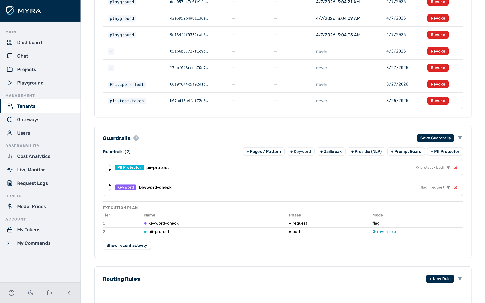

# Provider key management (BYOK)

Bring Your Own Key (BYOK) lets you store your provider API keys encrypted inside the gateway rather than hardcoding them in configuration files or environment variables. The gateway encrypts each key at rest and decrypts it on demand when making upstream provider requests.

## Key storage and encryption

Provider API keys are encrypted at rest using AES-256. The encryption key is managed by the Myra Security platform — you do not handle it directly.

## Key identity model

Each stored key is uniquely identified by the combination of:

- `gateway_id` — the gateway the key belongs to
- `provider` — the provider name (e.g. `openai`, `anthropic`, `bedrock`)
- `alias` — a label for the key (default: `"default"`)

## Multiple keys per provider

Multiple keys for the same provider on the same gateway coexist under different aliases. This lets you rotate keys without downtime or assign different keys to different request flows.

To select a non-default key on a specific inference request, send the `x-aig-byok-alias` header:

```bash
curl https://your-gateway-host/v1/my-tenant/my-gateway/chat/completions \
  -H "x-aig-token: <inference-token>" \
  -H "x-aig-byok-alias: backup" \
  -H "Content-Type: application/json" \
  -d '{"model": "gpt-4o", "messages": [...]}'
```

> 💡 **Note:** If the specified alias does not exist for the provider, the gateway falls back to the `"default"` alias.

## AWS Bedrock key format

For AWS Bedrock, enter credentials as a colon-delimited string in the **Key** field:

```
ACCESS_KEY_ID:SECRET_ACCESS_KEY
```

Or, with a session token:

```
ACCESS_KEY_ID:SECRET_ACCESS_KEY:SESSION_TOKEN
```

---

## Adding a BYOK key


*Add Key form*

► Proceed as follows to add a BYOK key:

1. Click on **Gateways** in the left sidebar.
   - The gateway list opens.
2. Click on the gateway you want to configure.
   - The gateway detail page opens.
3. Click on the **Keys** tab.
4. Click on the **Add Key** button.
   - The Add Key form opens.
5. Select the provider from the **Provider** drop-down list.
6. Enter an alias in the **Alias** text field. Leave the value as `default` unless you need multiple keys for the same provider.
7. Paste the API key into the **Key** text field.
8. Click on the **Save** button.

→ The key is encrypted immediately. The plaintext is not stored. The key appears in the key list.

---

## Deleting a BYOK key

► Proceed as follows to delete a BYOK key:

1. Click on **Gateways** in the left sidebar.
   - The gateway list opens.
2. Click on the gateway whose key you want to delete.
   - The gateway detail page opens.
3. Click on the **Keys** tab.
   - The key list appears.
4. Click on the delete icon next to the key you want to remove.

→ The key is deleted immediately.

> ⚠️ **Caution:** Deleting the `default` key for a provider causes all requests to that provider to fail until a new key is added.

---

## Using multiple BYOK keys

Store additional keys under named aliases via the **Keys** tab. Set the **Alias** field to a value other than `default`, for example `backup`.

To route a specific inference request to a named alias, include the `x-aig-byok-alias` header with the alias value. See the code example in [Multiple keys per provider](#multiple-keys-per-provider) above.

---

## API

Key management is also available via the Admin API. See [Tenants & Gateways API](../api-reference/tenants-gateways.md) for endpoint reference and request/response examples.

## See also

- [Authentication](authentication.md)
- [Gateway Configuration](../configuration/gateway-config.md)
- [Fallback & Retry](../routing/fallback.md)
- [Providers Overview](../providers/overview.md)
