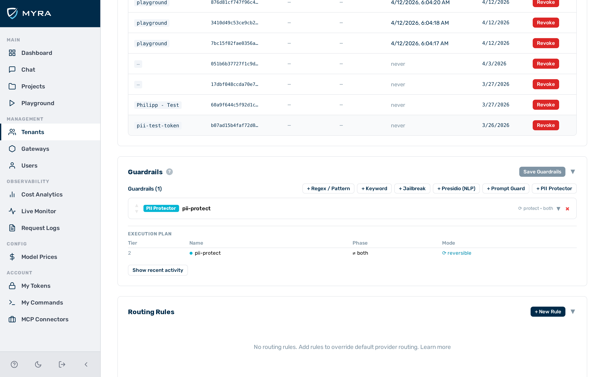

# Guardrails

AI Gateway by Myra Security evaluates every request and response through a configurable guardrail pipeline. Each guardrail inspects message content and returns a verdict — `block`, `scrub`, or `flag` — that controls how the gateway handles the traffic.


*Guardrail Builder*

## Two-tier architecture

Guardrails are grouped into two tiers based on where they execute and how fast they run.

| Tier | Guardrail types | Execution | Latency |
|---|---|---|---|
| Tier 1 | `regex`, `keyword`, `jailbreak`, `json_schema`, `contains_code`, `gibberish`, `language` | In-process | Sub-millisecond |
| Tier 2 | `presidio`, `prompt_guard`, `pii_protector` | Sidecar HTTP call | Milliseconds |

All Tier 1 guardrails run before any Tier 2 guardrail. Within the same tier, guardrails run in the order they appear in the `guardrails` array of the gateway configuration.

## Execution order and verdict behaviour

The pipeline processes guardrails sequentially.

| Verdict | Effect on pipeline |
|---|---|
| `block` | The request is denied immediately. No further guardrails run. |
| `scrub` | Matched content is replaced in the body. The pipeline continues. |
| `flag` | The match is recorded in the log entry. The pipeline continues. |

A `block` verdict from any single guardrail stops the entire pipeline. `scrub` and `flag` verdicts are non-terminal — the remaining guardrails still run after the match is recorded or the content is redacted.

## Targets

Each guardrail declares which traffic direction it inspects.

| Target | Description |
|---|---|
| `request` | Inspect the outbound request body (default) |
| `response` | Inspect the inbound model response body |
| `both` | Inspect both the request and the response |

## Verdict actions

### `block`

The request is denied. The caller receives a synthetic HTTP 200 response containing an assistant-role message that describes the reason for blocking. No upstream model call is made.

> ⭐ **Example:** Block message:
>
> ```
> Request blocked by content policy (block-pci): cc – Credit/Debit Card Number
> ```

For streaming requests, the synthetic block message is delivered as SSE events using the same format the model uses. Streaming clients do not need special handling.

### `scrub`

Matched content is replaced with a placeholder string before the body is forwarded. The default placeholder is `[REDACTED]`. The `regex` guardrail allows a custom value via `scrub_placeholder`.

> ⚠️ **Caution:** The `keyword`, `jailbreak`, and `prompt_guard` guardrails do not support `scrub`. When `action: "scrub"` is configured on those guardrails, the action is treated as `flag`.

### `flag`

The match is recorded in the gateway log entry for the request. The body is not modified and the request is not blocked.

## Tier 2 availability and `fail_open`

Tier 2 guardrails make an HTTP call to a locally hosted sidecar service running within Myra's certified infrastructure. Prompt content never leaves the Myra perimeter. When the sidecar is unavailable, the `fail_open` setting controls what happens.

| `fail_open` | Sidecar unavailable |
|---|---|
| `true` (default) | Request passes through as if no match occurred |
| `false` | Request is blocked |

> ⚠️ **Caution:** Set `fail_open: false` when the sidecar is a hard dependency for your security policy. With the default `fail_open: true`, a sidecar outage allows all traffic through uninspected.

## Log fields

Every guardrail that runs produces structured output. The following fields are set on the gateway log entry for the request.

| Field | Type | Description |
|---|---|---|
| `blocked` | boolean | `true` if any guardrail blocked the request |
| `blocked_by` | string | Name of the guardrail that issued the block verdict |
| `block_reason` | string | Pattern name or category code that triggered the block |
| `detectors_fired` | array | Names of all guardrails that produced a non-pass verdict |

---

## Creating a guardrail

Guardrails are configured using the visual **Guardrail Builder**, which is available in two places:

- **Existing gateway** — open the gateway detail page, then scroll down to the **Guardrails** card.
- **New gateway** — the Guardrail Builder is embedded at the bottom of the **New Gateway** modal.


*Guardrail Builder — type buttons*

Proceed as follows to create a guardrail:

1. Open the gateway detail page or the **New Gateway** modal.
   - The Guardrail Builder appears at the bottom of the page or modal.
2. Click on the button for the guardrail type you want to add:
   - **+ Regex / Pattern** — named pattern library and custom regex
   - **+ Keyword** — exact string matching
   - **+ Jailbreak** — zero-config detector pre-loaded with 18 known attack phrases
   - **+ Presidio (NLP)** — NLP-based PII detection
   - **+ Prompt Guard** — semantic safety classification (Llama Guard 3, locally hosted)
   - **+ PII Protector** — reversible PII tokenisation
   - A collapsed guardrail card appears at the bottom of the list.
3. Click on the guardrail card to expand it.
4. Enter a name in the **Name** text field.
5. Select the action from the **Action** drop-down list: `block`, `scrub` (not available on Keyword, Jailbreak, or Prompt Guard), or `flag`.
6. Select the target from the **Target** drop-down list: `request` (default), `response`, or `both`.
7. Configure any type-specific fields (patterns, keywords, entities, etc.). See the relevant guardrail type page for field details.
8. If required, use the **▲▼** arrows on the left side of each guardrail card to reorder guardrails within the list. Order matters within a tier — Tier 1 always runs before Tier 2, but within the same tier execution follows list order.
9. Click on the **Save Guardrails** button in the Guardrails card header (on an existing gateway), or complete the rest of the form and click on **Create Gateway** (in the New Gateway modal).

→ The guardrail is saved. The **Execution plan** table below the guardrail list updates to show the new guardrail in execution order.

---

## Editing a guardrail

Proceed as follows to edit a guardrail:

1. Open the gateway detail page.
   - The Guardrail Builder shows the configured guardrail list.
2. Click on the guardrail card you want to edit.
   - The card expands to show the configuration fields.
3. Update the required fields.
4. Click on the **Save Guardrails** button.

→ The updated guardrail configuration is saved.

---

## Deleting a guardrail

Proceed as follows to delete a guardrail:

1. Open the gateway detail page.
   - The Guardrail Builder shows the configured guardrail list.
2. Click on the **×** button on the right side of the guardrail card header you want to remove.
   - The card is removed from the list immediately.
3. Click on the **Save Guardrails** button.

→ The guardrail is deleted. The **Execution plan** table updates to reflect the removal.

---

## API

Guardrails are configurable via the Admin API as the `guardrails` array in the gateway configuration. See [Tenants & Gateways API](../api-reference/tenants-gateways.md) and the [Gateway Configuration Reference](../reference/config-reference.md) for details.

---

## Guardrail types

| Type | Tier | Description |
|---|---|---|
| [`regex`](guardrails/regex.md) | 1 | In-process regex and named pattern matching |
| [`keyword`](guardrails/keyword.md) | 1 | In-process exact keyword matching |
| [`jailbreak`](guardrails/jailbreak.md) | 1 | Pre-configured jailbreak and prompt-injection detector — zero configuration required |
| [`json_schema`](guardrails/json-schema.md) | 1 | Validates model responses against a declared JSON schema — enforces structured output |
| [`contains_code`](guardrails/contains-code.md) | 1 | Detects source code in requests or responses |
| [`gibberish`](guardrails/gibberish.md) | 1 | Detects low-quality or incoherent model responses using entropy and vocabulary heuristics |
| [`language`](guardrails/language.md) | 1 | Detects the dominant writing system of request or response text — permits or blocks by script |
| [`presidio`](guardrails/presidio.md) | 2 | NLP-based PII detection — locally hosted within Myra's certified infrastructure |
| [`prompt_guard`](guardrails/prompt-guard.md) | 2 | Safety classification via Llama Guard 3 — locally hosted within Myra's certified infrastructure |
| [`pii_protector`](guardrails/pii-protector.md) | 2 | Reversible PII tokenisation — real values restored in response |

---

## See also

- [Regex guardrail](guardrails/regex.md)
- [Keyword guardrail](guardrails/keyword.md)
- [Jailbreak guardrail](guardrails/jailbreak.md)
- [JSON Schema guardrail](guardrails/json-schema.md)
- [Code detection guardrail](guardrails/contains-code.md)
- [Gibberish detector](guardrails/gibberish.md)
- [Language guardrail](guardrails/language.md)
- [NLP PII detector](guardrails/presidio.md)
- [Prompt Guard](guardrails/prompt-guard.md)
- [PII Protector](guardrails/pii-protector.md)
- [Logs API](../api-reference/logs.md) — `blocked_by`, `block_reason`, `guardrail_verdict` fields
- [Gateway Configuration Reference](../reference/config-reference.md) — `guardrails` array
