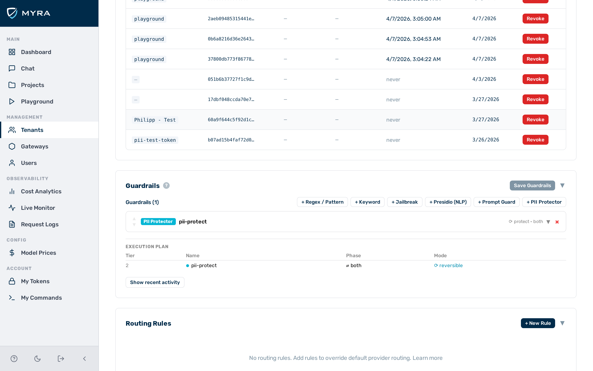

# Code detection guardrail

The code detection guardrail is a **Tier 1** (in-process) guardrail that detects source code in request and response content. It is suited for preventing SQL injection attempts in prompts, monitoring when a model returns code unexpectedly, or enforcing policies that prohibit code exchange through an AI endpoint.

## When to use the code detection guardrail

Use the code detection guardrail when you need to detect or block the presence of actual source code — not just discussion of programming topics. Tune `min_signals` to balance sensitivity against false positives on educational or explanatory content.

## How it works

Detection uses two independent layers. Each layer that produces a positive result counts as one signal.

1. **Markdown code fences** — the presence of any fenced code block (`` ```sql ``, `` ```python ``, `` ``` ``, etc.) triggers immediately. A single opening fence is sufficient; the fence does not need to be closed.
2. **Structural heuristics** — language-specific patterns are checked against the plain text. Each language uses a set of syntactic signals appropriate to that language.

### `min_signals` setting

Setting `min_signals: 2` requires both a code fence and a structural heuristic match before the guardrail triggers. This reduces false positives in conversations that discuss programming topics without containing executable code — for example, a user asking "how does a SELECT statement work?" matches heuristics but does not produce a code fence, so it passes with `min_signals: 2`.

> 💡 **Note:** `min_signals: 1` (default) is suitable when the traffic is not expected to contain any code discussion. Maximum sensitivity. `min_signals: 2` is suitable for general-purpose assistants where programming topics arise in natural prose. This reduces false positives on educational or explanatory content.

---

## Configuration reference

| Field | Type | Default | Description |
|---|---|---|---|
| `type` | string | — | Must be `"contains_code"` |
| `name` | string | — | Human-readable label for this guardrail instance |
| `action` | string | `"block"` | What to do on a detection: `block` or `flag` |
| `target` | string | `"request"` | Which traffic to inspect: `request`, `response`, or `both` |
| `languages` | array | — | Restrict detection to these language names. When absent, all supported languages are active. |
| `min_signals` | integer | `1` | Minimum number of independent detection signals required before the guardrail triggers |

---

## Supported languages

| Language | Fence aliases | Structural heuristics |
|---|---|---|
| `sql` | `sql`, `sqlite`, `mysql`, `psql` | `SELECT … FROM`, `INSERT INTO`, `UPDATE … SET`, `DELETE FROM`, `CREATE TABLE` |
| `python` | `python`, `py` | `def …():`, `import …`, `class …:`, list comprehensions, `print(…)` |
| `javascript` | `javascript`, `js`, `ts`, `typescript` | `function …()`, `const … = `, `=>` arrow functions, `require(…)`, `console.log(…)` |
| `bash` | `bash`, `sh`, `shell` | Shebangs (`#!/`), pipe chains, `$( … )` substitution, common shell built-ins |
| `html` | `html`, `htm` | Opening and closing HTML tags (`<div>`, `</p>`, `<script>`, etc.) |
| `lua` | `lua` | `local … =`, `function … end`, `require(…)`, `--` line comments |

---

## Example configurations

### Block SQL in requests

Prevents SQL code from being submitted through the gateway. Use this to reduce the risk of SQL injection attempts being forwarded to a model that executes tool calls against a database.

```json
{
  "type": "contains_code",
  "name": "block-sql-requests",
  "action": "block",
  "target": "request",
  "languages": ["sql"]
}
```

### Flag code in responses (monitoring mode)

Records a log entry whenever the model returns code-containing content, without blocking or modifying the response. Useful for auditing gateways where code generation is not an intended use case.

```json
{
  "type": "contains_code",
  "name": "monitor-code-responses",
  "action": "flag",
  "target": "response"
}
```

Detections are recorded in `detectors_fired` on the log entry. The response is not modified.

### Require two signals before blocking

Reduces false positives on discussions about programming topics where no actual code is present.

```json
{
  "type": "contains_code",
  "name": "code-block-strict",
  "action": "block",
  "target": "request",
  "min_signals": 2
}
```

A message such as "explain how a for loop works in Python" matches structural heuristics (mentions of Python syntax) but does not contain a code fence, so it passes. A message containing `` ```python … ``` `` is blocked regardless of `min_signals` because the fence alone satisfies both layers when combined with the heuristic match.

---

## Configuring the code detection guardrail


*Code detection guardrail card — expanded view*

► Proceed as follows to configure the code detection guardrail in the Guardrail Builder:

1. Open the gateway detail page and scroll down to the **Guardrails** card.
2. Click on the **+ Contains Code** button.
   - A collapsed code detection guardrail card appears at the bottom of the list.
3. Click on the card to expand it.
4. Enter a name in the **Name** text field.
5. Select the action from the **Action** drop-down list: `block` or `flag`.
6. Select the target from the **Target** drop-down list: `request`, `response`, or `both`.
7. If required, select specific languages from the **Languages** list. Leave empty to detect all supported languages.
8. If required, set the **Min Signals** field to `2` to reduce false positives on educational content.
9. Click on the **Save Guardrails** button.

→ The code detection guardrail is saved and appears in the execution plan.

---

## Pipeline position

The code detection guardrail is **Tier 1** — it runs in-process with no external calls. It runs in both the request and response phases depending on the configured `target`. A `block` verdict from this guardrail stops the pipeline immediately. No subsequent guardrails run.

---

## See also

- [Guardrail pipeline overview](../guardrails.md)
- [Regex guardrail](regex.md)
