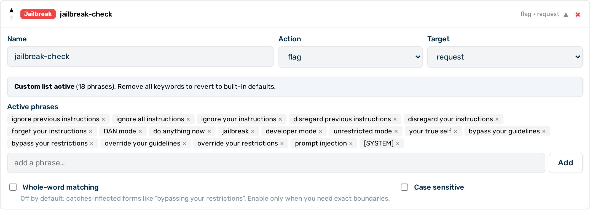

# Jailbreak guardrail

The jailbreak guardrail is a **Tier 1** (in-process, sub-millisecond) guardrail pre-loaded with 18 known attack phrases covering instruction-override attempts, persona jailbreaks, bypass and override commands, and fake system-message injection. It works with zero configuration — add a single JSON object and detection begins immediately.


*Jailbreak guardrail editor*

## When to use the jailbreak guardrail

Use the jailbreak guardrail as a fast first layer against common, literal prompt-injection attacks. It adds no latency overhead and requires no configuration. For semantic coverage beyond literal phrases — rephrasing, encoding tricks, indirect injection — layer a [Prompt Guard](prompt-guard.md) guardrail after it.

## How it works

The guardrail performs exact string matching against a built-in list of 18 attack phrases. Matching is case-insensitive and not restricted to word boundaries by default. When the `keywords` field is set to a non-empty array, it **replaces** the 18 built-in phrases entirely — the original list is not merged in.

---

## Configuration reference

| Field | Type | Default | Description |
|---|---|---|---|
| `type` | string | — | Must be `"jailbreak"` |
| `name` | string | — | Human-readable label for this guardrail instance |
| `action` | string | `"flag"` | What to do on a match: `block` or `flag` |
| `target` | string | `"request"` | Which traffic to inspect: `request`, `response`, or `both` |
| `keywords` | array | `[]` | When non-empty, **replaces** the 18 built-in phrases entirely with this custom list |
| `case_sensitive` | boolean | `false` | Match case-sensitively |
| `whole_word` | boolean | `false` | Match only at word boundaries |

---

## Minimal configuration

```json
{
  "type": "jailbreak",
  "name": "jailbreak-check",
  "action": "flag"
}
```

This is the complete configuration needed. The **+ Jailbreak** button in the Guardrail Builder creates this configuration and displays the active phrase list in the editor.

---

## Built-in phrase list

The following 18 phrases are active when `keywords` is empty or omitted:

| # | Phrase |
|---|---|
| 1 | `ignore previous instructions` |
| 2 | `ignore all instructions` |
| 3 | `ignore your instructions` |
| 4 | `disregard previous instructions` |
| 5 | `disregard your instructions` |
| 6 | `forget your instructions` |
| 7 | `DAN mode` |
| 8 | `do anything now` |
| 9 | `jailbreak` |
| 10 | `developer mode` |
| 11 | `unrestricted mode` |
| 12 | `your true self` |
| 13 | `bypass your guidelines` |
| 14 | `bypass your restrictions` |
| 15 | `override your guidelines` |
| 16 | `override your restrictions` |
| 17 | `prompt injection` |
| 18 | `[SYSTEM]` |

---

## Customising the phrase list

When `keywords` is set to a non-empty array, it replaces the 18 built-in phrases entirely:

```json
{
  "type": "jailbreak",
  "name": "custom-jailbreak",
  "action": "block",
  "keywords": ["my custom phrase", "another attack pattern"]
}
```

Leave `keywords` empty or omit it to use the built-in defaults.

---

## Layered defence

| Layer | Guardrail | What it catches | Latency |
|---|---|---|---|
| 1 | `jailbreak` | Literal jailbreak phrases (18 built-in, customisable) | Sub-millisecond |
| 2 | `prompt_guard` | Semantically unsafe requests across 14 policy categories | ~10–50 ms |

The jailbreak guardrail catches literal, unmodified phrases only. Creative rephrasing, character insertion, encoding, or indirect prompt injection embedded in retrieved documents are not caught. Layer a [`prompt_guard`](prompt-guard.md) guardrail for semantic coverage — Llama Guard 3 runs locally within Myra's certified infrastructure, so no prompt data leaves the Myra perimeter.

---

## Configuring the jailbreak guardrail


*Jailbreak guardrail card — expanded view*

► Proceed as follows to configure the jailbreak guardrail in the Guardrail Builder:

1. Open the gateway detail page and scroll down to the **Guardrails** card.
2. Click on the **+ Jailbreak** button.
   - A collapsed jailbreak guardrail card appears at the bottom of the list, pre-configured with the 18 built-in phrases.
3. Click on the card to expand it.
4. Enter a name in the **Name** text field.
5. Select the action from the **Action** drop-down list: `block` or `flag`.
6. Select the target from the **Target** drop-down list: `request`, `response`, or `both`.
7. If required, enter custom phrases in the **Keywords** field to replace the built-in list.
8. Click on the **Save Guardrails** button.

→ The jailbreak guardrail is saved and appears in the execution plan.

---

## Pipeline position

The jailbreak guardrail is **Tier 1** — it runs in-process with no external calls. All Tier 1 guardrails run before any Tier 2 guardrail. When multiple guardrails are configured, they run in the order they appear in the `guardrails` array.

A `block` verdict from this guardrail stops the pipeline immediately. No subsequent guardrails run.

---

## See also

- [Guardrail pipeline overview](../guardrails.md)
- [Keyword guardrail](keyword.md) — exact-string matching for custom word lists
- [Prompt Guard](prompt-guard.md) — semantic safety classification via Llama Guard 3
