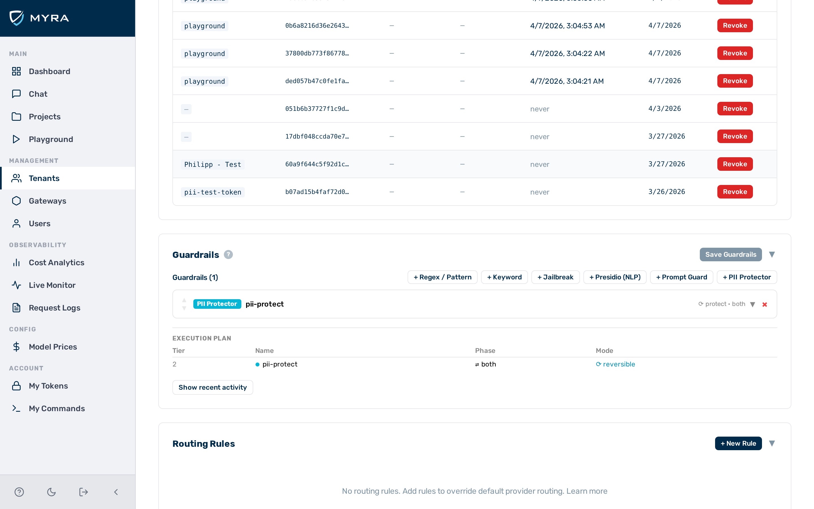

# JSON Schema guardrail

The JSON Schema guardrail is a **Tier 1** (in-process, no external call) guardrail that validates model responses against a declared JSON schema. It enforces structured output on classification endpoints, data extraction pipelines, and any use case where the model must return machine-readable JSON conforming to a known shape.

## When to use the JSON Schema guardrail

Use the JSON Schema guardrail when your application depends on receiving well-formed, schema-conformant JSON from the model. It runs entirely in-process and adds no latency overhead. Use `action: flag` during rollout to measure non-conforming output before switching to `action: block`.

## How it works

The guardrail parses the model response body as JSON and validates it against the declared `schema`. Before parsing, the guardrail removes any surrounding markdown code fences (`` ``` `` … `` ``` ``). Models that habitually wrap JSON in `` ```json … ``` `` blocks are handled correctly without special configuration.

The guardrail inspects model responses only. It cannot be targeted at `request` or `both`.

---

## Configuration reference

| Field | Type | Default | Description |
|---|---|---|---|
| `type` | string | — | Must be `"json_schema"` |
| `name` | string | — | Human-readable label for this guardrail instance |
| `action` | string | `"block"` | What to do on a violation: `block` or `flag` |
| `target` | string | `"response"` | Must be `"response"` — this guardrail only inspects model responses |
| `schema` | object | — | JSON schema descriptor — see [Schema properties](#schema-properties) below |

!!! note "Response-only guardrail"
    Set `target: "response"` or omit `target` — `"response"` is the default. Targeting `request` or `both` is not supported.

---

## Schema properties

The `schema` object supports a `required` array and a `properties` map. Each entry in `properties` declares constraints.

| Constraint | Applies to | Description |
|---|---|---|
| `type` | all | Expected JSON type: `string`, `number`, `boolean`, `array`, `object`, or `null` |
| `min` | number | Minimum value (inclusive) |
| `max` | number | Maximum value (inclusive) |
| `min_length` | string | Minimum character length (inclusive) |
| `max_length` | string | Maximum character length (inclusive) |
| `enum` | any | Array of allowed values — the field value must be one of the listed items |

---

## Block reason codes

When the guardrail triggers, the `block_reason` log field contains one of the following codes.

| Code | Meaning |
|---|---|
| `json_parse_error` | The response body is not valid JSON after stripping markdown code fences |
| `missing_field:<name>` | A field listed in `required` is absent from the response object |
| `type_mismatch:<name>` | The field is present but its JSON type does not match the declared `type` |
| `range_violation:<name>` | A numeric or string constraint (`min`, `max`, `min_length`, `max_length`, `enum`) is not satisfied |

---

## Example configurations

### Enforce structured output for a classification endpoint

Requires the response to be a JSON object containing `result` (a string) and `label` (one of three allowed values). Any response that fails to parse, omits a required field, or uses an unexpected label is blocked.

```json
{
  "type": "json_schema",
  "name": "classification-schema",
  "action": "block",
  "target": "response",
  "schema": {
    "required": ["result", "label"],
    "properties": {
      "result": { "type": "string" },
      "label": { "enum": ["positive", "negative", "neutral"] }
    }
  }
}
```

### Flag schema violations without blocking (monitoring mode)

Use `action: "flag"` during a rollout to measure how often the model produces non-conforming output before committing to blocking behaviour.

```json
{
  "type": "json_schema",
  "name": "classification-schema-monitor",
  "action": "flag",
  "target": "response",
  "schema": {
    "required": ["result", "label"],
    "properties": {
      "result": { "type": "string" },
      "label": { "enum": ["positive", "negative", "neutral"] }
    }
  }
}
```

Violations are recorded in `detectors_fired` and `block_reason` on the log entry. The response is not modified and the caller receives it unchanged.

---

## Configuring the JSON Schema guardrail


*JSON Schema guardrail card — expanded view*

Proceed as follows to configure the JSON Schema guardrail in the Guardrail Builder:

1. Open the gateway detail page and scroll down to the **Guardrails** card.
2. Click on the **+ JSON Schema** button.
    - A collapsed JSON Schema guardrail card appears at the bottom of the list.
3. Click on the card to expand it.
4. Enter a name in the **Name** text field.
5. Select the action from the **Action** drop-down list: `block` or `flag`.
6. Verify that the **Target** drop-down list is set to `response`.
7. Enter the JSON schema in the **Schema** field, including the `required` array and the `properties` map.
8. Click on the **Save Guardrails** button.
    - -> The JSON Schema guardrail is saved and appears in the execution plan.

---

## Pipeline position

The JSON Schema guardrail is **Tier 1** — it runs in-process with no external calls. It executes in the response phase only. A `block` verdict from this guardrail stops the pipeline immediately. No subsequent guardrails run.

---

## See also

- [Guardrail pipeline overview](../guardrails.md)
- [Regex guardrail](regex.md)
