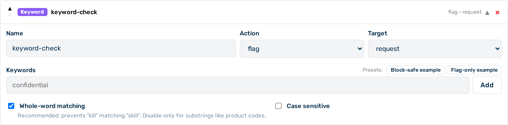
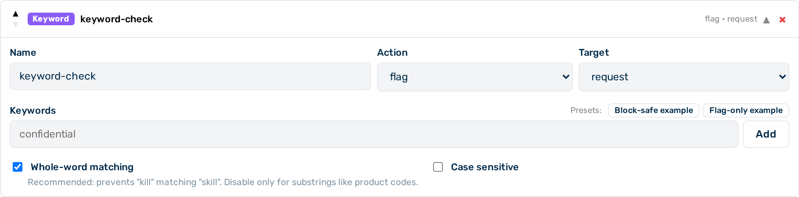

# Keyword guardrail

The keyword guardrail is a **Tier 1** (in-process, sub-millisecond) guardrail that scans request and response content for exact string matches. It is suited for topic filtering, brand protection, and blocking known-bad strings where pattern-based matching is not required.


*Keyword guardrail editor*

## When to use the keyword guardrail

Use the keyword guardrail when you need fast, deterministic detection of specific, known strings. It adds no latency overhead and requires no external service. For detecting structured data formats such as email addresses or card numbers, use the [Regex guardrail](regex.md). For NLP-based PII detection, use the [NLP PII Detector](presidio.md).

## How it works

The guardrail performs plain string matching. Each keyword in the `keywords` array must appear verbatim in the inspected body. No wildcards, regular expressions, or stemming are applied.

- **Case-insensitive (default):** `"lawsuit"` matches `lawsuit`, `Lawsuit`, `LAWSUIT`, and any other case variant.
- **Case-sensitive:** `"API"` matches only `API`, not `api` or `Api`.
- **Whole-word (default `true`):** `"kill"` matches only when surrounded by non-word characters — it does not match `"skill"` or `"killing"`. Set `whole_word: false` only when intentionally matching substrings, such as internal product codes that appear as part of longer strings.

A single match from any keyword in the list is sufficient to trigger the configured action. All matched keyword names are recorded in the `detectors_fired` log field.

> ⚠️ **Caution:** The keyword guardrail does not support `action: "scrub"`. When `"scrub"` is configured, the guardrail treats it as `"flag"`. To redact matched content, use the [Regex guardrail](regex.md) or [NLP PII Detector](presidio.md) instead.

> 💡 **Note:** For `action: block`, keep `whole_word: true` (the default) and use unambiguous, specific terms. Broad words such as `"attack"`, `"kill"`, or `"hack"` have high false positive rates — use `action: flag` for those.

---

## Configuration reference

| Field | Type | Default | Description |
|---|---|---|---|
| `type` | string | — | Must be `"keyword"` |
| `name` | string | — | Human-readable label for this guardrail instance |
| `action` | string | `"flag"` | What to do on a match: `block` or `flag` |
| `target` | string | `"request"` | Which traffic to inspect: `request`, `response`, or `both` |
| `keywords` | array | `[]` | Exact strings to match |
| `case_sensitive` | boolean | `false` | When `true`, matching is case-exact; when `false`, matching is case-insensitive |
| `whole_word` | boolean | `true` | When `true`, a keyword only matches when surrounded by non-word characters. Prevents `"kill"` from matching `"skill"`. Disable only when matching substrings such as product codes. |

---

## Example configurations

### Block requests mentioning competitor names

```json
{
  "type": "keyword",
  "name": "competitor-block",
  "action": "block",
  "target": "request",
  "keywords": ["AcmeCorp", "RivalAI", "OtherVendor"],
  "case_sensitive": false
}
```

### Flag responses containing specific internal terms

Records a log entry whenever the model response contains an internal codename, without blocking or modifying the response.

```json
{
  "type": "keyword",
  "name": "internal-term-flag",
  "action": "flag",
  "target": "response",
  "keywords": ["Project Nightingale", "Operation Keystone"],
  "case_sensitive": true
}
```

### Block prohibited topics

```json
{
  "type": "keyword",
  "name": "prohibited-topics",
  "action": "block",
  "target": "both",
  "keywords": ["jailbreak", "ignore previous instructions", "DAN mode"],
  "case_sensitive": false
}
```

### Detect jailbreak and prompt-injection attempts

The keyword guardrail catches the most common literal jailbreak and prompt-injection attempts with sub-millisecond latency and no sidecar dependency. The recommended action is `flag` rather than `block` because some phrases (e.g. `"jailbreak"` in a device support context) occur in legitimate contexts. Review flagged traffic before switching to `block`.

Set `whole_word: false` so inflected forms are also matched — for example `"bypassing your restrictions"` matches the phrase `"bypass your restrictions"`.

```json
{
  "type": "keyword",
  "name": "jailbreak-flag",
  "action": "flag",
  "target": "request",
  "case_sensitive": false,
  "whole_word": false,
  "keywords": [
    "ignore previous instructions",
    "ignore all instructions",
    "ignore your instructions",
    "disregard previous instructions",
    "disregard your instructions",
    "forget your instructions",
    "DAN mode",
    "do anything now",
    "jailbreak",
    "developer mode",
    "unrestricted mode",
    "your true self",
    "bypass your guidelines",
    "bypass your restrictions",
    "override your guidelines",
    "override your restrictions",
    "prompt injection",
    "[SYSTEM]"
  ]
}
```

The Guardrail Builder includes a **Jailbreak (flag)** preset button that populates this configuration automatically.

> ⚠️ **Caution:** Keyword matching catches only literal, unmodified phrases. Motivated users can bypass it by rephrasing, inserting characters, switching language, or injecting prompts via retrieved documents. For coverage beyond literal phrases, combine this guardrail with [Prompt Guard](prompt-guard.md) (Llama Guard 3), which performs semantic classification of request content. Llama Guard 3 runs locally within Myra's certified infrastructure — no prompt data leaves the Myra perimeter.

---

## Configuring the keyword guardrail


*Keyword guardrail card — expanded view*

► Proceed as follows to configure the keyword guardrail in the Guardrail Builder:

1. Open the gateway detail page and scroll down to the **Guardrails** card.
2. Click on the **+ Keyword** button.
   - A collapsed keyword guardrail card appears at the bottom of the list.
3. Click on the card to expand it.
4. Enter a name in the **Name** text field.
5. Select the action from the **Action** drop-down list: `block` or `flag`.
6. Select the target from the **Target** drop-down list: `request`, `response`, or `both`.
7. Enter the keywords in the **Keywords** field, one per line.
8. Toggle the **Case Sensitive** switch if exact case matching is required.
9. Toggle the **Whole Word** switch off if substring matching is required (e.g. for product codes).
10. Click on the **Save Guardrails** button.

→ The keyword guardrail is saved and appears in the execution plan.

---

## Pipeline position

The keyword guardrail is **Tier 1** — it runs in-process with no external calls. All Tier 1 guardrails run before any Tier 2 guardrail. When multiple keyword guardrails are configured, they run in the order they appear in the `guardrails` array.

A `block` verdict from this guardrail stops the pipeline immediately. No subsequent guardrails run.

---

## See also

- [Guardrail pipeline overview](../guardrails.md)
- [Regex guardrail](regex.md)
- [NLP PII detector](presidio.md)
