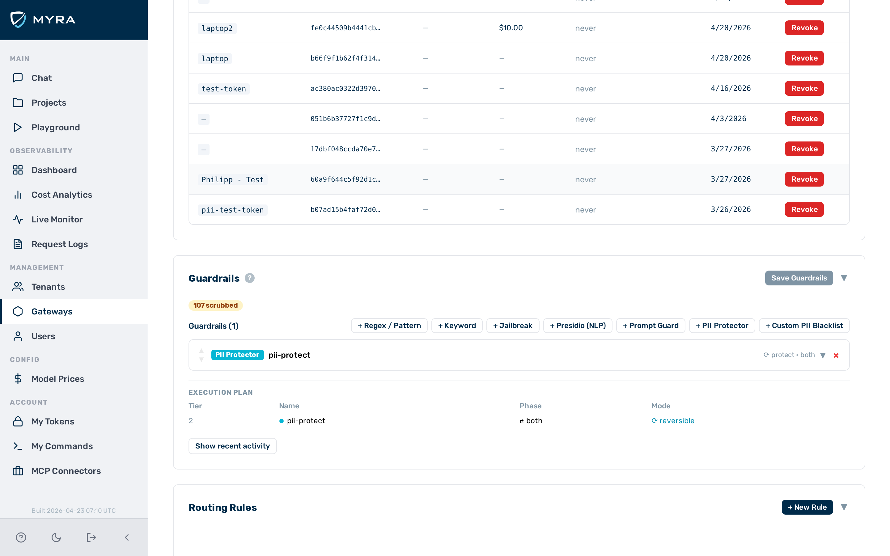

# Language guardrail

The language guardrail is a **Tier 1** (in-process, sub-millisecond) guardrail that identifies the dominant writing system of request or response text and blocks or flags traffic that does not use a permitted script. It is suited for deployments that serve a known-language audience and need to prevent misuse through non-Latin scripts or detect unexpected language usage.

## When to use the language guardrail

Use the language guardrail when your deployment serves a specific-language audience and you need to block or log requests or responses in unexpected writing systems. Note that the guardrail detects **writing systems**, not languages — all Latin-script languages (English, French, German, Spanish, and others) map to the same `latin` code.

## How it works

Detection uses UTF-8 byte-range heuristics — no dictionary lookups or external models are required. Each code point is classified into one of the supported writing systems. The detected script is the writing system with the highest character count, provided that count exceeds `min_ratio` of the total text. When no non-Latin script meets the `min_ratio` threshold, the text is classified as `latin`.

### Sub-Latin language discrimination

The language guardrail detects writing systems, not individual languages. All Latin-script languages map to the same `latin` code. It is not possible to permit English while blocking French using this guardrail. For sub-Latin language discrimination (e.g. allow only English), use a sidecar language-detect service and apply the result via a custom guardrail or routing rule.

---

## Configuration reference

| Field | Type | Default | Description |
|---|---|---|---|
| `type` | string | — | Must be `"language"` |
| `name` | string | — | Human-readable label for this guardrail instance |
| `action` | string | `"block"` | What to do on a disallowed script: `block` or `flag` |
| `target` | string | `"request"` | Which traffic to inspect: `request`, `response`, or `both` |
| `allowed` | array | — | Language codes that are permitted. Traffic using any other detected script triggers the configured action. |
| `min_ratio` | number | `0.1` | Minimum fraction of non-Latin characters needed for a non-Latin script to be declared dominant. Below this threshold, the text is classified as `latin`. |

---

## Supported scripts

| Language code | Writing system | Unicode range |
|---|---|---|
| `latin` | Latin, ASCII, and all unclassified text | Default (non-matching characters) |
| `cjk` | Chinese, Japanese, Korean | U+4E00–U+9FFF |
| `cyrillic` | Russian, Bulgarian, Serbian, Ukrainian, and others | U+0400–U+04FF |
| `arabic` | Arabic, Farsi, Urdu | U+0600–U+06FF |
| `hebrew` | Hebrew | U+0590–U+05FF |
| `thai` | Thai | U+0E00–U+0E7F |
| `devanagari` | Hindi, Sanskrit, Marathi, Nepali, and others | U+0900–U+097F |

---

## `min_ratio` setting

`min_ratio` prevents false positives on text that mixes scripts — for example, an English sentence that mentions a product name in Cyrillic or includes a few CJK characters. With the default `min_ratio: 0.1`, at least 10% of the text must be a given non-Latin script before it is declared dominant.

Lower `min_ratio` to increase sensitivity to mixed-script content. Raise it to require a more heavily non-Latin document before triggering.

---

## Example configurations

### Allow only Latin-script requests

Block any request that is predominantly written in a non-Latin writing system:

```json
{
  "type": "language",
  "name": "latin-only",
  "action": "block",
  "target": "request",
  "allowed": ["latin"]
}
```

### Allow Latin and CJK (for a bilingual deployment)

```json
{
  "type": "language",
  "name": "latin-cjk",
  "action": "block",
  "target": "both",
  "allowed": ["latin", "cjk"]
}
```

### Flag non-Latin requests for review without blocking

```json
{
  "type": "language",
  "name": "non-latin-flag",
  "action": "flag",
  "target": "request",
  "allowed": ["latin"]
}
```

### Increase sensitivity to mixed-script content

With `min_ratio: 0.05`, even a small fraction of Cyrillic characters triggers detection:

```json
{
  "type": "language",
  "name": "strict-latin",
  "action": "block",
  "target": "request",
  "allowed": ["latin"],
  "min_ratio": 0.05
}
```

---

## Configuring the language guardrail


*Language guardrail card — expanded view*

Proceed as follows to configure the language guardrail in the Guardrail Builder:

1. Open the gateway detail page and scroll down to the **Guardrails** card.
2. Click on the **+ Language** button.
    - A collapsed language guardrail card appears at the bottom of the list.
3. Click on the card to expand it.
4. Enter a name in the **Name** text field.
5. Select the action from the **Action** drop-down list: `block` or `flag`.
6. Select the target from the **Target** drop-down list: `request`, `response`, or `both`.
7. Select the permitted writing systems from the **Allowed** list (e.g. `latin`, `cjk`).
8. If required, adjust the **Min Ratio** field to change the sensitivity to mixed-script content.
9. Click on the **Save Guardrails** button.
    - -> The language guardrail is saved and appears in the execution plan.

---

## Pipeline position

The language guardrail is **Tier 1** — it runs in-process with no external calls. It runs in both the request and response phases depending on the configured `target`. A `block` verdict stops the pipeline immediately.

---

## See also

- [Guardrail pipeline overview](../guardrails.md)
- [Gibberish detector](gibberish.md) — detect low-quality model responses
- [Keyword guardrail](keyword.md) — exact-string matching for specific terms
