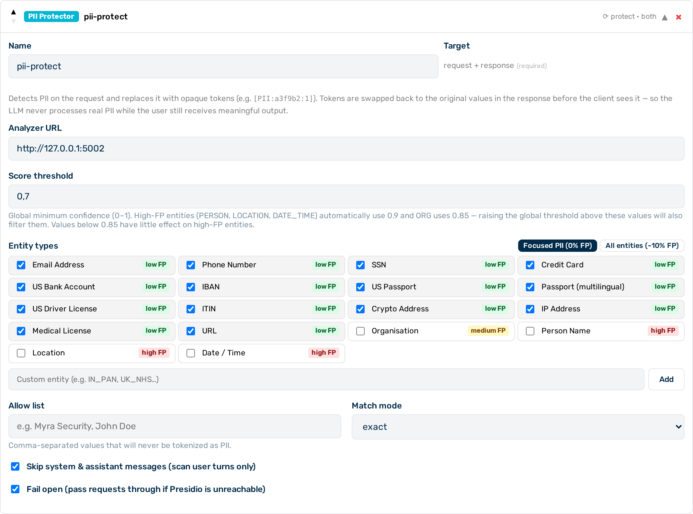

# PII Protector

PII Protector is a **Tier 2** (sidecar HTTP call, milliseconds) guardrail that provides reversible PII tokenisation. It detects PII in the request body using a locally hosted NLP engine running within Myra's certified infrastructure, replaces each detected value with an opaque token, forwards the tokenised request to the AI provider, and restores the original values in the response before it reaches the client. The AI model never processes real PII, and the engine never transmits data outside the Myra perimeter.


*PII Protector editor*

## When to use PII Protector

Use PII Protector when the AI model needs contextual continuity — the ability to reference names, addresses, or other PII naturally — but the real values must not reach the provider. For permanent, irreversible scrubbing without restoration, use the [NLP PII Detector](presidio.md) with `action: "scrub"` instead.

## How it works

1. **Request phase** — The NLP PII detection engine scans the request body for PII spans. Each unique value is replaced with a token in the format `[MYRA-REDACT-{TYPE}:SALT:N]`, where `TYPE` is the detected entity type (e.g. `EMAIL_ADDRESS`, `US_SSN`), `SALT` is a random per-request prefix, and `N` is a sequential counter. The same original value always maps to the same token within a single request.
2. **Provider call** — The upstream AI provider receives only the tokenised body. Real PII values are never transmitted.
3. **Response phase** — All tokens present in the response are replaced with their original values before the response is sent to the client.

**Example:** a prompt containing `"My SSN is 123-45-6789"` is forwarded to the provider as `"My SSN is [MYRA-REDACT-US_SSN:a3f1c2:1]"`. If the model echoes the token back, the client receives the response with `123-45-6789` restored.

The detection engine automatically identifies the language of each request and applies the appropriate NLP model. English and German are fully supported; other Latin-script languages are handled on a best-effort basis. No `language` field is required.

!!! note "No `action` or `target` fields"
    PII Protector does not have an `action` or `target` field. It always tokenises on the request phase and restores on the response phase. Both phases are always active.

---

## Configuration reference

| Field | Type | Default | Description |
|---|---|---|---|
| `type` | string | — | Must be `"pii_protector"` |
| `name` | string | — | Human-readable label for this guardrail instance |
| `entities` | array \| null | `null` | Entity types to tokenise; `null` tokenises all supported entity types |
| `score_threshold` | number | `0.7` | Minimum confidence score for a detection to count (0.0–1.0) |
| `allow_list` | array \| null | `null` | Values that are never tokenised, regardless of confidence score |
| `allow_list_match` | string | `"exact"` | How allow-list entries are matched: `"exact"` (full string) or `"partial"` (substring) |
| `skip_system_messages` | boolean | `true` | When `true`, only user-role messages are scanned; when `false`, system and assistant messages are also scanned |
| `timeout_ms` | integer | `3000` | Timeout for the sidecar call in milliseconds |
| `fail_open` | boolean | `true` | When `true`, sidecar errors allow the request to pass through without tokenisation; when `false`, they block it |

---

## Entity types and FP risk

PII Protector uses the same entity types as the [NLP PII Detector](presidio.md). See that page for the full list of supported entity types and their benchmarked false-positive rates.

The 14 low-FP types are: `EMAIL_ADDRESS`, `PHONE_NUMBER`, `US_SSN`, `CREDIT_CARD`, `US_BANK_NUMBER`, `IBAN_CODE`, `US_PASSPORT`, `PASSPORT`, `US_DRIVER_LICENSE`, `US_ITIN`, `CRYPTO`, `IP_ADDRESS`, `MEDICAL_LICENSE`, `URL`.

`PASSPORT` covers passport numbers in any format or language via NER. `US_PASSPORT` covers only US-format numbers via regex. Both can be active simultaneously.

The named-entity types — `ORG`, `PERSON`, `LOCATION`, `DATE_TIME` — are useful for contextual continuity but produce more false positives on general text. The gateway automatically raises `score_threshold` to `0.85` for `ORG` and to `0.9` for `PERSON`, `LOCATION`, and `DATE_TIME` when they are included.

---

## Token format

Tokens use the format `[MYRA-REDACT-{TYPE}:SALT:N]`:

| Component | Description |
|---|---|
| `TYPE` | Detected entity type in uppercase (e.g. `EMAIL_ADDRESS`, `US_SSN`, `PHONE_NUMBER`, `CREDIT_CARD`). Falls back to `PII` if the type is unavailable. |
| `SALT` | 6-character random hex prefix, unique per request |
| `N` | Sequential integer starting at 1, incremented for each distinct PII value found |

Including the entity type in the token lets the AI model respond semantically — for example, it can say "I'll contact you at your email address" rather than echoing the opaque token verbatim.

The same original value appearing multiple times in a single request always maps to the same token. On the response side, all occurrences of a given token are restored to the same original value.

---

## Deduplication and overlapping spans

**Deduplication:** when the same PII value appears multiple times in the request, all occurrences are replaced with the same token and all are restored identically in the response.

**Overlapping spans:** when the detection engine identifies overlapping entity spans (for example, a name inside an email address detected as both `EMAIL` and `PERSON`, or a numeric string matching both `CREDIT_CARD` and `IBAN`), the span with the highest confidence score wins. The lower-confidence span is discarded.

---

## `fail_open` behaviour

| `fail_open` | Sidecar unavailable |
|---|---|
| `true` (default) | Request passes through without tokenisation |
| `false` | Request is blocked |

---

## Comparison with NLP PII detector scrub

| | PII Protector | NLP PII Detector (`action: "scrub"`) |
|---|---|---|
| Request PII handling | Tokenised (reversible) | Replaced with `<TYPE>` placeholder (permanent) |
| Response restoration | Yes (non-streaming only) | No |
| Model sees real PII | Never | Never |
| Client sees real PII | Yes (non-streaming) | No |
| Same-value deduplication | Yes (same token per value) | N/A (same label either way) |
| HTTP calls per request | 1 (analyse only) | 2 (analyse + anonymise) |
| Typical use case | Model needs contextual continuity; client needs original values | Audit or compliance logging; no restoration needed |

---

## Limitations

!!! warning "Streaming responses"
    PII Protector does not restore tokens in streaming responses. When a request is streamed, the response body is not buffered by the gateway, so token restoration is skipped. The client sees raw tokens such as `[MYRA-REDACT-US_SSN:a3f1c2:1]` in the streamed output instead of the original values.

    Privacy is fully preserved — the AI model never received the real PII — but the user experience is degraded for streaming. Use non-streaming requests (`"stream": false`) when complete token restoration is required.

!!! note "Model paraphrasing"
    If the model paraphrases rather than echoing a token verbatim, restoration is skipped for that value. Privacy is maintained (the model never saw the real PII), but the response does not contain the original value in that position.

---

## Example configurations

### Protect specific entity types

```json
{
  "type": "pii_protector",
  "name": "protect-pii",
  "entities": ["PERSON", "EMAIL_ADDRESS", "PHONE_NUMBER", "US_SSN"],
  "score_threshold": 0.75
}
```

### Protect all entity types, blocking on sidecar failure

```json
{
  "type": "pii_protector",
  "name": "protect-all-pii",
  "fail_open": false
}
```

### Combine with regex pre-filtering

Use a regex guardrail (Tier 1) to block structured PCI data before PII Protector tokenises remaining PII. The regex block prevents card numbers from ever reaching the provider; PII Protector handles names, emails, and other values that benefit from restoration.

```json
[
  {
    "type": "regex",
    "name": "block-pci",
    "action": "block",
    "target": "request",
    "patterns": ["pci_pan"]
  },
  {
    "type": "pii_protector",
    "name": "tokenize-pii",
    "entities": ["PERSON", "EMAIL_ADDRESS", "PHONE_NUMBER", "US_SSN", "LOCATION"]
  }
]
```

### Exempt specific values from tokenisation

Use `allow_list` to prevent known non-PII values from being replaced with tokens:

```json
{
  "type": "pii_protector",
  "name": "protect-pii",
  "entities": ["PERSON", "EMAIL_ADDRESS", "PHONE_NUMBER"],
  "allow_list": ["Myra Security", "AI Gateway"],
  "allow_list_match": "exact"
}
```

---

## Configuring PII Protector


*PII Protector card — expanded view*

Proceed as follows to configure PII Protector in the Guardrail Builder:

1. Open the gateway detail page and scroll down to the **Guardrails** card.
2. Click on the **+ PII Protector** button.
    - A collapsed PII Protector card appears at the bottom of the list.
3. Click on the card to expand it.
4. Enter a name in the **Name** text field.
5. If required, select specific entity types from the **Entities** list. Leave empty to tokenise all supported types.
6. If required, adjust the **Score Threshold** field.
7. If required, enter values in the **Allow List** field to exempt known non-PII strings.
8. Toggle the **Skip System Messages** switch off if system and assistant messages also require scanning.
9. Toggle the **Fail Open** switch to `false` if the sidecar must be a hard dependency.
10. Click on the **Save Guardrails** button.
    - -> PII Protector is saved and appears in the execution plan.

---

## Pipeline position

PII Protector is **Tier 2** — it makes an HTTP call to the Presidio sidecar. All Tier 1 guardrails (regex, keyword) run before any Tier 2 guardrail. Any regex or keyword scrubbing runs first; PII Protector tokenises whatever remains.

---

## See also

- [Guardrail pipeline overview](../guardrails.md)
- [NLP PII detector](presidio.md) — permanent scrubbing without restoration
- [Regex guardrail](regex.md) — in-process pattern matching for structured data
