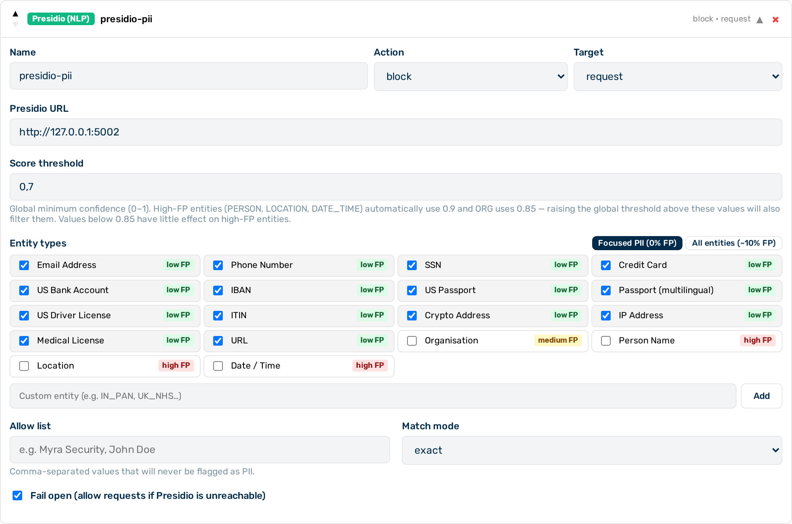

# NLP PII detector

The NLP PII detector is a **Tier 2** (sidecar HTTP call, milliseconds) guardrail that uses a named entity recognition (NER) engine to detect and optionally anonymise personally identifiable information (PII) in request and response bodies. The detection engine runs as a locally hosted sidecar within Myra's certified infrastructure — data is never transmitted outside the Myra perimeter.


*NLP PII detector editor*

## When to use the NLP PII detector

Use the NLP PII detector when you need contextual, NLP-based detection of PII — including unstructured forms such as names, locations, and dates that regex cannot reliably match. For structured data formats with known patterns (card numbers, SSNs), the [Regex guardrail](regex.md) (Tier 1) is faster and requires no sidecar call.

## How it works

The guardrail sends the inspected body to a locally hosted Presidio sidecar. The sidecar analyses the text using NER models and returns detected entity spans with confidence scores. The guardrail applies the configured action to any span that meets or exceeds the `score_threshold`.

The detection engine automatically identifies the language of each request and applies the appropriate NLP model. English and German are fully supported; other Latin-script languages are handled on a best-effort basis. No `language` field is required.

> 💡 **Note:** When `action: "scrub"` is used, matched PII is replaced with static labels such as `<PERSON>` or `<EMAIL_ADDRESS>`. If the model output needs to reference the original values, use the [PII Protector guardrail](pii-protector.md) instead, which tokenises PII reversibly.

---

## Configuration reference

| Field | Type | Default | Description |
|---|---|---|---|
| `type` | string | — | Must be `"presidio"` |
| `name` | string | — | Human-readable label for this guardrail instance |
| `action` | string | `"flag"` | What to do when PII is detected: `block`, `scrub`, or `flag` |
| `target` | string | `"request"` | Which phase to inspect: `request`, `response`, or `both` |
| `entities` | array \| null | `null` | Entity types to detect; `null` detects all supported entity types |
| `score_threshold` | number | `0.7` | Minimum confidence score for a detection to count (0.0–1.0) |
| `allow_list` | array \| null | `null` | Values that are never flagged as PII, regardless of confidence score |
| `allow_list_match` | string | `"exact"` | How allow-list entries are matched: `"exact"` (full string) or `"partial"` (substring) |
| `timeout_ms` | integer | `3000` | Timeout for the sidecar call in milliseconds |
| `fail_open` | boolean | `true` | When `true`, sidecar errors allow the request to pass through; when `false`, they block it |

---

## Actions

| Action | Behaviour |
|---|---|
| `block` | Request is denied if any entity is detected above the confidence threshold. The caller receives a synthetic assistant message. |
| `scrub` | Detected spans are replaced with `<ENTITY_TYPE>` placeholders (e.g. `<EMAIL_ADDRESS>`). The pipeline continues with the redacted body. |
| `flag` | Entity detections are recorded in the request log. The pipeline continues without modifying the body. |

---

## Supported entity types

The NLP PII detector supports 50+ entity types. The following are commonly configured. FP rates are benchmarked at `score_threshold: 0.7` across representative general-purpose and business text corpora.

| Entity type | Description | FP risk at 0.7 |
|---|---|---|
| `EMAIL_ADDRESS` | Email addresses | Low |
| `PHONE_NUMBER` | Phone numbers | Low |
| `US_SSN` | US Social Security numbers | Low |
| `CREDIT_CARD` | Credit card numbers (Luhn-validated) | Low |
| `US_BANK_NUMBER` | US bank account numbers | Low |
| `IBAN_CODE` | IBAN bank account codes | Low |
| `US_PASSPORT` | US passport numbers (regex, US format only) | Low |
| `PASSPORT` | Passport numbers in any format — detected via NER (multilingual) | Low |
| `US_DRIVER_LICENSE` | US driver's licence numbers | Low |
| `US_ITIN` | Individual Taxpayer Identification Numbers | Low |
| `CRYPTO` | Cryptocurrency wallet addresses | Low |
| `IP_ADDRESS` | IPv4 and IPv6 addresses | Low |
| `MEDICAL_LICENSE` | Medical licence numbers | Low |
| `URL` | Web URLs | Low |
| `ORG` | Company and organisation names — detected via NER (multilingual) | **Medium** — threshold auto-raised to 0.85 |
| `PERSON` | Full or partial person names | **High** — ~20% FP; threshold auto-raised to 0.9 |
| `LOCATION` | Location names | **High** — ~18% FP; threshold auto-raised to 0.9 |
| `DATE_TIME` | Dates and times | **High** — ~7–14% FP; threshold auto-raised to 0.9 |

> 💡 **Note:** For `action: block` or `action: scrub`, restrict `entities` to the 14 low-FP types and omit `ORG`, `PERSON`, `LOCATION`, and `DATE_TIME`. This set produces 0% false positives across benchmarks. The gateway automatically raises `score_threshold` to 0.85 for `ORG` and to 0.9 for the other named-entity types when they are included.

---

## `fail_open` behaviour

| `fail_open` | Sidecar unavailable |
|---|---|
| `true` (default) | Request passes through as if no PII was found |
| `false` | Request is blocked |

> ⚠️ **Caution:** Set `fail_open: false` when PII detection is a hard compliance requirement. With `fail_open: true`, a sidecar outage allows all traffic through uninspected.

---

## Example configurations

### Block any request containing detected PII

```json
{
  "type": "presidio",
  "name": "block-pii",
  "action": "block",
  "target": "request",
  "fail_open": false
}
```

### Scrub specific financial entity types from both request and response

```json
{
  "type": "presidio",
  "name": "scrub-financial",
  "action": "scrub",
  "target": "both",
  "entities": ["CREDIT_CARD", "IBAN_CODE", "US_BANK_NUMBER"],
  "score_threshold": 0.85
}
```

### Flag PII in responses for audit purposes only

```json
{
  "type": "presidio",
  "name": "flag-pii-responses",
  "action": "flag",
  "target": "response"
}
```

### Exempt specific values from detection

Use `allow_list` to prevent known non-PII values from triggering a detection:

```json
{
  "type": "presidio",
  "name": "block-pii",
  "action": "block",
  "target": "request",
  "entities": ["PERSON", "EMAIL_ADDRESS", "PHONE_NUMBER"],
  "allow_list": ["Myra Security", "AI Gateway"],
  "allow_list_match": "exact"
}
```

### Use the NLP PII detector after a regex pre-filter

Running a regex guardrail first (Tier 1) reduces the volume of content reaching the Presidio sidecar (Tier 2). The example below blocks obvious PCI patterns in-process, then sends everything else to the NLP PII detector for broader PII detection.

```json
[
  {
    "type": "regex",
    "name": "block-pci",
    "action": "block",
    "target": "request",
    "patterns": ["pci_pan"]
  },
  {
    "type": "presidio",
    "name": "scrub-remaining-pii",
    "action": "scrub",
    "target": "request",
    "entities": ["PERSON", "EMAIL_ADDRESS", "PHONE_NUMBER", "US_SSN"]
  }
]
```

---

## Streaming limitation

> ⚠️ **Caution:** When `target` is `"response"` or `"both"`, response-phase inspection applies only to non-streaming responses. Streamed responses are not buffered by the gateway, so response-phase scrubbing and flagging are skipped for them. Request-phase inspection is unaffected.

---

## Configuring the NLP PII detector


*NLP PII detector card — expanded view*

► Proceed as follows to configure the NLP PII detector in the Guardrail Builder:

1. Open the gateway detail page and scroll down to the **Guardrails** card.
2. Click on the **+ Presidio (NLP)** button.
   - A collapsed NLP PII detector card appears at the bottom of the list.
3. Click on the card to expand it.
4. Enter a name in the **Name** text field.
5. Select the action from the **Action** drop-down list: `block`, `scrub`, or `flag`.
6. Select the target from the **Target** drop-down list: `request`, `response`, or `both`.
7. If required, select specific entity types from the **Entities** list. Leave empty to detect all supported types.
8. If required, adjust the **Score Threshold** field.
9. If required, enter values in the **Allow List** field to exempt known non-PII strings.
10. Toggle the **Fail Open** switch to `false` if the sidecar must be a hard dependency.
11. Click on the **Save Guardrails** button.

→ The NLP PII detector is saved and appears in the execution plan.

---

## Pipeline position

The NLP PII detector is **Tier 2** — it makes an HTTP call to a sidecar service. All Tier 1 guardrails (regex, keyword) run before any Tier 2 guardrail. Within Tier 2, guardrails run in the order they appear in the `guardrails` array.

---

## See also

- [Guardrail pipeline overview](../guardrails.md)
- [Regex guardrail](regex.md) — in-process pattern matching, no sidecar required
- [PII Protector](pii-protector.md) — reversible tokenisation that restores original values in the response
