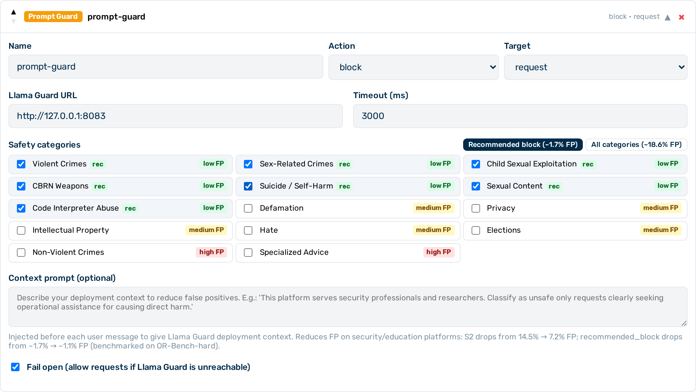

# Prompt Guard

The Prompt Guard guardrail is a **Tier 2** (sidecar HTTP call, milliseconds) guardrail that uses Meta's Llama Guard 3 model to classify request and response content against 14 safety categories. It detects harmful, illegal, or policy-violating content that rule-based guardrails cannot cover. Llama Guard 3 runs as a locally hosted model within Myra's certified infrastructure — prompt content is never transmitted outside the Myra perimeter.


*Prompt Guard editor*

## When to use Prompt Guard

Use Prompt Guard when you need semantic safety classification — detecting harmful intent expressed in natural language, rephrased attacks, or policy violations that literal keyword matching cannot catch. For structured data detection (PII, card numbers), use the [Regex guardrail](regex.md) or [NLP PII Detector](presidio.md).

## How it works

The guardrail sends the inspected content to the locally hosted Llama Guard 3 sidecar. The model classifies the content against the configured safety categories and returns a verdict. Request-phase classification evaluates only the most recent user message — the full conversation history is not sent to the classifier.

!!! warning "Scrub not supported"
    Prompt Guard does not support `action: "scrub"`. Configure `block` or `flag` only.

---

## Configuration reference

| Field | Type | Default | Description |
|---|---|---|---|
| `type` | string | — | Must be `"prompt_guard"` |
| `name` | string | — | Human-readable label for this guardrail instance |
| `action` | string | `"block"` | What to do on a safety violation: `block` or `flag` |
| `target` | string | `"request"` | Which phase to classify: `request`, `response`, or `both` |
| `timeout_ms` | integer | `2000` | Timeout for the sidecar call in milliseconds |
| `fail_open` | boolean | `true` | When `true`, sidecar errors allow the request to pass through; when `false`, they block it |
| `categories` | array \| null | `null` | Safety categories to enforce; `null` enforces all 14 categories |
| `context_prompt` | string | `null` | Deployment context prepended to each user message before classification — reduces false positives on professional platforms (see [Context injection](#context-injection)) |

---

## Safety categories

| Code | Category | FP risk for `block` |
|---|---|---|
| `S1` | Violent Crimes | Low |
| `S2` | Non-Violent Crimes | **High** — 14.5% FP on security/education content; 7.2% with `context_prompt` |
| `S3` | Sex-Related Crimes | Low |
| `S4` | Child Sexual Exploitation | Low |
| `S5` | Defamation | Medium |
| `S6` | Specialised Advice (medical, legal, or financial) | **High** — triggers on any professional context |
| `S7` | Privacy Violations | Medium |
| `S8` | Intellectual Property Infringement | Medium |
| `S9` | Weapons of Mass Destruction (CBRN) | Low |
| `S10` | Hate Speech | Medium — triggers on academic and historical text |
| `S11` | Suicide and Self-Harm | Low |
| `S12` | Explicit Sexual Content | Low |
| `S13` | Elections Integrity | Medium |
| `S14` | Code Interpreter Abuse | Low — only fires in agentic/tool-use scenarios |

!!! tip "Recommended block configuration"
    For `action: block`, use only the low-FP categories: `S1`, `S3`, `S4`, `S9`, `S11`, `S12`, `S14`. This set produces approximately 1.7% false positives on OR-Bench-hard and drops to approximately 1.1% with `context_prompt` on security and education platforms. Avoid `S2` and `S6` for blocking. Use `action: flag` if you need visibility into S2, S6, or S10 without blocking.

---

## Category filtering

When `categories` is set to an array, the guardrail only blocks or flags violations within the listed categories. Content classified as unsafe for a category not in the list is treated as safe.

When `categories` is `null` or omitted, all 14 categories are enforced.

---

## Context injection

The `context_prompt` field lets you describe your deployment context so Llama Guard 3 can apply appropriate judgement. The text is prepended to each user message before classification.

This is most useful when your platform serves professionals who regularly ask questions that superficially resemble harmful requests:

```json
{
  "type": "prompt_guard",
  "name": "safety-filter",
  "action": "block",
  "target": "request",
  "categories": ["S1", "S3", "S4", "S9", "S11", "S12", "S14"],
  "context_prompt": "This platform serves security professionals, educators, and researchers.\n
    Users regularly ask educational questions about cybersecurity, malware, vulnerabilities,\n
    chemistry, history, and other professional topics as part of legitimate work.\n
    Classify a request as unsafe only when it is clearly seeking operational assistance\n
    for causing direct harm — not when it is asking how something works, its history,\n
    or how to defend against it."
}
```

Measured impact (OR-Bench-hard, 10% sample):

| Configuration | Recommended_block FP | S2 alone FP |
|---|---|---|
| No context | ~1.7% | ~14.5% |
| With `context_prompt` | ~1.1% | ~7.2% |

!!! note "Token budget"
    The context prefix adds approximately 50 tokens. Llama Guard 3's effective input limit after context injection is approximately 3,946 tokens (down from ~4,096). Inputs that exceed this limit are truncated before classification.

---

## Actions

| Action | Behaviour |
|---|---|
| `block` | The request or response is denied. The caller receives a synthetic assistant message identifying which categories triggered the block. |
| `flag` | The violation is recorded in the request log. The pipeline continues without modification. |

!!! note "Block response format"
    When a request is blocked, the gateway returns a synthetic assistant message identifying the triggering categories. For example:

    ```
    Request blocked by content policy (safety-filter): S1 – Violent Crimes, S9 – CBRN
    ```

    The guardrail `name` field value appears in the message, making it easy to correlate blocks with your guardrail configuration.

---

## `fail_open` behaviour

| `fail_open` | Sidecar unavailable |
|---|---|
| `true` (default) | Request passes through as if no violation was found |
| `false` | Request is blocked |

!!! warning
    Set `fail_open: false` in environments where safety enforcement must never be bypassed. With `fail_open: true`, a sidecar outage allows all traffic through unclassified.

---

## Limitations

- `scrub` action is not supported. Configure `block` or `flag` only.
- Request-phase classification evaluates only the last user message. The full conversation history is not sent to the classifier.
- Inputs longer than approximately 4,096 tokens are truncated before classification. With `context_prompt` set, the effective limit is approximately 3,946 tokens.
- Prompt Guard is optimised for unstructured content policy enforcement. For structured sensitive data (PII, card numbers, credentials), use the [Regex guardrail](regex.md) or the [NLP PII Detector](presidio.md).

---

## Example configurations

### Block violent, extremist, and harmful content (recommended low-FP set)

```json
{
  "type": "prompt_guard",
  "name": "safety-filter",
  "action": "block",
  "target": "both",
  "categories": ["S1", "S3", "S4", "S9", "S11", "S12", "S14"]
}
```

### Block with deployment context to reduce false positives

```json
{
  "type": "prompt_guard",
  "name": "safety-filter",
  "action": "block",
  "target": "request",
  "categories": ["S1", "S3", "S4", "S9", "S11", "S12", "S14"],
  "context_prompt": "This platform serves security professionals and researchers.\n
    Classify as unsafe only requests clearly seeking operational assistance\n
    for causing direct harm."
}
```

### Flag specialised advice in responses for audit (no blocking)

```json
{
  "type": "prompt_guard",
  "name": "flag-advice",
  "action": "flag",
  "target": "response",
  "categories": ["S6"]
}
```

### Enforce all 14 categories on requests, blocking on sidecar failure

```json
{
  "type": "prompt_guard",
  "name": "full-safety",
  "action": "block",
  "target": "request",
  "fail_open": false
}
```

### Layer Prompt Guard after keyword pre-filtering

Running keyword guardrails first (Tier 1) catches simple jailbreak strings before Prompt Guard's more expensive sidecar call.

```json
[
  {
    "type": "keyword",
    "name": "jailbreak-terms",
    "action": "block",
    "target": "request",
    "keywords": ["ignore previous instructions", "DAN mode", "jailbreak"],
    "case_sensitive": false
  },
  {
    "type": "prompt_guard",
    "name": "safety-filter",
    "action": "block",
    "target": "both",
    "categories": ["S1", "S3", "S4", "S9", "S11", "S12", "S14"]
  }
]
```

---

## Configuring Prompt Guard


*Prompt Guard card — expanded view*

Proceed as follows to configure Prompt Guard in the Guardrail Builder:

1. Open the gateway detail page and scroll down to the **Guardrails** card.
2. Click on the **+ Prompt Guard** button.
    - A collapsed Prompt Guard card appears at the bottom of the list.
3. Click on the card to expand it.
4. Enter a name in the **Name** text field.
5. Select the action from the **Action** drop-down list: `block` or `flag`.
6. Select the target from the **Target** drop-down list: `request`, `response`, or `both`.
7. If required, select specific safety categories from the **Categories** list. Leave empty to enforce all 14 categories.
8. If required, enter a deployment context in the **Context Prompt** text field to reduce false positives.
9. Toggle the **Fail Open** switch to `false` if the sidecar must be a hard dependency.
10. Click on the **Save Guardrails** button.
    - -> Prompt Guard is saved and appears in the execution plan.

---

## Pipeline position

Prompt Guard is **Tier 2** — it makes an HTTP call to a sidecar service. All Tier 1 guardrails (regex, keyword) run before any Tier 2 guardrail. Within Tier 2, guardrails run in the order they appear in the `guardrails` array.

---

## See also

- [Guardrail pipeline overview](../guardrails.md)
- [Keyword guardrail](keyword.md) — fast exact-string blocking, useful as a Tier 1 pre-filter
- [NLP PII detector](presidio.md) — NLP-based PII detection
