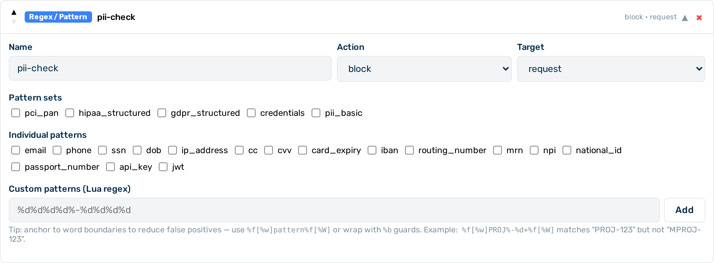

# Regex guardrail

The regex guardrail is a **Tier 1** (in-process, sub-millisecond) guardrail that scans request and response content against named pattern libraries or custom expressions. It is the recommended starting point for detecting structured sensitive data such as personally identifiable information (PII), payment card numbers, credentials, and healthcare identifiers.


*Regex guardrail editor*

## When to use the regex guardrail

Use the regex guardrail when you need fast, deterministic matching of structured data formats. It adds no latency overhead. For unstructured PII detection — such as names, dates, or addresses expressed in natural language — use the [NLP PII Detector](presidio.md) (Tier 2) instead.

## How it works

The guardrail evaluates the `patterns` array (named patterns) and the `custom_patterns` array (raw regex strings) against the inspected body. Both lists are evaluated together. A single match from either list triggers the configured action.

For `action: "scrub"`, each matched span is replaced independently with the `scrub_placeholder` value. If multiple spans match, each is replaced separately.

---

## Configuration reference

| Field | Type | Default | Description |
|---|---|---|---|
| `type` | string | — | Must be `"regex"` |
| `name` | string | — | Human-readable label for this guardrail instance |
| `action` | string | `"flag"` | What to do on a match: `block`, `scrub`, or `flag` |
| `target` | string | `"request"` | Which traffic to inspect: `request`, `response`, or `both` |
| `patterns` | array | `[]` | Named patterns or pattern sets to match (see tables below) |
| `custom_patterns` | array | `[]` | Raw regex strings to match in addition to named patterns |
| `scrub_placeholder` | string | `"[REDACTED]"` | Replacement text used when `action` is `"scrub"` |

---

## Named patterns

Reference these by name in the `patterns` array. False positive (FP) rates are benchmarked across representative general-purpose and business text corpora.

| Name | Description | FP risk |
|---|---|---|
| `email` | Email addresses | Medium — 8% FP on business text |
| `phone` | Phone numbers (international format) | **High** — 26% FP; phone numbers appear in everyday queries |
| `ssn` | US Social Security Numbers (dashes optional) | **High** — 11.5% FP; 9-digit sequences match SSN format |
| `dob` | Dates of birth (MM/DD/YYYY or MM-DD-YYYY) | Low — 0% FP |
| `ip_address` | IPv4 addresses | **High** — 13% FP; IP addresses appear in technical text |
| `cc` | Credit/debit card numbers (Luhn-validated) | Low — 2% FP (Luhn check eliminates most false matches) |
| `cvv` | Card verification values | Low — 0% FP |
| `card_expiry` | Card expiry dates | Low — 1.5% FP |
| `iban` | International Bank Account Numbers | Low — 0% FP |
| `routing_number` | ABA routing numbers (9-digit) | Medium — 5% FP; 9-digit numbers are common |
| `mrn` | Medical Record Numbers | Low — 0% FP |
| `npi` | National Provider Identifiers | Low — 0.5% FP |
| `national_id` | National ID numbers | Low — 0% FP |
| `passport_number` | Passport numbers | Low — 0% FP |
| `api_key` | API key patterns (key=value format) | Low — 0% FP |
| `jwt` | JSON Web Tokens (ey... three-segment format) | Low — 0% FP |

> 💡 **Note:** `phone`, `ssn`, and `ip_address` have 11–26% false positive rates on general business text. Use `action: scrub` rather than `action: block` for these patterns, or switch to the [NLP PII Detector](presidio.md), which applies NLP context to reduce false detections.

> 💡 **Note:** The `cc` pattern applies a Luhn checksum check in addition to format matching. This significantly reduces false positives from 16-digit numbers that happen to match a card number format but are not valid card numbers.

---

## Pattern sets

Pattern sets are shorthand aliases that expand to multiple named patterns. Use them in the `patterns` array the same way as individual pattern names.

| Set | Patterns included | FP risk |
|---|---|---|
| `pci_pan` | `cc`, `cvv`, `card_expiry`, `iban`, `routing_number` | Low — all patterns are format-specific; `cc` is Luhn-validated |
| `hipaa_structured` | `ssn`, `mrn`, `npi`, `dob`, `phone`, `email`, `ip_address` | **High** — includes `phone`, `ssn`, `ip_address` which have 11–26% FP on general text |
| `gdpr_structured` | `email`, `phone`, `ip_address`, `iban`, `national_id`, `passport_number` | **High** — includes `phone` and `ip_address` |
| `credentials` | `api_key`, `jwt` | Low — format-specific; 0% FP |
| `pii_basic` | `email`, `phone`, `ssn` | **High** — includes `phone` and `ssn` |

> 💡 **Note:** `hipaa_structured`, `gdpr_structured`, and `pii_basic` all include high-FP patterns. Use `action: scrub` to redact matched content rather than `action: block`, which denies entire requests. `pci_pan` and `credentials` are low-FP and suitable for `action: block`.

---

## Custom patterns

`custom_patterns` accepts raw regex strings in POSIX ERE syntax — the same basic `[0-9]`, `+`, `*`, `{N}` syntax as most regex engines. Custom patterns are evaluated alongside any named patterns in the same guardrail instance.

---

## Example configurations

### Block requests containing credit card numbers

```bash
curl -X PATCH "https://<your-gateway-host>/admin/v1/gateways/{id}" \
  -H "x-aig-token: <admin-token>" \
  -H "Content-Type: application/json" \
  -d '{
    "config": {
      "guardrails": [
        {
          "type": "regex",
          "name": "block-pci",
          "action": "block",
          "target": "request",
          "patterns": ["pci_pan"]
        }
      ]
    }
  }'
```

### Scrub credentials from requests and responses

Detects API keys and JWTs in both the outbound request and the inbound model response, replacing any matches with a custom placeholder.

```json
{
  "type": "regex",
  "name": "scrub-credentials",
  "action": "scrub",
  "target": "both",
  "patterns": ["credentials"],
  "scrub_placeholder": "[REDACTED-CREDENTIAL]"
}
```

### Scrub HIPAA-structured identifiers from requests

```json
{
  "type": "regex",
  "name": "hipaa-scrub",
  "action": "scrub",
  "target": "request",
  "patterns": ["hipaa_structured"]
}
```

### Flag a custom internal ID format

Uses `custom_patterns` to match formats not covered by the named pattern library. This example flags any occurrence of an internal customer ID (`CUST-` followed by six digits), recording the match in the log without blocking or modifying the request.

```json
{
  "type": "regex",
  "name": "internal-ids",
  "action": "flag",
  "target": "request",
  "custom_patterns": ["CUST-%d%d%d%d%d%d"]
}
```

> 💡 **Note:** `custom_patterns` and `patterns` can be combined in a single guardrail. Both lists are evaluated, and the configured `action` applies if any pattern from either list matches.

### Combine named patterns and custom patterns

```json
{
  "type": "regex",
  "name": "combined-scrub",
  "action": "scrub",
  "target": "request",
  "patterns": ["pii_basic"],
  "custom_patterns": ["ACCT-[0-9]{10}"],
  "scrub_placeholder": "[PII]"
}
```

---

## Configuring the regex guardrail


*Regex guardrail card — expanded view*

Proceed as follows to configure the regex guardrail in the Guardrail Builder:

1. Open the gateway detail page and scroll down to the **Guardrails** card.
2. Click on the **+ Regex / Pattern** button.
   - A collapsed regex guardrail card appears at the bottom of the list.
3. Click on the card to expand it.
4. Enter a name in the **Name** text field.
5. Select the action from the **Action** drop-down list: `block`, `scrub`, or `flag`.
6. Select the target from the **Target** drop-down list: `request`, `response`, or `both`.
7. Select one or more named patterns or pattern sets from the **Patterns** list, or enter raw regex strings in the **Custom Patterns** field.
8. If the action is `scrub` and you require a custom placeholder, enter the replacement text in the **Scrub Placeholder** text field.
9. Click on the **Save Guardrails** button.

→ The regex guardrail is saved and appears in the execution plan.

---

## Pipeline position

The regex guardrail is **Tier 1** — it runs in-process with no external calls. All Tier 1 guardrails run before any Tier 2 guardrail. When multiple regex guardrails are configured, they run in the order they appear in the `guardrails` array.

A `block` verdict from this guardrail stops the pipeline immediately. No subsequent guardrails run.

---

## See also

- [Guardrail pipeline overview](../guardrails.md)
- [Keyword guardrail](keyword.md)
- [NLP PII detector](presidio.md)
